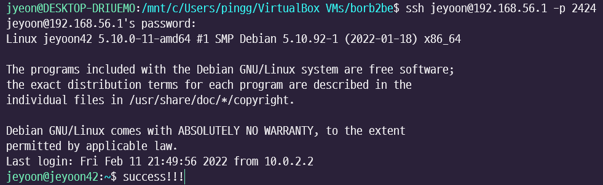

## 🚀 Intro

서브젝트의 SSH 부분에 보면 SSH의 사용이 디펜스 중간에 테스트 될 것이라는 말이 있다. 실제로 좀 열심히 서치를 해보면 찾을 수 있는 평가표를 봐도 디펜스 중에 Host PC에서 Guest PC로 SSH를 통하여 접속을 해야 하는 상황이 생기는데, 이런저런 과제 관련 자료를 찾다보면 이 과정에서 **포트 포워딩**이라는 개념이 사용된다는 것을 짐작할 수 있다.

문제는 많은 분들께서 하신 대로 설정을 잘 따라가면 뭔가 Host에서 Guest로 잘 접속이 되긴 하는데 내가 왜 포트포워딩이라는 개념을 사용하게 된건지, 내가 뭘 설정을 한건지(ㅋㅋㅋ) 잘 이해가 되지 않아서 한참을 삽질하고 있었다.

그리고 과제 디펜스를 앞둔 지금에서야 조금 가닥이 잡히는 것 같아서 기쁜 마음에 과제에 필요한 정도의 내용만 간단히 정리를 해 보려고 한다. (아직은 더 이상은 모름...)

## 🚀 Port forwarding

포트 포워딩이란 말그대로 포트를 전달해주는거다. 진짜 간단하게 말하면 서버의 특정 포트로 요청이 왔을 때, 이 포트로 오는 요청은 어디의 어떤 포트로 전달해주자! 라는 것을 설정해 두는 것이다.

[국문 위키백과](https://ko.wikipedia.org/wiki/%ED%8F%AC%ED%8A%B8_%ED%8F%AC%EC%9B%8C%EB%94%A9)에 잘 설명이 되어 있는데 용어가 좀 어려워서... 처음엔 잘 이해하지 못했는데 결국엔 그냥 위에 저렇게 풀어쓴거랑 똑같은 말이더라.

근데 내가 궁금했던 부분은 SSH 접속을 하기 위해서 사용하는 아래의 명령에서

```shell
ssh <id>@<address> -p <port_number>
```

3개의 값을 모두 아는데 왜 포트포워딩이 필요하며, 왜 실제로 접속이 안되는지였다.

답을 미리 말하면... VM에서 `hostname -I`로 알게 된 (host 기준에서)원격지 IP인 10.0.2.15는 나만 알고 있는거였고 공공연히 (?) 알려지지는 않은 주소였다.

## 🚀 Public IP vs. Private IP

### ✨ Public IP (공인 IP)

인터넷 서비스 공급자(ISP)가 제공하는 IP 주소이다.

외부에 공개되어 있는 IP주소이고, 유일한 값을 갖는다.

외부에 공개되어 있기 때문에 다른 PC로부터의 접근이 가능하다.

### ✨ Private IP (사설 IP)

라우터에 의해서 할당되는 IP주소이다.

같은 네트워크 내에서는 유일한 값을 갖지만 같은 네트워크 외에서는 유일한 값이 보장되지 않고, 외부에서 접근 또한 불가능하다.

정보를 찾으면서 사설 IP의 주소 대역에 대해서 알게 되었는데...

- Class A: 10.0.0.0 ~ 10.255.255.255
- Class B: 172.16.0.0 ~ 172.31.255.255
- Class C: 192.168.0.0 ~ 192.168.255.255

보니까 가상머신의 10.0.2.15가 위의 Class A에 포함이 된다.

이게 내가 아무리 10.0.2.15라는 주소를 알고 있어도 직접적으로는 접속이 절대 안되었던 이유였다.

## 🚀 VirtualBox Network

이렇게 가상머신 외부에서 가상머신에 접속을 하기 위해서는 포트 포워딩을 통해야 한다는 사실을 알게 되었는데 사실은 설정에 따라서는 굳이 포트 포워딩을 하지 않아도 접속이 가능했다.

VirtualBox 가상머신 설정에서 할 수 있는 네트워크 종류들은 아래 사진과 같은데 나는 기본값이고 포트포워딩이 필요한 방식인 NAT과 포트포워딩이 필요 없는 방식인 브리지 방식에 대해서만 공부해보았다.


### ✨ NAT

Network Address Translation (VirtualBox 기본값)

Host PC로부터 IP를 할당받는다. 

따라서 Host PC를 통해서 포트 포워딩을 통해 외부 네트워크와 통신이 가능하다.

---

일단 호스트PC의 cmd창에서 `ipconfig`로 VirtualBox의 IP address를 알아낸다. (window 기준)


그리고 가상머신 내에서 `hostname -I` 로 가상머신의 IP address를 알아낸다.

다음 가상머신을 끄고, 설정 -> 네트워크-> 고급 -> 포트포워딩 메뉴로 들어가서 호스트 IP에 VirtualBox의 IP를, 게스트 IP에 가상머신의 IP를 넣어준다. 포트번호는 적당히 맞게 넣어주기.

그리고 가상머신을 켜고 (게스트에 SSH가 켜져 있어야 함.) 호스트 측에서 게스트에 접속을 시도하면



잘 접속이 된다.

### ✨ Bridge

브리지 방식을 사용하면 IP를 공유기에서 직접 받아온다.

공유기가 호스트 PC와 가상머신에 같은 네트워크 대역의 IP를 할당하게 되기 때문에 동일한 수준의 PC로 인식이 되고, 바로 접속할 수 있게 된다.

---

VirtualBox의 설정 -> 네트워크에서 네트워크를 아래와 같이 **어댑터에 브리지**로 바꾸어준다.


그리고 가상머신을 켜서 `hostname -I`로 IP address를 확인해보면 아까 NAT 방식일때와 다른 IP address가 나올텐데, 그 IP address로 Host 에서 가상머신으로 접속해보면


포트포워딩을 하지 않았음에도 잘 접속이 된다.


## 🚀 Reference

[포트 포워딩 - 위키백과, 우리 모두의 백과사전 (wikipedia.org)](https://ko.wikipedia.org/wiki/포트_포워딩)

[공인(Public) && 사설(Private) IP의 차이점 (velog.io)](https://velog.io/@hidaehyunlee/공인Public-사설Private-IP의-차이점)

[[네트워크\] 눈으로 확인해보는 Vmware Host-Only, Nat, Bridge 차이 (tistory.com)](https://liveyourit.tistory.com/26?category=867755)

[Virtual Box 네트워크 설정 정리 :: 타쿠대디 (tistory.com)](https://takudaddy.tistory.com/352)