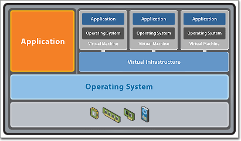
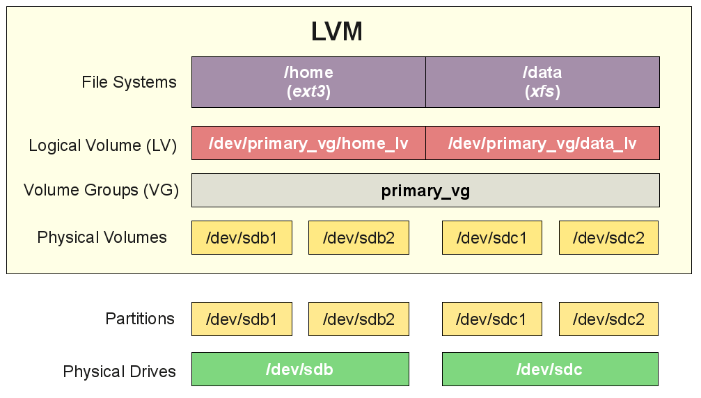
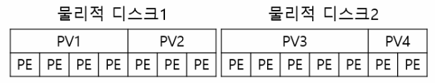
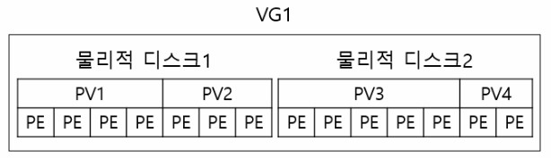
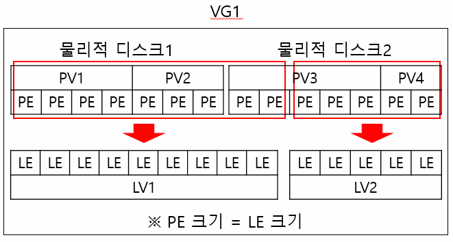
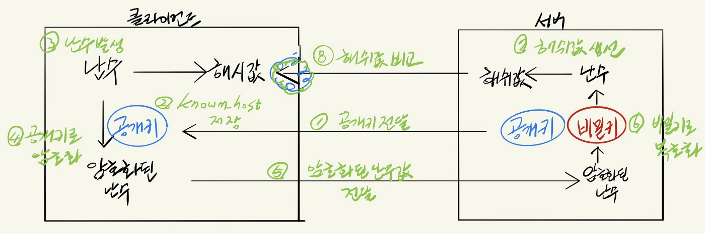
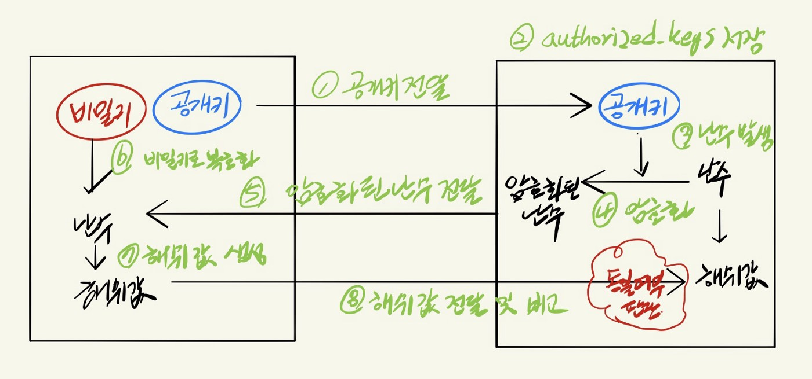

가상머신을 만들어보고, 그 안에 운영체제를 설치해보고, 운영체제의 이런저런 설정을 해 보는 과제이다.

Bonus part는 제외한 내용.

내용이 너무 길어져 핵심만 적었습니다. 아래 내용만으로는 평가받기에 부족할 수도 있습니다.

**출처가 있는 이미지의 경우에는 해당 이미지를 누르면 출처 링크로 이동합니다.**

## 🚀 Virtual Machine

### ✨ 정의, 작동 방식

가상머신이란 컴퓨팅환경을 소프트웨어로 구현한 물리적 컴퓨터와 동일한 기능을 하는 소프트웨어이다. 

하이퍼바이저로 구현된 가상화 기술로 물리 리소스들을 여러 OS에서 동일한 방식으로 사용할 수 있게 함으로써 작동한다. 

(위 이미지에서의 Virtual Infrastructure가 하이퍼바이저이다.)

(🔎 가상화, 하이퍼바이저)

(🔎 native타입, hosted타입, 가상화, 반가상화)

(🔎 시스템 가상머신, 프로세스 가상머신)

### ✨ 사용 목적 (장점)

- 하나의 하드웨어로 여러 운영체제를 사용할 수 있게 된다.
- 호스트 환경에서 바로 실행해보기에는 곤란한 작업들을 할 수 있다.

### ✨ vdi

VirtualBox에서 전용으로 사용하는 가상머신 이미지 파일

이후 SnapShot 기능을 사용하려면 이 형식을 사용해야 한다.

#### Disk image

여러 파일과 그 파일의 위치, 연결된 구조를 하나의 파일로 뭉친 것, 주로 가상 드라이브에 사용하기 위해서 사용한다.

이 파일 안에는 시스템 부팅에 필요한 파일들이 있다.

### ✨ snapshot

VirtualBox의 snapshot 기능을 이용하면 특정한 시점의 가상머신의 상태를 저장하고, 다시 되돌릴 수 있다.

평가를 위해서 스냅샷을 찍을 경우에는 반드시 가상머신을 종료하고 (현재 상태 저장) 스냅샷을 찍고, 해시값을 받은 다음에 그 해시값을 제출하도록 하자.

[1.10. Snapshots](https://www.virtualbox.org/manual/ch01.html#snapshots)

## 🚀 Devian vs CentOS

Devian과 CentOS는 리눅스 배포판이다.

(🔎 배포판, 커널)

| Devian                                  | CentOS                                                     |
| --------------------------------------- | ---------------------------------------------------------- |
| 온라인 커뮤니티에서 제작                | RHEL의 소스를 이용하여 만든 배포판 (레드햇 유료 소스 이용) |
| 2년 주기로 새로운 버전 출시             | 2~5년 주기로 새로운 버전 출시                              |
| 비교적 덜 안정적 (unstable 버전도 출시) | 안정적 (stable 버전만 출시)                                |
| 개인 사용자용으로 인기                  | 기업 서버용으로 인기                                       |
| 개인 사용자 층이 넓다.                  | 개인 사용자층이 좁다.                                      |

## 🚀 LVM

### ✨ LVM이란? 장점?

LVM: Logical Volume Manager. Logical Volume을 만들고, 관리하기위한 프로그램이다.

기존에 파티션이란 논리적으로 나누는 방식이 있긴 했지만, 이건 단순히 "나눌"뿐이었기 때문에 여전히 물리적인 개념이나 다름없다. 따라서 파티션의 용량이 부족한 경우에는 새로운 디스크를 추가하여, 마운트하고, 기존 데이터를 복사하는 등의 복잡한 과정이 필요했는데 LVM을 사용하게 되면 보다 유연한 관리가 가능하게 된다.

### ✨ 구성

#### PV

Physical Volume. 기존의 디스크 공간과 동일한 물리적인 공간.

파티션들을 LVM에서 사용할 수 있게 변환한 것이다.

#### PE

Physical Extent. PV를 구성하는 일정한 크기의 블록.

대부분 크기는 4MB이다.

굳이 동일한 디스크 공간을 가리키는 PV를 구성하는 별도의 가장 작은 단위를 사용하는 이유는 서로 다른 디스크 공간을 같이 사용하기 때문에 최소 단위를 통일시키기 위함이다.

#### VG

Volume Group. PV들을 합쳐서 하나의 그룹으로 만든 것이다.

VG 내에서 LV를 할당할 수 있다.

#### LV

Logical Volume. 사용자가 최종적으로 다루게 되는 논리적인 스토리지. 

VG에서 필요한 만큼 할당해서 LV를 만들어낸다.

#### LE

Logical Extent

기존의 PV가 VG에 묶였다가, 다시 LV로 할당되게 되면 기본 단위가 PE에서 LE로 바뀐다.

LV를 이루는 단위이기 때문에 LE인 것이고 PE와 1:1로 매핑되기 때문에 용량도 동일한 4MB이다.

## 🚀 aptitude, apt, AppArmor

### ✨ aptitude, apt

apt와 aptitude는 Debian 계열에서 사용하는 고수준 패키지 관리자이다.

(🔎 패키지, 패키지 관리자)

Debian 계열의 저수준 패키지 관리자는 dpkg이다.

패키지 관리자로는 패키지의 설치, 삭제, 업데이트를 비롯해서 검색, 의존성 해결 등을 할 수 있다.

#### apt

- 기존 패키지 관리자인 apt-get과 apt-cache같은 다른 패키지 관리자들에서 자주 사용되는 기능들을 모아 새로 만든 패키지 관리자
- 그래픽 인터페이스가 없이 명령줄로만 사용할 수 있다.
- 기능이 aptitude보다는 좀 부족함.

#### aptitude

- apt에서 조금 더 기능을 추가한 패키지 관리자.
- 그래픽 인터페이스와 명령줄 모두에서 사용할 수 있다.
- apt보다 기능이 좀 더 많다.
  - 패키지를 삭제할 때 의존성만을 위해서 설치한, 더 이상 불필요한 패키지들을 같이 삭제한다.
  - 충돌이 발생했을 때 apt와는 달리 이 문제를 어떻게 해결할 것인지 해결책을 제시해준다.
  - ...

### ✨ AppArmor

Debian 계열에서 사용하는 보안 모듈

MAC 방식을 제공한다. 

(🔎 MAC(강제 접근 제어), DAC(임의 접근 제어))

주체가 객체에게 접근하려고 할 때마다 관리자가 미리 정의한 규칙(프로파일)과 비교해서 접근을 허용하는 방식이다.

각각의 자원마다 규칙을 설정해 두기 때문에 개별적인 응용프로그램 보안에 중점을 두고있다고 할 수 있다.

(🔎 SELinux)

## 🚀 SSH

### ✨ SSH?

원격 컴퓨터에 접속하기 위해서 사용되는 인터넷 프로토콜.

사용자가 네트워크 상의 컴퓨터에 로그인해서 원격에 있는 컴퓨터를 사용할 수 있다.

SSH를 통해서 주고받는 데이터는 기본적으로 암호화되어서 전송된다.

### ✨ 동작 원리

#### 서버 인증

#### 사용자 인증

(🔎 대칭키, 비대칭키)

## 🚀 UFW firewall

### ✨ 방화벽

#### 개념

방화벽이란 미리 정의된 규칙에 따라서 신뢰수준이 낮은 네트워크(외부 네트워크 구간)로부터 오는 트래픽이 신뢰 수준이 높은 네트워크(내부 네트워크 구간)로 들어오지 못하게 막는 보안 시스템이다.

#### 패킷 필터링

방화벽의 여러 분류 중 하나.

네트워크 계층과 전송 계층 사이에서 패킷 자체만 미리 정의된 정책에 따라 검사하여 접속을 허용하거나 차단을 결정하는 방식이다.

초창기 방화벽인 이 방화벽은 특정한 IP 혹은 포트를 허용하거나 차단하는 용도로 사용된다.

다른 방식에 비해서 제한된 검사만 수행하기 때문에 (다른 방식의 예: 프록시 방식 - 세션을 하나 더 만들어서 검사한다.)더 많은 트래픽을 검사할 수 있다는 특징이 있다.

### ✨ UFW firewall

리눅스는 netfilter라는 패킷 필터링 시스템을 제공하고, 그 netfilter를 사용하기 위한 인터페이스가 iptables라는 명령어 모음이다.

(🔎 netfilter, iptables)

iptables가 완전하기도 하고, 굉장히 유연한 설정을 할 수 있다는 장점에도 불구하고 사용하기에 복잡하기 때문에 이를 위한 프론트엔드 시스템이 많이 개발되었는데 그 중 하나가 바로 UFW이다.

데비안 계열에서 사용되는 UFW는 Uncomplicated firewall이라는 이름에 맞게 firewall 설정에 익숙하지 않은 사람들이 쉽게 사용할 수 있는 인터페이스 제공을 목적으로 한다.

## 🚀 sudo

sudo란 다른 사용자의 권한을 이용해서 프로그램을 구동할 수 있게 해 주는 프로그램이다.

기능으로는 

- 사용자가 실행할 수 있는 명령을 제한하는 기능
- 각각의 명령에 대한 로그를 기록해서 누가 명령을 했는지 추적하기 쉽게 한다.
- 사용자가 sudo를 호출하고 암호를 입력하면 일정시간(기본값은 5분)동안 티켓을 발급하여 호출한 본인은 다시 sudo를 사용할때 비밀번호를 입력하지 않아도 되고, 다른 사용자들으니 root에 접근하지 못하게 한다.
- sudo의 설정파일인 sudoers는 동일한 sudoers 파일을 여러 컴퓨터에서 사용할 수 있게 한다. 그래서 호스트별로 사용자의 권한을 유연하게 정의할 수 있으면서도 동시에 중앙 관리 또한 할 수 있다.

sudo로 명령어를 실행했을 때 권한 자체만 root권한인 것이지 본질적으로는 sudo를 이용하여 명령을 실행한 사용자가 내리는 명령이기 때문에 기록도, 명령의 결과도 그 사용자가 된다.

sudo의 로고는 샌드위치 모양인데 유명한 밈에서 영감을 받은 것이라고 한다. 

ㅋㅋㅋㅋㅋ

## 🚀 Cron

Cron은 유닉스 시스템에서 사용되는 시간 기반 잡 스케줄러이다. (여기서 잡(Job)이라는 것은 명령어나, 쉘 스크립트를 의미한다.) 특정한 잡을 정해진 시간, 날짜, 간격을 두고 실행하고 싶으면 Cron을 사용하면 된다.

crond라는 데몬으로 작동이 되고 (cf. 데몬이란 항상 백그라운드에서 실행중인 프로세스를 말한다.) cron의 설정은 crontab 파일에서 할 수 있다.

## 🚀 Reference

[Red Hat 토픽 - 가상화 이해](https://www.redhat.com/ko/topics/virtualization)

[가상머신(Virtual Machine)의 이해](https://webdir.tistory.com/392)

[가상머신 (가상운영체제) 을 이해하고 정복하기](https://blog.daum.net/2vaupc/1555414)

[신비 블로그 :: 가상 머신과 VMware](https://shinb.tistory.com/5)

[버추얼박스(VirtualBox) 가상머신 파일(VDI) 생성](https://wnw1005.tistory.com/12)

[CentOS vs Debian - 12 Most Amazing Differences To Learn ](https://www.educba.com/centos-vs-debian/)

[CentOS Vs Debian Vs Ubuntu: Linux distribution comparison](https://www.fasthosts.co.uk/blog/linux-distribution-comparison/)

[마무: lvm 이란 매우 쉽게!](https://mamu2830.blogspot.com/2019/12/lvmpv-vg-lv-pe-lvm.html)

[\[소개\] LVM(Logical Volume Manager) – 개념 | NDS Cloud Tech Blog](https://tech.cloud.nongshim.co.kr/2018/11/23/lvmlogical-volume-manager-1-%EA%B0%9C%EB%85%90/)

[Arch Linux Tutorial - How to configure LVM on Arch Linux 2017 ](https://manjaro.site/arch-linux-tutorial-configure-lvm-arch-linux-2017/)

[Aptitude - Debian Wiki](https://wiki.debian.org/Aptitude)

[APT (software) - Wikipedia](https://en.wikipedia.org/wiki/APT_(software))

[What is APT and Aptitude? and What's real Difference Between Them?](https://www.tecmint.com/difference-between-apt-and-aptitude/)

[Home · Wiki · AppArmor / apparmor · GitLab](https://gitlab.com/apparmor/apparmor/-/wikis/home)

[Documentation · Wiki · AppArmor / apparmor · GitLab](https://gitlab.com/apparmor/apparmor/-/wikis/Documentation)

[About · Wiki · AppArmor / apparmor · GitLab](https://gitlab.com/apparmor/apparmor/-/wikis/About)

[SSH란 ? - Pilyeooong 개발 로그](https://pilyeooong.tistory.com/entry/SSH%EB%9E%80)

[What is SSH?. An Introduction to Secure Shell | by Mariam Jaludi | Level Up Coding](https://levelup.gitconnected.com/what-is-ssh-103f89e3e4b8)

[SSH Tutorial for Beginners - How Does SSH Work](https://www.hostinger.com/tutorials/ssh-tutorial-how-does-ssh-work#How_Does_SSH_Work)

[SSH 동작원리 및 EC2 SSH 접속. SSH 암호화 방식에 대한 설명 | by redwood](https://medium.com/@labcloud/ssh-%EC%95%94%ED%98%B8%ED%99%94-%EC%9B%90%EB%A6%AC-%EB%B0%8F-aws-ssh-%EC%A0%91%EC%86%8D-%EC%8B%A4%EC%8A%B5-33a08fa76596)

[방화벽 (네트워킹) - 위키백과, 우리 모두의 백과사전](https://ko.wikipedia.org/wiki/%EB%B0%A9%ED%99%94%EB%B2%BD_(%EB%84%A4%ED%8A%B8%EC%9B%8C%ED%82%B9))

[방화벽에 대해서 : 네이버 블로그](https://m.blog.naver.com/PostView.naver?isHttpsRedirect=true&blogId=ynkim642&logNo=220420006809)

[UncomplicatedFirewall - Ubuntu Wiki](https://wiki.ubuntu.com/UncomplicatedFirewall#Features)

[UFW - Community Help Wiki](https://help.ubuntu.com/community/UFW)

[sudo - 위키백과, 우리 모두의 백과사전](https://ko.wikipedia.org/wiki/Sudo)

[A Short Introduction | Sudo](https://www.sudo.ws/about/intro/)

[cron - 위키백과, 우리 모두의 백과사전](https://ko.wikipedia.org/wiki/Cron)

[Checking and Restarting the Cron Daemon](http://www.dba-oracle.com/t_linux_cron.htm)

[Linux에서 Daemon과 Cron은 무엇일까요?](https://ggodong.tistory.com/187)