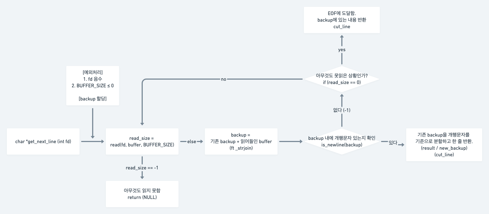
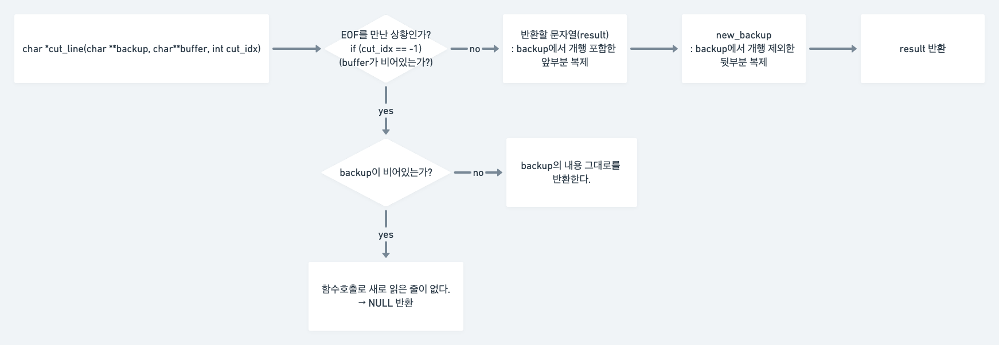
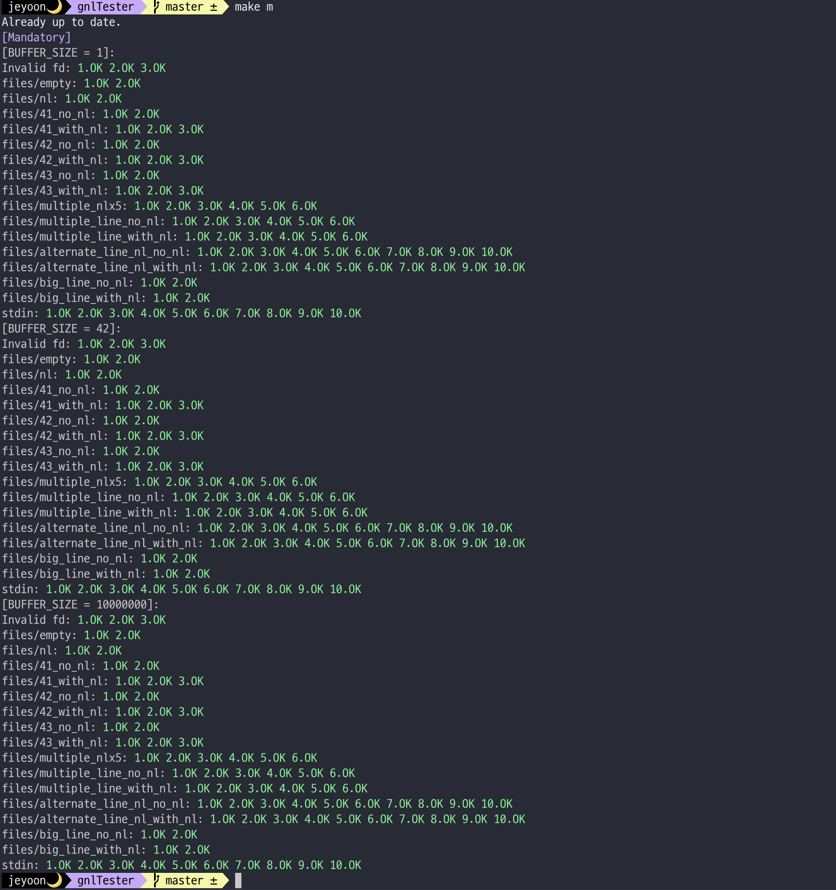

## 🚀 서브젝트 이해하기 (Mandatory)
매 호출마다 파일에서 "한 줄"을 읽어서 반환하는 함수를 구현합시다.
```C
char *get_next_line(int fd);
```
### ✨ 반환값에 대하여
- 정상적으로 읽었을 경우엔 그 읽은 문자열을 반환한다.
- 아무것도 읽지 않았거나 에러가 발생한 경우에는 `NULL`을 반환한다.

### ✨ 주의해야 하는 부분
- 빈 파일을 읽게 되는 경우 -> 아무것도 읽지 않았음에 해당하므로 `NULL`을 반환해야 한다.
- 매 함수 호출마다 최대한 적게 `read`를 호출해야 한다.
- 읽어들인 라인에 개행문자가 있는 경우에는 반환값에 개행문자가 포함되어야 한다. 하지만 파일의 끝을 만나서 개행문자가 없을 때 반환을 해야 하는 경우에는 개행문자를 포함하지 않는다.

## 🚀 관련 개념 공부하기
### ✨ static 변수
서브젝트에 따르면 global 변수를 사용하면 안된다. 하지만 우리는 여러번의 `get_next_line` 함수 호출간에 공유되는 하나의 변수를 사용해야 할 필요가 있다. (`lseek` 함수 사용이 불가능하기 때문에) 서브젝트를 찬찬히 보다보면 눈치챌 수 있겠지만 static 변수를 사용하면 된다.

static 변수는 프로그램의 시작에 할당되어서 (초기화하지 않으면 0 값으로 초기화된다.) 프로그램이 끝날 때까지 유지되는 변수이다. global 변수와 비슷해보이는데 global 변수는 해당 소스파일 전체에서 사용할 수 있는 변수라면 static 변수는 어디에 선언하느냐에 따라서 함수 스코프 내부에서만 참조할 수 있게 할 수 있다.

참고한 글 : https://code4human.tistory.com/128

### ✨ 댕글링 포인터
댕글링 포인터란 이미 해제된 메모리공간을 가리키고 있는 포인터를 말한다. 예를 들면
```C
char *pointer;

pointer = (char *)malloc(100);
free(pointer);
```
이런 경우에 pointer는 이미 해제된 공간을 가리키고 있어서 댕글링포인터가 된다는 것이다.

이런 댕글링포인터의 문제는 접근하게 되었을 때 예상치못한 결과가 나온다는 것이고, 대부분의 경우에는 segmentation fault가 발생한다.

해결방법은 간단한데
```C
char *pointer;

pointer = (char *)malloc(100);
free(pointer);
pointer = 0;
```
이런 식으로 메모리를 해제한 다음에 0(`NULL`)으로 설정해주면 이 포인터가 더 이상 이미 해제된 메모리공간을 가리키고 있지 않기 때문에 다시 접근을 하더라도 문제가 발생하지 않는다.

사실 다른 과제들에서는 그렇게 신경을 썼던 부분은 아닌데 이번 과제에서는 `backup`같은 같은 포인터 변수를 갖고 할당과 해제를 반복하다보니 댕글링포인터가 발생했던 것 같다.
### ✨ read 함수의 반환값에 대하여
read 함수의 반환값을 잘못 알고 있었어서 다시 공부했다.
```C
ssize_t read(int fd, void buffer, size_t nbytes);
```
**반환값**
- -1: 오류가 생겨서 읽지 못했을 경우
- 0: EOF를 만난 경우
- 읽어들인 바이트 수: 읽었을 경우

1. 파일의 전체 크기 < n bytes 가 되어 읽긴 읽었는데 EOF에 도달한 경우, 0을 반환하는것이 아니라 읽어들인 바이트 수를 반환한다.
2. EOF를 만나 0을 반환한 이후에 다시 read 함수를 호출하면 계속 0을 반환한다.

이 두가지를 모르고 있었어서 삽질을 좀 오래했다.
## 🚀 고민한 내용
### ✨ fd의 최댓값에 대하여
만약에 보너스까지 하게 되면 `OPEN_MAX` 에 대해서 디펜스 하기가 조금 난감할수도 있으므로 링크드리스트를 사용해서 좀 더 확실하게 하는 것이 맞는 것 같다.

하지만 나는 보너스를 하지 않으므로 fd값의 최댓값에 대해서 좀 고민을 해봤다.

일단 서브젝트에 명시되어 있듯이 매 `get_next_line` 함수의 호출에서 가능한 `read` 함수를 적게 사용하라고 했기 때문에 가능하면 `read`가 호출되기 전에 에러처리를 하는 것이 좋을 것이다.

_You should try to read as little as possible each time get_next_line is called. If you encounter a newline, you have to return the current line. Don’t read the whole file and then process each line._

fd는 음이 아닌 양수로 정의되어 있다. [https://en.wikipedia.org/wiki/File_descriptor](https://en.wikipedia.org/wiki/File_descriptor) 음수인 경우는 값이 없거나 혹은 error condition을 가리키는 것으로 예약되어 있다고 한다. 결론적으론 `read`함수의 fd 파라미터에 0보다 작은 음수를 넣으면 무조건적으로 에러가 난다는 뜻이므로 걸러내는 게 맞다고 생각하여 `fd < 0`일 경우에는 `read` 함수를 호출하지 않고 무조건 `NULL`을 반환하도록 했다.

그러면 최댓값이 문제인데, 보너스를 하시는 분들은 일단 `OPEN_MAX`를 기본적인 fd 값의 최댓값으로 생각하고 계신 것 같다. 그래서 나도 `OPEN_MAX`를 사용해서 이 값 이상의 경우에는 `read`를 하지 않도록 하기로 했었다.

하지만 `OPEN_MAX`를 변경할 수 있는 등 `OPEN_MAX`값을 fd의 최대로 설정하기에 타당하지 않은 근거들이 좀 있어서 대부분 보너스를 하시는 분들은 링크드 리스트를 사용하신다. 그럼 나는?

```c
ssize_t read(int, void *, size_t)
```

일단 `read` 함수의 원형에서도 알 수 있듯이 fd 값에는 int가 들어간다. 그래서 int의 최댓값으로 걸러줘야 하나? 하고 생각을 했었는데, 좀 더 생각해보니 굳이 필요 없는 작업이라는 생각이 들었다. 일단 이 함수의 사용 용도가 열린 파일에서 한 줄을 읽기 위한 것이다. 그러니까 fd 값은 어쨌든 `open` 함수의 반환값이 될 것인데, file open에 문제가 생겨서 반환되는 -1만 아니면 내 선에서 처리해 줄 에러는 없을 것 같았다.

그러니까, `open`의 반환값이 `OPEN_MAX` 이상이 된다 하면, 걍 읽으면 되는 것이다. 내가 굳이 굳이 `OPEN_MAX`로 최댓값을 한정해 줄 필요가 없다는 것을 깨달았다. 그래도 혹시 예상치 못한 오류가 생길까 해서 [https://code4human.tistory.com/123](https://code4human.tistory.com/123) 이 블로그를 참고해서 내 개인 맥의 `OPEN_MAX` 값을 확인해보았고, 그 값 이상의 fd 값을 넣어서 `read`를 호출해 봤더니

```c
# include <unistd.h>
# include <stdlib.h>
# include <stdio.h>

int main(){
    int max_fd;
    ssize_t read_size;
    char *temp;

    max_fd = sysconf(_SC_OPEN_MAX);
    printf("max_fd: %d\n", max_fd);
    
    temp = (char *)malloc(1000);
    read_size = read(99999, temp, 100);
    printf("read_size of fd = 99999 : %zd\n", read_size);
    
    return (0);
}

/* 출력 결과 */
max_fd: 10496
read_size of fd = 99999 : -1
```

이런 결과가 나와서 `read`함수에서는 가능한 fd 값 이상이 인자로 들어오더라도 에러를 발생시키지 않고 그냥 -1을 반환함으로써 에러 발생을 알린다는 것을 확인했다.

결론적으로는 굳이 애매한 범위를 설정해서 열릴 것도 안열리게 하는 것 보다는 그냥 최댓값에 대한 경우에는 `read` 함수에게 맡기는 것이 좋겠다는 것이 나의 생각.

그래서 fd의 범위에 대한 예외처리는 음수인 경우만 해 주었다.

## 🚀 구현하기
전체 코드는 [github](https://github.com/yoouyeon/42Cursus/tree/main/get_next_line) 참고
### ✨ get_next_line


fd가 음수거나, `BUFFER_SIZE`가 0 이하면 `read`를 호출하더라도 유의미한 결과가 나오지 않을 것이기 때문에 미리 예외처리를 해 주었다.

이 외의 경우에는 일단 `read`를 해 주고, 읽어들인 내용이 있다면 `ft_strjoin`을 이용해서 `backup`에 덧붙여주었다.

다음 `backup` 내에서 개행 여부를 앞에서부터 확인한다. 만약 개행문자가 있으면 그 앞부분을 함수의 반환값으로 반환하고, 그 뒷부분을 다시 `backup`으로 저장해주면 된다.

`backup` 내에 개행문자가 없다 하더라도 `read`의 반환값이 0이라면 더 이상 읽을수가 없으므로 개행이 없는 채로 지금까지 읽어들인 것들을 반환해주어야 한다.

이 두가지 경우는 `cut_line` 함수 내부에서 구분해서 처리해 줄 것이므로 일단 유의미한 문자열을 반환해야 하는 상황이 오면 `cut_line` 함수를 호출해 주었다.

만약 `backup`에 개행문자가 없고, `read` 함수의 반환값도 -1 또는 0이 아닐 경우에는 다시 돌아가서 read를 호출해주면 된다.

### ✨ cut_line


개행문자의 인덱스를 찾아서 반환해주는 `is_newline` 함수는 개행문자를 찾지 못했을 때 -1을 반환한다. `is_newline` 함수의 반환값을 그대로 `cut_line`의 `cut_idx`로 전달하는 방식이기 때문에 `backup`에 개행문자가 없음은 전달된 `cut_idx` 변수가 -1인지를 확인해서 알 수 있다.

앞서 말한 `read`함수의 반환값에서도 알 수 있듯이 `read` 함수의 반환값이 0이라는 것은 EOF에 도달했다는 것 이전에 아무것도 읽지 않았다는 것을 의미한다. 나는 `cut_line` 함수를 `backup` 내에 개행문자가 없고, `read_size == 0`인 경우에 호출하므로 읽어들인 내용, 즉 `buffer`가 비어있음을 알 수 있다. 따라서 반환 결과는 `backup`의 내용에 따라서 달라진다.

`backup` 또한 비어있으면 결론적으로 `get_next_line` 함수를 호출해서 새로 읽은 줄이 없다는 뜻이므로 `NULL`을 반환해야 한다. 그리고 `backup` 내에 무언가가 있다면 그 내용 그대로를 반환하면 된다.

EOF에 도달하여 반환하는 경우가 아니면 `backup`내에는 개행문자가 있고, 그 개행문자를 기준으로 앞 부분은 함수의 반환값으로, 뒷쪽은 새로운 `backup`으로 할당해주면 된다.

### ✨ 그 외의 함수들
#### is_newline
파라미터로 전달된 문자열에 개행문자가 있는지 확인하고, 개행문자가 있으면 그 위치에 해당하는 인덱스를, 없으면 -1을 반환한다.
#### mem_free
할당되어있는 메모리들을 모두 해제하고 `NULL`을 반환하는 함수
`backup`과 `buffer`를 모두 해제해야 하는 상황 (에러발생, EOF 도달함 등)에 호출한다.
#### ft_strlen, ft_strjoin, ft_strlcpy
문자열들을 조작해주기 위해서 사용한 함수들이고 libft에서 작성했던 함수들을 그대로 갖고 왔다.
조금 달라진 함수는 `ft_strjoin`인데 `get_next_line` 내에서
```c
backup = ft_strjoin(backup, buffer);
```
이런 식으로 호출되기 때문에 첫번째 파라미터를 메모리 해제해 주어야 leak이 발생하지 않는다!!
#### ft_strndup
역시 libft의 `ft_strdup` 함수와 틀은 같은데 달라진 부분은 모두 복제하는 것이 아니라 일부 (n 바이트)만 복제한다는 것이다. 
굳이 수정한 이유는 이런 방식으로 하면 메모리 할당 부분 라인수를 좀 아낄 수 있다,,,

만약 함수 라인 수가 부담이 없다면 그냥 `malloc` 후 `ft_strlcpy`를 사용해도 똑같은 결과가 나올 것이다. 

---

개강이랑 norm 변경, 서브젝트 변경 등 이런저런 일이 많이 겹쳐서 gnl을 거의 5달을 붙들고 있었다. 게다가 내가 가장 취약한 메모리 에러가 너무너무너무 많이 나서 디버깅도 굉장히 힘들었다..ㅎㅎ 그래서 테스터 돌려서 올 그린 나왔을때 솔직히 감격했다. 빨리 다음 과제도 끝내야지 

