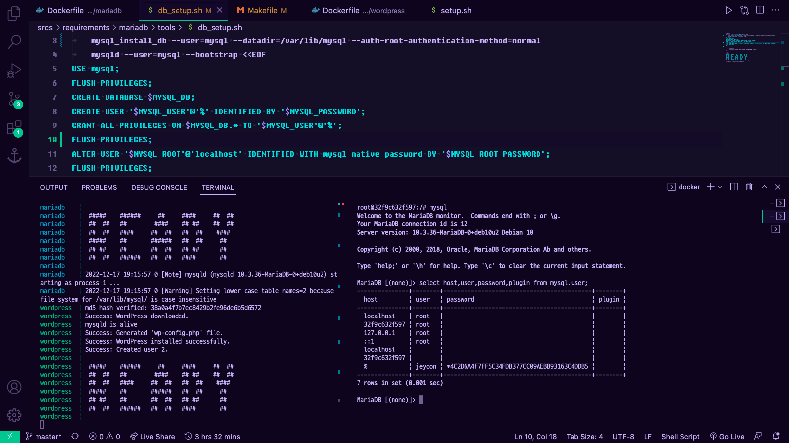
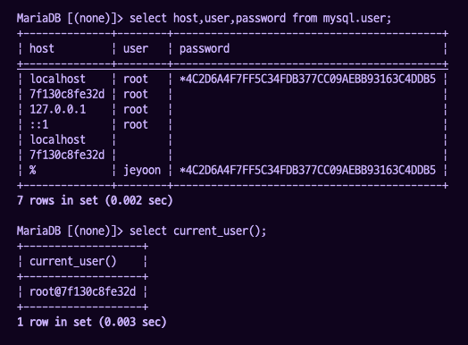
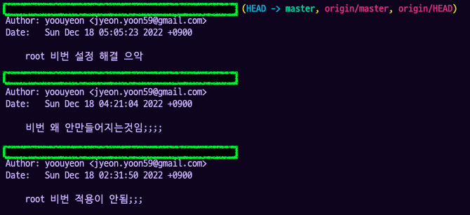

~~너무힘들다 피곤해서 그냥 손가락 가는대로 쓰는 중이라 글이 엉망일 것으로 예상됨~~

## 🌟 wordpress와 mariadb 사이의 의존성

### ✨ depends_on

https://docs.docker.com/compose/compose-file/compose-file-v3/#depends_on

depends_on의 값으로 적힌 서비스가 시작한 뒤에 시작하는 방식으로 동작한다.

중요한것은 시작 순서만 보장하고 완료 순서는 보장하지 않는다는 것이다.

따라서 완료 시점을 보장해야 할 경우에는 따로 의존하는 컨테이너의 동작을 확인해야 한다.

공식문서에 순서를 보장할 수 있는 방법이 소개되어 있는데 (참고 : https://docs.docker.com/compose/startup-order/) 나는 스크립트를 이용한 방식을 사용하기로 했다.

### ✨ mysqladmin

저번에 이 관리자 유틸리티에 대해서 공부할 때 필요성에 대해서 알아봐야 겠다고 했었는데... 필요했다 (ㅎㅎ)

참고 : https://m.blog.naver.com/yswon72/56986888

Mysqladmin 명령에 ping 명령어를 사용하면 mysql이 살아있는지 여부를 알 수 있다.

Wordpress 설정을 위해서는 반드시 mysql 데몬이 살아있어야 하므로 조건을 달아서 데몬이 시작하기만을 기다리게 할 수 있었다.

```bash
until mysqladmin -h $MYSQL_HOST -u $MYSQL_USER --password=$MYSQL_PASSWORD ping 2> /dev/null ; do
	echo "MariaDB is not ready...."
	sleep 1
done
```

### ✨ 꼼수..?

Wp 파일을 다운받는데 걸리는 시간이 상당하다

따라서 wp core download 명령을 dockerfile이 아닌 script 파일로 옮겨주었더니 아주 무난하게 의존성 문제는 해결되었다.

## 🌟 mysql root 계정 접속

저번에 공부했었는데, mysql의 최신버전은 socket 인증 방식을 사용해서 (시스템의) root 계정으로 실행한 mysql은 별도의 인증 과정을 거치지 않는다고 했었다.

그래서 root 계정에서도 비밀번호를 요구하기 위해서는 인증 방식을 바꿔줘야 하는데, 여러 방법이 있지만 그 중에서도 mysql_install_db 를 사용하는 방법이 있었다.

```bash
mysql_install_db --auth-root-authentication-method=normal
```

이렇게 설정해주면 이렇게 생성된 mysql에 접속할때에는 root계정으로 접속했더라도 비밀번호를 요구해야 할 것 같은데... 안됨.



예전 인증 방식인 비밀번호를 사용해서 인증하게 되면 플러그인 부분에 mysql_native_password 이 적혀있어야 하는데 안뜸..

~~무엇보다 문제는 root 계정 비밀번호가 설정되지 않음 텅빈 password (대박사건대박큰문제)~~

방금 해결했는데 문제는 `WITH mysql_native_password` 구문이었다. (어째서...?)

```mysql
# 이거 아님
ALTER USER '$MYSQL_ROOT'@'localhost' IDENTIFIED WITH mysql_native_password BY '$MYSQL_ROOT_PASSWORD';
# 이거 맞음
ALTER USER '$MYSQL_ROOT'@'localhost' IDENTIFIED BY '$MYSQL_ROOT_PASSWORD';
```



기본적으로 mysql을 쳤을 때 접속되는 유저는 root@[컨테이너아이디] 였다. 설정에서 host가 localhost인 root 계정에만 비밀번호를 걸어줬기 때문에 그냥 mysql을 쳤을 때에는 시스템 root 계정의 권한으로 일단 접속을 시켜 준 것이었다.

-h 옵션을 줘서 localhost의 root 계정으로 접속을 시도했을때에는 비밀번호를 요구하고, 틀렸을 경우에는 접속을 제한하는 것을 확인했다.

root 접속의 모든 경우에서 비밀번호를 요구하려면

```mysql
ALTER USER '$MYSQL_ROOT'@'%' IDENTIFIED BY '$MYSQL_ROOT_PASSWORD';
```

이런 식으로 해 주면 될 것 같긴 한데, 문제는 그럼 외부접속도 가능해지기 때문에 어디에 중점을 두느냐에 따라 판단하면 될 것 같다.... 나는 일단 그냥 localhost에만 비밀번호를 걸어주는 것으로 생각하고 있다.

.... 뭐지 원래 미해결이었는데 적다보니까 답을 찾았다 😆

## 🌟 끝



뭔가 허무한데... 두시간 반동안 고생많았습니다.
