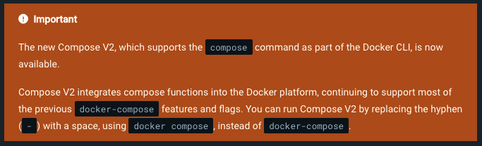
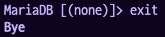

## 🌟 요약

아래 내용들이 너무 의식의 흐름으로 적혀 있어서 깔끔하게 정리한 내용을 위로 올렸다.

### ✨ docker-compose와 docker compose의 차이

참고 : https://docs.docker.com/compose/reference/

새로운 Compose V2는 Docker CLI의 `compose` 명령으로 속해 있다.

`compose` 명령은 기존 `docker-compose`의 특징과 옵션을 거의 모두 지원하기 때문에 비슷하게 사용하면 된다.

이건 뇌피셜이지만 `docker-compose`는 이전버전, `docker compose`는 새로운 버전의 Compose를 실행할 수 있게 되는 것 같다.

### ✨ docker 설치의 여러 방법

```shell
apt-get update && apt-get -y upgrade
apt-get install -y docker
```

```shell
curl -fsSL <https://get.docker.com> -o get-docker.sh
# DRY_RUN=1 라인은 옵션임 (테스트 실행, 스크립트 실행 단계를 미리 볼 수 있다.)
DRY_RUN=1 sudo sh ./get-docker.sh
sudo sh get-docker.sh
```

### ✨ docker compose up 옵션

- `-d` : Detached mode: Run containers in the background / 백그라운드에서 실행
- `-build` : Build images before starting containers / 이미지도 빌드
- `-no-build` : Don't build an image, even if it's missing. / 이미지가 없어도 빌드하지 않는다.

### ✨ MariaDB 관련 내용들

- mysql 설치는 `/var/lib/mysql` 여기에 되어 있었다.

  데이터베이스가 생성되면 이곳을 루트로 해서 관련된 내용들을 담는 디렉토리가 생성되었다.

- `IF NOT EXISTS` 옵션

  - DB를 생성할때나 USER를 생성할 때 기존에 같은 이름으로 생성된 내용이 있다면 error를 띄운다.
  - `IF NOT EXISTS` 옵션을 붙여주면 존재하지 않을 경우를 조건으로 걸 수 있어서 기존에 같은 이름이 있을 경우에도 error가 아닌 warning으로 처리가 된다.

- 예고편 (이자 todo)

  - **`mysql_install_db`**
  - **`mysqladmin`**

## 🌟 시작

삽질 기록을 중구난방으로 정리해두니 이걸 정리했는지 안했는지, 이걸 한건지 안한건지 머릿속에서 뒤죽박죽이 되어서 일단 퇴고없이 여기에 정리해두기로 했다.

사실 이러려고 따로 블로그 만든건데 이것도 블로그라고 계속 퇴고의 퇴고를 반복하다보니 안올리고 미루고미루고미루고미루더라…

## 🌟 docker-compose와 docker compose의 차이

저번 버전 서브젝트에는 `docker-compose`를 사용하라고 되어 있었는데 지금 서브젝트에는 `docker compose`를 사용하라고 되어 있다.

잠깐 찾아봤을 때에는 단순히 `docker compose`가 `docker-compose`로 alias 되어 있는 것이라고 생각했었는데, 이번에 환경 세팅을 다시 하면서 보니 docker의 최신 버전에 Compose가 들어 있어서 `docker-compose`를 쓰지 않고 `docker compose`를 사용할 수 있는 것이었다. (실제로 그냥 `apt-get`으로 도커를 설치했을때에는 `docker compose` 명령을 찾지 못했다. (이것도 왜 안되었는지 의문….))

다시 보니까 애초에 docker docs에 주황박스로 중요 공지가 되어 있었다.

https://docs.docker.com/compose/reference/



서브젝트에서 바꾸기를 요구한 이유는 Compose의 최신 버전을 사용하기 위함이었던 것 같다.

최신 Compose V2는 `compose` 커맨드로 도커의 일부로 포함되어 있기 때문에, docker의 `compose` 커맨드로 Compose V2를 사용할 수 있다. (기존 `docker-compose`의 특성과 옵션 대부분 지원)

이건 뇌피셜이긴 하지만 `docker-compose`는 구버전을 의미하고 있는게 아닐까… 그래서 최신 버전을 사용하는 것을 서브젝트는 원한게 아닐까…

## 🌟 docker 설치하기

`apt-get`으로는 원하는 버전을 설치하는 방법을 모르겠어서 설치 스크립트를 사용하기로 했다.

이것도 버전을 선택할 수 있을지는 잘 모르겠는데… 모르겠다. 요즘 걍 아무것도 모르겠음;

https://docs.docker.com/engine/install/debian/

```
curl -fsSL <https://get.docker.com> -o get-docker.sh
DRY_RUN=1 sudo sh ./get-docker.sh
sudo sh get-docker.sh
```

`DRY_RUN=1` : 스크립트가 실행할 단계를 먼저 확인해 볼 수 있는 옵션

```
$ docker --version
Docker version 20.10.21
```

## 🌟 docker compose hangs on Attaching to

저번에 다 해 두었던 nginx 세팅을 올리고 돌려봤는데

```
[+] Running 1/1
 ⠿ Container nginx  Recreated																		0.1s
Attaching to nginx
```

여기서 멈추어서 더이상 진전이 안되었다.

https://beeodoc.tistory.com/27

이 블로그에서처럼 마지막에 `-d` 옵션을 넣어주면 해결된다. (분명히 비슷한걸 예전에 했었는데..? 또 이렇게 기억을 못한다.)

`-d` : 백그라운드에서 실행한다는 뜻

(참고) : `-build` : 이미지도 빌드한다는 뜻. `—no-build` 옵션은 이미지를 빌드하지 않는다.

여기까지 하고 예전에 해 두었던 nginx를 돌려보니 일단 깡통 nginx (나중에 php-fpm 관련 설정도 추가로 해 줘야 하는 것으로 알고있음… 🫠) 는 잘 돌아가는 것 같다. curl 통해서 일반 http로 접속하니 접속도 막아줌 굿~!

## 🌟 mariaDB setup

저번 글에서 DB 셋업은 sql 파일로 바로 리다이렉트해서 입력해주겠다 했었는데 조금 보니까 그렇게 해 주면 또 스크립트를 써서 이런저런 설정을 해야 하는 것 같아서 (일단 이 글을 쓰는 시점에서는 정확히 뭘 설정해줘야하는진 잘 모르겠음.. 암튼 뭔가 추가 작업이 필요함) 그냥 다시 마지막 ENTRYPOINT로 셋업 스크립트 파일을 실행시키는 방식으로 변경했다.

사실 저번 글에서 셋업을 다 하고 에러만 좀 잡으면 되겠다 생각했는데 아무것도 잘 된게 없었다 🫠

그래서 처음부터 다시 봄.

### ✨ MariaDB 설치와 설정

(일단 손으로 직접 설정해봅니다.)

```bash
apt-get update && apt-get -y upgrade
apt-get install -y mariadb-server mariadb-client
```

설치된 경로 : `/var/lib/mysql`

```
root:/var/lib/mysql# ls
aria_log.00000001  debian-10.3.flag  ib_logfile0  ibdata1  mysql_upgrade_info
aria_log_control   ib_buffer_pool    ib_logfile1  mysql    performance_schema
```

DB를 임의로 만들어서 다시 확인해보니

```
root:/var/lib/mysql# ls -al
total 122956
drwxr-xr-x 5 mysql mysql     4096 Dec 10 14:41 .
drwxr-xr-x 1 root  root      4096 Dec 10 14:38 ..
-rw-rw---- 1 mysql mysql    16384 Dec 10 14:25 aria_log.00000001
-rw-rw---- 1 mysql mysql       52 Dec 10 14:25 aria_log_control
-rw-r--r-- 1 root  root         0 Dec 10 14:25 debian-10.3.flag
-rw-rw---- 1 mysql mysql      972 Dec 10 14:25 ib_buffer_pool
-rw-rw---- 1 mysql mysql 50331648 Dec 10 14:40 ib_logfile0
-rw-rw---- 1 mysql mysql 50331648 Dec 10 14:25 ib_logfile1
-rw-rw---- 1 mysql mysql 12582912 Dec 10 14:25 ibdata1
-rw-rw---- 1 mysql mysql 12582912 Dec 10 14:40 ibtmp1
-rw-rw---- 1 mysql mysql        0 Dec 10 14:40 multi-master.info
drwx------ 2 mysql mysql     4096 Dec 10 14:25 mysql
-rw-r--r-- 1 root  root        15 Dec 10 14:25 mysql_upgrade_info
drwx------ 2 mysql mysql     4096 Dec 10 14:25 performance_schema
-rw-rw---- 1 mysql mysql    24576 Dec 10 14:40 tc.log
drwx------ 2 mysql mysql     4096 Dec 10 14:41 testdb // 이거!
```

이렇게 이 폴더 하위에 DB 이름으로 디렉토리가 생성되어 있더라.

중복된 데이터베이스를 만드려고 시도하면 이렇게 에러가 나기 때문에 확인 작업을 거쳐 주는게 좋을 것 같다.

```
MariaDB [(none)]> CREATE DATABASE testdb;
ERROR 1007 (HY000): Can't create database 'testdb'; database exists
```

(추가) `IF NOT EXISTS` 옵션을 넣어주면 warning만 주고 정상작동되는 것 같다. 이렇게하면 되겠다! (유저에도 동일하게 동작함.)

```
MariaDB [(none)]> CREATE DATABASE IF NOT EXISTS testdb;
Query OK, 0 rows affected, 1 warning (0.000 sec)

MariaDB [(none)]> CREATE USER 'newbie'@'%' IDENTIFIED BY 'passwd';
Query OK, 0 rows affected (0.002 sec)
MariaDB [(none)]> CREATE USER 'newbie'@'%' IDENTIFIED BY 'passwd';
ERROR 1396 (HY000): Operation CREATE USER failed for 'newbie'@'%'
MariaDB [(none)]> CREATE USER IF NOT EXISTS 'newbie'@'%' IDENTIFIED BY 'passwd';
Query OK, 0 rows affected, 1 warning (0.000 sec)
```

## 🌟 좀 더 찾아봐야 하는 키워드

- **`mysql_install_db`**
- **`mysqladmin`**

위 내용 참고 : https://epicarts.tistory.com/159

## 🌟 끝



나갈때마다 인사해주는데 왜 접속할때는 인사를 안해줄까… 아쉽다.
