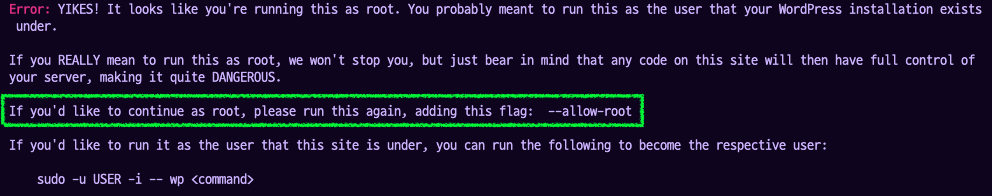
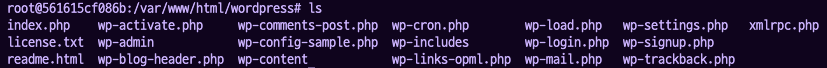

## 🌟 PHP 설정

아래의 WP-CLI 커맨드들을 먼저 보고 테스트해보려고 했는데 php 가 설치되어 있지 않아서 문제가 발생했다..

어차피 Wordpress 컨테이너에 php도 함께 설치해줘야 하는 것이 맞으므로 앞 순서로 당겼다.

PHP 8 버전은 wp-cli와 호환되지 않는다는 이슈가 있다(https://github.com/wp-cli/wp-cli/issues/5452). 그래서 7 버전을 써야 함.

그냥 `apt-get install php-fpm`을 실행하면 php7.3-fpm을 설치해준다. 버전을 명시하는게 좋으므로 직접 php7.3-fpm을 설치해줬다. (의존성이 있는 패키지들은 알아서 설치해주므로 굳이 내가 설치해 줄 필요는 없을 것 같다.)

(추가) 아래에서 `wp core install` 명령에서 php.mysql을 요구해서 설치해줌

```bash
apt-get install -y php7.3-fpm php7.3-mysql
```

## 🌟WP-CLI Commands

### ✨ Wordpress 설치 : **`wp core <command>`**

https://developer.wordpress.org/cli/commands/core/

- `wp core download`

  - https://developer.wordpress.org/cli/commands/core/download/
  - wordpress 파일을 다운로드함.
  - 경로를 지정하지 않았다면 현재 경로를 사용하여 다운로드 한다.
  - **`[--path=<path>]`** : 설치할 경로를 지정할 수 있다.
  - **`[--locale=<locale>]`** : 설치 언어를 지정할 수 있다.
  - **`[--version=<version>]`** : 설치 버전을 지정할 수 있다.

- `wp core install`

  - https://developer.wordpress.org/cli/commands/core/install/
  - 새로운 Wordpress table을 데이터베이스에 만든다.
  - 만드는데 필요한 정보는 옵션으로 넣어줄 수 있다. (URL, default admin user 등)
  - **`--url=<url>`** : 새로운 사이트의 주소
  - **`--title=<site-title>`** : 새로운 사이트의 제목
  - **`--admin_user=<username>`** : 관리자 유저의 이름
  - **`[--admin_password=<password>]`** : 관리자 유저의 pw. 설정해주지 않으면 랜덤으로 생성된 문자열이 설정된다.
  - **`--admin_email=<email>`** : 관리자 유저의 이메일
  - **`[--skip-email]`** : 새로운 관리자 유저에게 이메일 알림을 보내지 않는 옵션

- wp core is-installed

  - Wordpress가 설치되었는지 확인함.

  - 이런 식으로 스크립트에서 활용 가능!!!

    ```bash
    # Check whether WordPress is installed; exit status 0 if installed, otherwise 1
    $ wp core is-installed
    $ echo $?
    1
    
    # Bash script for checking whether WordPress is installed or not
    if ! wp core is-installed; then
        wp core install
    fi
    ```

### ✨ wp-config.php 파일 관리 : **`wp config <command>`**

여기선 생성만 합니다.

- `wp config create`

  - 새로운 `wp-config.php` 파일을 만든다. (db 상수(?)들이 올바른지도 확인할 수 있다고 함.)

  - **`--dbname=<dbname>`** : database name

  - **`--dbuser=<dbuser>`** : database user

  - **`[--dbpass=<dbpass>]`** : database user password

  - **`[--dbhost=<dbhost>]`** : database user host (default : localhost)\

    - https://www.inflearn.com/questions/343997/wordpress-db-host-mysql-질문
    - dbhost의 의미를 잘 모르겠어서 찾아봄.
    - dbhost의 값으로 접속했을 때 그 데이터베이스로 접속할 수 있게 하는 것이다.

  - 이렇게 넣어준 값들은 이렇게 wp-config.php 파일에 적히게 된다.

    ```php
    // ** Database settings - You can get this info from your web host ** //
    /** The name of the database for WordPress */
    define( 'DB_NAME', '뫄뫄' );
    /** Database username */
    define( 'DB_USER', '솨솨' );
    /** Database password */
    define( 'DB_PASSWORD', '랄랄라' );
    /** Database hostname */
    define( 'DB_HOST', '뿅뿅뿅' );
    ```

### ✨ WP-CLI 사용하기



다운로드를 위해서 `wp` 명령어를 사용했더니 `--allow-root` 플래그를 사용하라는 안내가 떴다. 컨테이너 내의 사용자를… 변경해 줄 필요는 없을 것 같아서 경고가 뜨면 `--allow-root` 플래그를 넣어 주었다.

```bash
# 기본 - root 계정에서는 실행이 되지 않는다.
# wp core download
# 명령어를 실행하는 위치에 파일 다운로드
# wp core download --allow-root
# 파일 다운로드할 디렉토리 설정 (폴더가 없으므로 만들어줘야 한다.)
	# mkdir - 이미 존재하고 있으면 만들지 않는다.
	# -p : 부모 폴더도 만들어준다.
mkdir -p /var/www/html/wordpress
# 설정한 위치에 다운로드
wp core download --allow-root --path=/var/www/html/wordpress
```

기본적으로 en_US 언어로 설치가 되고, (다른 언어는 `--locale` 옵션으로 지정해 줄 수 있었다.) `--path` 옵션으로 다운로드할 위치를 설정안해뒀더니 명령어를 실행한 루트에 파일이 저장되었다. Wordpress 설치 가이드들을 보면 대부분 설치 파일들을 `/var/www/html/wordpress/` 디렉토리에 위치시키는 것 같아서 나도 그 경로로 위치시켜 주기로 했다.



`wp core install` 전에 `wp-config.php` 파일을 만들어줘야 한다. (에러떠서 알게됨 😅) → `wp config create` 명령으로 만들어주기

```bash
# 여기서 지칭하는 DB는 Wordpress에서 사용할 DB인 MariaDB이므로
# 거기서 사용했던 환경변수들을 이용해주면 되겠다.
# 파일 존재 확인 필요
wp config create --dbname=$MYSQL_DB \
	--dbuser=$MYSQL_USER --dbpass=$MYSQL_PASSWORD \
	--dbhost=$MYSQL_HOST --path=/var/www/html/wordpress --allow-root
```

`⚠️ Error: Unknown MySQL server host` - 문제가 있어서 `--dbhost` 옵션을 빼고 했더니 잘 생성이 되었다. (하지만 들어가는게 맞는 것 같으므로 어떻게 설정을 해야 하는 것인지 찾아봐야 함)

중복해서 생성하려고 시도하면 이미 있다고 에러를 발생시키므로 create 전에 해당 경로에 파일이 있는지 확인해줘야 할 듯 하다.

```bash
# 다운로드한 파일을 갖고 설치해주기
# 인자들은 모두 환경변수로 다루어주자
# --allow-root : root 계정에서 wp를 사용할 수 있게
# This does not seem to be a WordPress installation. Pass --path=`path/to/wordpress`.
# 이런 사유로 --path 추가
wp core install --url=$DOMAIN_NAME --title=$WP_TITLE \
	--admin_user=$WP_ADMIN_USER --admin_password=$WP_ADMIN_PASSWORD \
	--admin_email=$WP_ADMIN_EMAIL --skip-email \
	--path=/var/www/html/wordpress --allow-root
```

`⚠️ Error: Your PHP installation appears to be missing the MySQL extension which is required by WordPress.` - php-mysql을 설치하지 않아서 발생하는 문제라고 함 (참고 : https://ansan-survivor.tistory.com/1064) php-fpm과 동일하게 php7.3-mysql을 설치해주었다.

`⚠️ Error: Cannot select database. The database server could be connected to (which means your username and password is okay) but the mariadb database could not be selected.` - 생각해보니까 당연함… 아까 설정 파일에서 host에서 문제가 생겼던것과 동일한 원인일 것 같다. ⇒ 위의 설정파일의 dbhost의 값에다 mariadb가 설치되어있는 컨테이너의 ip (172.18.0.2) 를 넣어주니 설치까진 잘 된다. (뭘까…)

------

이 이후부터는 Virtual Box에서 해 보는게 나을 것 같아서… 내일의 나에게로 미룹니다. (뭔가 잘될것같기도???!?!?!?!?!?!)
