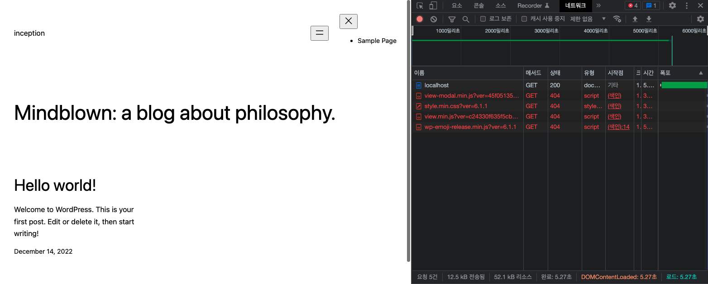

## 🌟 YIL (Yesterday I Learned)

어제 (사실상 그저께) 클러스터 가서 잔뜩 물어보고 왔음,,, (그러고 집에 오니까 너무 힘들어서 뻗어버렸다.)

### ✨ 잘 된다고 생각했는데 잘 안되고 있었던 MariaDB

- `mysqld_safe` 를 사용하면 당연히 안전할거라 생각했는데? 데몬이 자꾸 죽어버리는 문제가 있었다. 당연히 `mysqld_safe`를 사용했으니 죽으면 재시작을 해 주지만, 문제는 1분마다 재시작을 해 준다는 것이었다… 이 문제는 `mysqld`를 사용해서 해결할 수 있었는데, 이런 해결책이 머리로는 납득이 가는데 마음으로는 아직 납득이 안되는 상황이라 더 찾아봐야 할 듯 하다. (분명히 저번에 시도할때는 무한재시작이 안생겼었는데 !! ㅜㅜ (기록도 남아있음))

- 위와 동일한 이유로 데몬에서 자꾸 문제가 발생해서 아예 mysql을 시작하지 않고 바로 입력을 해 주는 방식을 사용해보기로 했고, 성과가 있었다.

  ```bash
  	mysql_install_db --datadir=/var/lib/mysql --user=mysql
  	mysqld --user=mysql --bootstrap <<EOF
  [직접 sql문 입력해주기]
  EOF
  ```

  주말동안 공부했던게 산산조각나는 순간… 근데 이 문제(라기보단 이것도 내가 마음으로 납득이 안되는 상황이라..) 역시 위의 데몬 문제가 해결되면 같이 해결되는 문제라 (기존처럼 mysql을 시작해서 입력해 줄 수 있음) 해결의 여지가 있다. 😜

- `mysqld` 를 root 유저 (그러니까 컨테이너에 속해있는 유저들 중에서 root 유저) 로 실행했을 때 문제가 발생했어서 `-user=mysql` 이 옵션을 넣어서 `mysqld`를 실행하는 유저를 mysql이라는 유저로 설정해주었다.

- `mysqld`를 시작할 때 `/run/mysqld` 폴더를 찾는 문제가 있었다. 그런데 애초에 `/run` 폴더는 존재하지 않고, 그나마 있는 `/var/run` 폴더 안에는 mysql이라는 폴더가 없었기 때문에,,,,,,,,,,, `/run/mysql` 폴더를 만들어 주고 mysql 유저 그룹에 권한을 추가해주었다. 이상한 것은 `/var/run/mysql` 폴더를 사용해도 문제가 발생하지 않았다. 이 폴더의 용도는 무엇일까.. 혼란하다 혼란해

### ✨ Wordpress  무한 재시작 멈추기 😩

- Wordpress 컨테이너를 돌리기 위해서는 `php-fpm7.3` 명령을 실행해야 했었다 (몰랐다) 이 명령은 기본적으로 백그라운드로 실행이 되는데, 도커 컨테이너에서는 백그라운드로 실행되는 프로세스는 실행 상태와 상과없이 종료로 간주하기 때문에 (아닐수도 있음) 백그라운드로 돌아가고 있는 프로세스가 있는 경우에도 컨테이너를 종료시킬 수 있다. 따라서 `php-fpm7.3`을 실행중인 도커가 꺼지지 않게 하기 위해서는 이 프로세스를 포어그라운드로 돌려야 했었고, `exec php-fpm7.3 -F` 이렇게 실행해서 해결할 수 있었다. (포어그라운드, 백그라운드, `exec`에 대해서 전혀 모르므로 공부해야 함)
- Wordpress와 mysql이 연결이 안되는 문제가 있었는데 (`/run` 폴더 하위의 `.sock` 파일을 찾고있었음) 이 문제는 허무하게도… `php-mysql`의 버전 문제였다. (`php7.3-mysql`을 설치했던게 문제였다…..)

## 🌟 nginx와 Wordpress 연결하기

### ✨ nginx configuration

nginx 설정하던 때에 conf 파일을 수정했었는데, 그 conf 파일의 location 블록을 하나 추가해주면 된다.

```
location ~ \\.php {
	fastcgi_split_path_info ^(.+\\.php)(.*)$;
	fastcgi_pass wordpress:9000;
	fastcgi_index index.php;
	include fastcgi_params;
	fastcgi_param SCRIPT_FILENAME $document_root$fastcgi_script_name;
} 
```

### ✨ docker network

컨테이너들을 연결할 수 있는 네트워크를 정의해줘야 한다.

```yaml
services:
  nginx:
    build: requirements/nginx
    container_name: nginx
    ...
    networks:
      - intra

  mariadb:
    build: requirements/mariadb
    container_name: mariadb
    ...
    networks:
      - intra

  wordpress:
    build: requirements/wordpress
    container_name: wordpress
    ...
    networks:
      - intra

networks:
  intra:
```

자세한 설명은 [여기](https://docs.docker.com/network/)서 볼 수 있는데 지금 일단 동작 확인이 너무 급해서… 다 돌려두고 꼼꼼하게 보겠습니다;

기본적으로 network 를 정의하면 driver가 bridge로 설정이 되기 때문에 별다른 추가 설정 없이 정의만 해 줘도 괜찮았다.

모든 컨테이너들이 하나의 네트워크에 연결이 되어야 하므로.. 하나만 정의해줬다.

### ✨ docker volume

연결 뿐 아니라 실제로 공유할 수 있는 공간도 마련해줘야 했다. 이 설정을 볼륨에서 할 수 있다.

,,, 사실 연결만 해 두고 볼륨 설정을 엉망으로 해 뒀더니 그냥 빈 폴더만 생겨버리는 불상사가… 있었다 ㅋㅋㅋ

역시 자세한 설명은 [여기](https://docs.docker.com/compose/compose-file/#volumes)서 볼 수 있고 이번에도 빠른 동작 확인을 위해 일단 넘어가겠습니다…

```yaml
services:
  nginx:
    build: requirements/nginx
    ...
    volumes:
      - wordpress-volume:/var/www/html/wordpress

  mariadb:
    build: requirements/mariadb
    ...
    volumes:
      - database-volume:/var/lib/mysql/

  wordpress:
    build: requirements/wordpress
		...
    volumes:
      - wordpress-volume:/var/www/html/wordpress

volumes:
  wordpress-volume:
    [설정...]
  database-volume:
    [설정...]
```

## 🌟 오류 관련 현황

### ✨ php 유저 그룹 관련 문제 ✅

```
[14-Dec-2022 12:09:42] ERROR: [pool www] cannot get gid for group 'www-data'
[14-Dec-2022 12:09:42] ERROR: FPM initialization failed
```

www-data라는 유저는 있는데 그 그룹에 없어서 발생하는 문제였다.

php 설정 파일인 www.conf 파일을 보면 유저와 그룹 모두 www-data로 기본 설정되어 있으므로 그냥 usermod 명령어로 그룹을 생성해서 추가해주면 문제가 해결되었다.

### ✨ 403 에러 ✅

wordpress에 접속했을 때 403 에러가 종종 떠서 권한 문제인 줄 알고 조금 헤맸는데 알고보니 그냥 파일이 없는 경우에도 **간혹** 403 에러가 떴다. 문제는 404 에러도 잘 난다는 것…

아무튼 이번에 만났던 403 에러의 원인은 index.php 파일이 없어서 생겼던 문제였다. (볼륨 설정 문제였음)

### ✨ php7.3-fpm.pid ✅

```
[14-Dec-2022 12:41:24] ERROR: Unable to create the PID file (/run/php/php7.3-fpm.pid).: No such file or directory (2)
[14-Dec-2022 12:41:24] ERROR: FPM initialization failed
```

`php7.3-fpm` 명령을 실행했을 때 발생했던 문제.

왜인지 모르겠는데 이것도 mysql 때 처럼 단순히 `/run/php` 폴더를 생성해줬더니 문제가 해결되었다. run 폴더가 대체 무슨 폴더인지 너무 궁금하다.

완전 무근본 해결책은 아니고 스택오버플로우 보고 따라한것임. https://stackoverflow.com/questions/45540492/cannot-start-php-because-it-is-unable-to-create-pid-file (근데 여기서도 왜 에 대한 답은 보이지 않는다…)

### ✨ nginx 404 error ❌

wordpress와 nginx 연결이 모두 잘 되었다고 생각했는데 어쩐지 화면이 좀 이상했다. CSS 파일을 포함해서 필요한 파일들이 모두 응답받지 못해서 index.php 자체만 화면에 띄워지고 있었다.



단순히 .php 확장자를 가진 것들에서만 문제가 발생하는 것은 아니고 wp-login.php 파일조차도 리다이렉션을 통하면 접근이 불가능한것을 보면 아무래도 nginx 설정 자체에 뭔가 문제가 있는 듯 한데……………. 아직은 잘 모르겠다.

### ✨ **502 Bad Gateway** ❌

docker compose를 down한 뒤에 빠르게 up을 하면 **간혹** 502 Bad Gateway 에러가 뜬다.

정말 간혹 발생해서 왜인지 잘 모르겠다;;;
