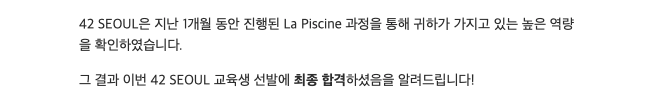

## 🎉 본과정 합격

하하... 다행히 눈물의 후기를 쓰지 않아도 되었다.. 

결론부터 말하자면 합격했다. 4기 본과정이 5월 3일에 시작하는 터라 한 4월 20일 정도에 발표가 나지 않을까? 하고 생각했었는데 예상보다는? 조금 늦게 나와서 한동안은 잊고 있다가 20일 즈음부터는 결과를 좀 기다렸던 것 같다. 슬랙에 갑자기 수고했다는 글이 올라오고, 같이 러쉬했던 팀원 중 한분이 떨어졌다는 소식을 전해주셔서 메일함에 가보니 알림이 씹힌(...) 본과정 합격 메일이 있었다.

합격이란 결과를 받아본지가 너무 오래돼서 합격 발표가 나면 어떤 느낌일지 궁금했었는데 생각보다 덤덤해서 놀랐다. 그냥 와... 이게 되네... 하는 생각밖에 안들었다. 아무튼... 내심 불합격하면 몇 안되는 라피신 불합격 후기를 쓸 수 있게 되지 않을까? 하고 생각하고있었는데... 네 아쉽게도(?) 합격 후기가 되었네요...ㅋㅋㅋ

재빠르게 킥오프 신청(예전에 라피신 신청 후에 했던거랑 비슷한 신청 확인 절차인 것 같다.)을 하고 나서야 조금 실감이 났다. 나 본과정 가는구나...

## 🤷‍♀️ 기준이 뭘까

같이 고생했던 피시너들의 결과도 궁금하긴 했는데 생각해보니까 상대의 결과를 모르는 상태에서 '저 붙었는데 혹시 님 붙었어요?' 이런 느낌으로 물어보기가 되게... 망설여져서 결국 먼저 연락주신 같이 러쉬한 팀원의 결과만 들었다. 그래서 솔직히 말하면 합격 기준... 잘 모르겠습니다.ㅋㅋㅋ 연락주신 분은 레벨의 차이가 아닐까 라고 말씀해주시긴 했는데 (그분의 레벨보다 내 레벨이 높았음) 단순히 레벨로만 선발했을리는 절대 없고 다양한 기준이 있었겠죠? 근데 레벨이 높다는 것은 이것저것 많이 시도를 하고 결과도 어느정도 괜찮게 나왔다는 의미이기 때문에 레벨이 높다고 무조건 합격하는 것은 아니지만 레벨이 낮은데도 합격하신 분들은 다른 부분에서 뭔가 뛰어난 역량을 보여주셨기 때문에 합격하신게 아닐까.. 하는 생각을 한다.

당연한 이야기일수도 있지만 42는 어떤 의미에서 투자를 하는 것이기 때문에 (교육을 하고 지원금을 주고....) 투자 가치가 있는 사람을 본과정으로 선발 할 것이고 어떻게 하면 투자 가치를 보일 수 있을까를 생각하면 대충 어떤 사람을 선발했을지 느낌정도는 오는 것 같다.

그래서 내 생각에는 42의 커리큘럼 하에서 개발자로의 성장 가능성을 보인 사람 + 어느정도 실력이 향상되었거나 실력이 있는 사람을 다양한 척도로 판단하여 선발했을 것 같다. (정말 개인적인 생각입니다... 실력만 있는 사람도 뽑았을지도 몰라요...) 

## 🏃‍♀️ 아무튼...

아무튼 합격을 했고, 한달동안의 노력이 나름 42의 방향에 잘 맞았다는 것을 인정받은 것 같아 기분이 좋다. 그리고 5월, 6월에 엄청 바빠지게 될 것 같아 두려움 반 설레임 반인 심정이다. 지금도 죽어라 바쁜데 졸프, 프로젝트 과제, 본과정, 기말고사... 가 겹치게 생겼네요.. 흑흑 하지만 내가 좋아하는 일로 바쁠 수 있다는 것은 축복이라고 생각하기 때문에 일단은 ... 일단은 행복하게 기다리겠습니다...

저도 여러 후기들을 보고 피신동안의 방향을 잡는데에 많은 도움을 받았었기 때문에 이 글을 읽어주시는 분들 중에 혹시라도 궁금한 점이 있으시다면 댓글 달아주시면 제가 답할 수 있는 범위 내에서는 최대한 답변을 해 드리도록 하겠습니다...

이렇게 라피신 후기를 마치게 되었다. 새삼스럽게 느끼는 거지만 나 정말 글 못쓴다... 정말 얼레벌레 쓴 후기인데 여기까지 읽어주신 분들 정말 수고 많으셨고 감사드립니다....
