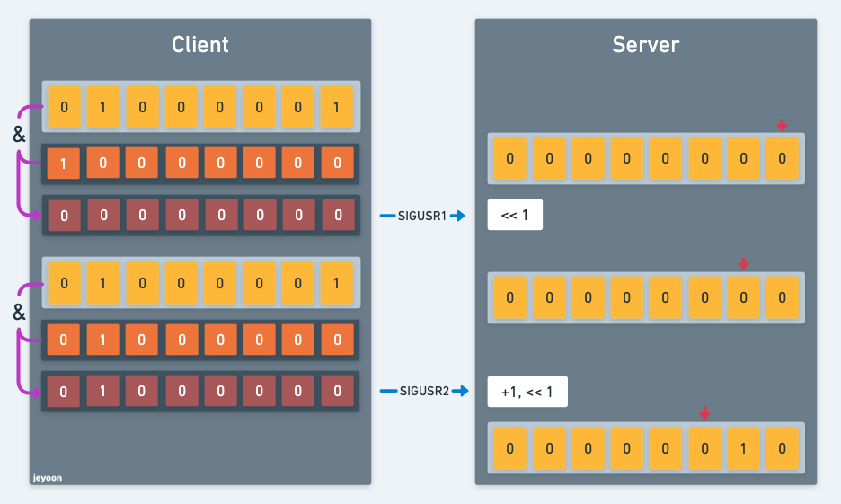

## 🚀 개요

UNIX 시그널을 이용하여 문자열을 송수신하는 두개의 프로그램 만들기.

## 🚀 Mandatory Part 요구사항

1. client와 server 라는 이름을 가진 두 실행파일을 만들기.
2. 최대 1개의 전역변수만 사용하기
3. 사용할 수 있는 UNIX 시그널은 `SIGUSR1`과 `SIGUSR2` 2개 뿐.
4. 빠르게 전송하기 (100글자에 1초는 너무 느리다.)

## 🚀 Mandatory 구현에 사용한 함수

### ✨ Signal 관련

#### kill

```c
#include <signal.h>
int kill(pid_t pid, int sig);
```

매뉴얼 보는 법  `man 2 kill`

`sig`가 의미하는 signal을 `pid`라는 process id를 가진 프로세스로 전송한다.

- `pid` > 0

  `sig`를 `pid`와 동일한 프로세스 id를 가진 프로세스로 전송한다.

- `pid` == 0

  sender와 동일한 process group id를 가진 프로세스에 모두 `sig`를 전송한다. (sender가 전송할 수 있는 권한이 있어야 한다.)

- `pid` == -1

  유저가 super user 권한을 갖고 있을 경우 : 시스템 프로세스와 현재 시그널을 전송하고 있는 프로세스를 제외한 프로세스를 제외한 모든 프로세스에 시그널이 전송된다.

  유저가 super user가 아닐 경우 : 현재 시그널을 전송하고 있는 프로세스를 제외하고 유저와  같은 `uid`를 가진 프로세스 전체에게 시그널을 전송한다. 

  만약 어떤 프로세스에도 시그널을 전송하지 못하더라도 에러는 발생하지 않느다.

- `pid` < -1

  group id가 `pid`의 절댓값과 같은 모든 프로세스에 시그널이 전송된다.

반환값: 성공 시 0, 실패 시 -1

#### signal

```c
#include <signal.h>
 void (*signal(int sig, void (*func)(int));)(int);
```

어떤 프로세스에 시그널이 도착한다면, 프로세스가 할 수 있는 일은 대부분 3가지인데

- 정의되어있는 기본 동작
  - 프로세스 종료
  - 시그널 무시
- 유저가 정의한 action

signal 함수를 이용해서 위의 내용들을 설정하려면 `func` 의 내용을 설정하면 된다.

- 정의되어있는 기본 동작 -> `SIG_DFL`

- 시그널 무시 -> `SIG_IGN`

- 유저가 정의한 action -> `func`에 해당하는 함수 인자로 전달하기

  (함수 프로토타입을 보면 알겠지만 함수를 정의할 때에는` int`형 인자 1개를 갖는 함수로 정의해야 한다.)

action이 성공했을 경우에는 이전 action (아마도 `func`의 함수 포인터인 것 같다.)이 반환된다.

### ✨ Process 관련

#### getpid

```c
#include <unistd.h>
pid_t getpid(void);
```

현재 프로세스의 pid를 반환한다.

항상 성공하기 때문에 error에 대한 반환값은 없다.

`pid_t`는 process id를 나타내기 위한 자료형이고 `<sys/types.h>`에 정의되어 있는데 부호 있는 정수 자료형을 의미한다. (<https://stackoverflow.com/questions/1922761/size-of-pid-t-uid-t-gid-t-on-linux>)

#### exit

```c
#include <stdlib.h>
void exit(int status);
```

매뉴얼 보는 법  `man 3 exit`

프로세스를 종료하는 함수이다.

`status` 값으로 `EXIT_SUCCESS`와 `EXIT_FAILURE`를 가질 수 있는데 각각 0과 1로 정의되어 있다.

## 🚀 문자열 전송 (ASCII)

2개의 시그널을 사용할 수 있기 때문에 클라이언트에서 문자열을 비트 단위로 쪼개서 서버 쪽으로 전송해주면 된다.

말로 설명하는 것 보다는 그림으로 설명하는것이 더 이해가 잘 될 것 같아서 자세한 내용은 그림으로 대신한다.



## 🚀 반성..

클라이언트 실행 시 `pid`와 전송할 문자열을 인자로 넣게 되는데 `pid`에 대한 테스트가 부족하여 평가자가 제시한 테스트케이스에서 예상과 다른 결과가 나오는 문제가 있었다.

이는 pid의 값을 받아올 때 단순히 `ft_atoi`만을 사용했었기 때문인데 좀 더 다양한 케이스들을 검토해봤으면 금방 찾을 수 있는 문제여서 좀 아쉬웠다.