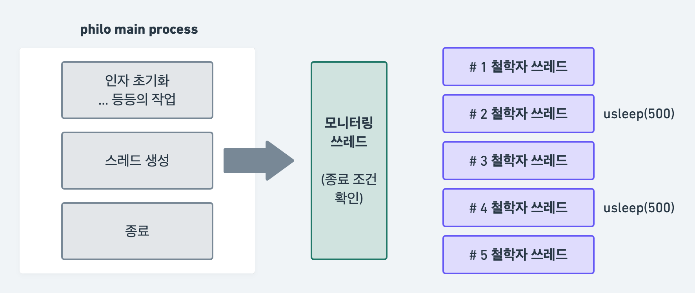

## 🚀 Philosophers

분명히 저번 과제 후기에 블랙홀 코앞에 두고 평가 받지 않겠다고 다짐했었는데... 이렇게 세상이 날 안도와준다... (내 잘못 99%임) 핑계는 치우고, 원래는 평가를 다 받고 과제 정리글을 쓰는 편인데 이번 과제는 내 머릿속이 완전히 뒤죽박죽이 되어버려서 내 생각을 좀 확실하게 정리를 하고 평가를 받아야 ~~1트에~~ 통과를 할 수 있을 것 같아서 먼저 정리를 해 본다. (구현 이후부터는 평가 받고 작성함.)

이 과제는 제목에도 적어 두었듯이 원탁에 둘러앉은 금쪽이 철학자들에게 중간에 있는 스파게티를 싸우지 않게 누구 하나 굶어 죽지 않게 잘 먹이는 과제이다.

쉽게 말했지만 사실 엄청 유명한 문제이다. [식사하는 철학자들 문제 위키백과](https://ko.wikipedia.org/wiki/%EC%8B%9D%EC%82%AC%ED%95%98%EB%8A%94_%EC%B2%A0%ED%95%99%EC%9E%90%EB%93%A4_%EB%AC%B8%EC%A0%9C)

문제를 좀 풀어서 설명하면 아래와 같이 적을 수 있을 것 같다.

> **조건**
>
> - 포크는 철학자의 수 만큼 철학자들이 앉은 사이사이에 놓여져 있다.
> - 스파게티를 덜기 위해서는 왼손과 오른손에 포크를 잡아야 한다.
>
> **교착상태**
>
> 3명의 철학자들이 동시에 먹기 시작할 때, 모든 철학자들이 왼쪽의 포크를 잡게 되면, 1번의 오른쪽 포크는 2번의 왼쪽 포크, 2번의 오른쪽 포크는 3번의 왼쪽 포크, 3번의 오른쪽 포크는 1번의 왼쪽 포크가 되므로 영원히 남은 오른쪽 포크를 잡을 수 없게 되어 결국... 스파게티를 먹지 못해 굶어죽게 된다.

이 문제 상황을 (Mandatory 기준) thread와 mutex로 구현하고, 최대한 교착상태에 빠지지 않게 만들어보는게 이 과제의 목표이다.

## 🚀 Thread와 Mutex

컴공 전공생이라면 운영체제 수업은 반드시 들었을테니 익숙한 개념이긴 한데 실제로 이렇게 돌려볼 경험은 많지 않아서 막상 사용하려니 되게 막막했다.

참고 : https://goodgid.github.io/What-is-Thread/

### ✨ Thread와 Process

과제에서 철학자들 개개인을 스레드로 표현하라고 했다. 그러니까 과제 결과물을 실행시키면 철학자(=스레드)들이 동시에 파바바박 실행이 되는 것이다. ... 뭐 따지고 보면 완전 동시는 아니지만.

스레드는 프로그램, 즉 프로세스 실행의 최소 단위이다. 프로세스가 여러 개의 쓰레드로 구성이 가능하다는 것.

나는 보너스를 하지 않아서 프로세스에 대해서는 깊게 공부하진 않았지만 프로세스는 간단히 말하면 프로그램이 실행을 위해서 운영체제로부터 메모리 공간을 할당받은 것이다. 독립된 메모리 공간을 가지고 있기 때문에 다른 프로세스들끼리 메모리 공간을 공유할 수 없다. 

반면에 스레드는 프로세스에 할당된 메모리를 공유하면서 별도의 스택을 갖는다. 따라서 다른 스레드들 간에 데이터 영역, 힙 영역, 코드 영역은 공유하지만 스택 영역은 공유하지 않는다.

### ✨ Thread Context Switching

우리의 CPU의 개수는 한정되어 있고, CPU 하나는 한번에 한 작업밖에 할 수 없으므로 이 과제처럼 여러개의 스레드를 동시에 돌아가는 것 처럼 보이기 위해서는 CPU가 중간중간 다른 스레드로 옮겨가면서 작업을 해 줘야 한다. 이것을 Context Switching(문맥 교환)이라고 한다.

앞서 말했듯이 스레드는 서로 공유하는 자원이 많기 때문에 문맥 교환이 그렇게 느리거나, 부담스러운 작업이 아니다. 하지만 보너스 과제에서 다루게 될 프로세스의 문맥교환은 오버헤드 발생 가능성이 높고 스레드보다 방법도.. 복잡하지 않을까 싶다.

사실 Mandatory 부분에서 Context Switching 부분은 아주 깊게 고민하진 않았는데 고민한 내용 하나는 뒤에 가서 얘기하겠지만 스레드별로 문맥 교환이 될 "여유"를 만들어줘야 적절하게 스위칭이 된다는 것이었다. 이걸 몰라서 좀 고전을 했던 기억이 있다.

### ✨ Mutex와 Data race

#### Mutex

과제에 나와있기를 포크의 상태를 뮤텍스라는 것으로 보호하라고 되어 있다.

보호해야 하는 이유는 간단하다. 앞서 들었던 예를 다시 이용하면 2번이 왼쪽 포크를 든 상태에서 1번이 동일한 포크인 오른쪽 포크를 들게 된다면 포크가 복제가 되는 아주 큰 문제가 생긴다. 각기 다른 철학자들(스레드들) 사이에서 포크의 상태를 여러 스레드들의 간섭 없이 읽고 변경하기 위해서 뮤텍스를 사용한다.

뮤텍스는 스레드들이 공유하는 코드 영역에서 임계구역(여러 프로세스가 동시에 접근할 수 없는 공유영역)을 설정할 수 있게 해 준다.

```c
#include <pthread.h>

int num = 1;
pthread_mutex_t mutex;

int func(void)
{
  pthread_mutex_lock(&mutex);
  // critical section start!
  ...
  // critical section end!
  pthread_mutex_unlock(mutex);
}
```

이런 식으로 임계구역(critical section)을 설정해주면 어떤 스레드가 임계 구역안에 진입을 하게 되면, unlock되기 전까지 다른 스레드들은 lock에서 대기하고 있게 된다. 그런데 이렇게 대기하고 있는 스레드들이 임계 구역의 lock이 풀렸을 때 대기한 순서대로 임계 구역에 들어갈 수 있는것은 아니다! 진입 순서가 보장되지는 않는다는 뜻이다.

우리 과제에 적용해보면 어떤 철학자가 뮤텍스로 보호된 포크를 들고 밥을 먹고 있으면, 그 포크를 들고자 하는 철학자들이 쭈르르 대기하고 있는 것이라고 해도 되겠다.

#### Data race

스레드는 자원을 공유할 수 있다고 했다. 이 공유자원을 스레드들이 경쟁적으로 사용하려고 하면 어떤 스레드에서는 값을 변경했는데 다른 스레드에서는 변경 전 값을 사용한다던지 하는 데이터의 일관성이 유지되지 못하는 문제가 발생할 수 있다. 

이는 어떤 하나의 변수를 사용하거나, 변경하기 위해서 여러 스레드들이 접근하기 때문이므로 이 공유된 변수를 사용하는 영역을 위에서 말한 뮤텍스를 사용하여 임계구역으로 만들어주면 해결되는 문제이다.

데이터레이스를 탐지하는 간편한 방법은 컴파일 시에 아래와 같은 플래그를 추가하는 것이다.

```
-g -fsanitize=thread
```

데이터레이스가 없다면 별 다른 출력 없이 잘 실행된다.

## 🚀 Deadlock

이 과제의 1차적인 목표는 데드락이 발생하지 않아야 하는 것이다.

데드락이란 아까 문제 설명할 때 나왔던 교착상태와 같은 말인데 백과사전의 간단하고 명확한 설명에 따르면 ([교착상태 위키백과](https://ko.wikipedia.org/wiki/%EA%B5%90%EC%B0%A9_%EC%83%81%ED%83%9C)) 두 개 이상의 작업이 서로 상대방의 작업이 끝나기만을 기다리고 있으면서 결과적으로 완료되지 못하는 상태를 말한다고 한다.


설명도 못하고 채용도 못하는... 이런 상황이 계속 반복되는게 데드락이다.

자원을 획득하기 위해서는 먼저 요청을 한다. 요청을 하면 사용 가능한지 여부를 확인한 뒤에 사용 가능하다면 바로 할당을, 사용 불가능하다면 요청한 스레드는 대기 상태에 들어간다. 자원이 사용가능하게 된다면 스레드는 자원을 사용하고, 사용이 끝난 자원은 해제한다.

이런 흐름 속에서 어떤 스레드가 자원을 사용하고 해제하지를 않아 계속해서 다른 스레드들이 대기상태에 빠지게 되면 데드락이 발생하는 것이다. 

과제를 하면서 흔히 경험했던(🥲) 데드락은 뮤텍스 락을 해 준 뒤에 해제를 해 주지 않아서 ... 데드락이 발생하는 경우가 많았다.

데드락이 발생하는 조건은

- 상호 배제 : 한번에 프로세스 하나만 해당 자원을 사용할 수 있어서 다른 프로세스가 자원을 사용하려면 기다려야 한다.
- 점유 대기 : 자원을 최소한 하나 보유하고, 다른 프로세스가 사용하고 있는 자원을 기다리고 있는 프로세스가 있어야 한다.
- 비선점 : 다른 프로세스가 사용중인 자원을 뺏을 수 없다.
- 순환대기 : 프로세스들이 순환 형태로 자원을 대기하고 있어야 한다. 

이 4가지가 있고, 해결 방법에는

- 예방 : 위의 4가지 조건이 모두 만족해야 데드락이 발생하므로 저 조건 중 하나라도 발생하지 않도록 하는 방법. 시스템의 효율성을 떨어뜨릴 수 있다.
- 회피 : 데드락이 발생하지 않을 환경을 만드는 방식. 이 과제에서 사용한 방식이다.
- 탐지와 회복 : 데드락의 발생을 확인하고 그것을 해결시키는 방식
- 무시 : 데드락이 매우 드물게 발생하는 경우 그냥 무시하는 방식

이렇게 4가지 방식이 있다. 

## 🚀 허용 함수

### ✨ usleep

```c
#include <unistd.h>

int usleep(useconds_t microseconds);
```

인자로 전달된 **마이크로초** 동안 프로세스의 실행을 중단한다.

성공시에는 0 반환, 실패하면 -1을 반환한다.

`usleep`의 기준은 마이크로초고 우리 과제에서 사용하는 초 단위는 밀리초다... 헷갈리지말자

이 `usleep`이 생각보다 오차가 많다. 그냥 단순히 `usleep`만으로 먹는시간, 자는시간을 기다려주면 찔끔찔끔씩 시간이 밀려서 정확도가 크게 떨어진다. 그래서 과제에서는 현재 시간을 계속 구하면서 원하는 간격이 될 때 까지 계속해서 조금씩 `usleep`을 걸어주는 방식으로 구현해주었다.

### ✨ gettimeofday

```c
#include <sys/time.h>

int gettimeofday(struct timeval *restrict tp, void *restrict tzp);

struct timeval {
	time_t       tv_sec;   /* seconds since Jan. 1, 1970 */
	suseconds_t  tv_usec;  /* and microseconds */
};

struct timezone {
	int     tz_minuteswest; /* of Greenwich */
	int     tz_dsttime;     /* type of dst correction to apply */
};
```

현재 시간을 반환하는 함수이다. 이 함수를 호출하면 `tp`에 전달한 구조체에는 초와 마이크로초가 담겨서 나온다.

성공시에는 0 반환, 실패하면 -1을 반환하고, 역시 마이크로초이다. 헷갈리지말자... (내가 헷갈렸어서 그러는거 맞음)

### ✨  pthread_create

스레드를 생성하는 함수이다.

```c
#include <pthread.h>

int	pthread_create(pthread_t *restrict thread, const pthread_attr_t *restrict attr, void *(*start_routine)(void *), void *restrict arg);


```

프로세스 내에서 스레드들을 처리할 때 이 `pthread_t` 타입의 변수로 스레드들을 관리하게 된다. 운영체제마다 다르게 구현되어있다고 하는데 Mac OS에서는 `pthread` 구조체의 pointer로 구현되어 있다고 한다.

다음 인자인 `attr`은 스레드의 속성을 설정하는 변수인데 NULL을 넣으면 기본 속성이 들어가고 이 과제에서도 NULL만 전달해주었다.

`start_routine`은 새로 생성된 스레드에서 바로 실행될 함수이고, 이 함수는 단 하나의 인자만 받는데 그게 뒤의 마지막 인자인 arg이다.

스레드 생성하면 0을 반환, 그 외의 숫자가 반환되면 오류가 있었다는 뜻이다.

### ✨ pthread_detach, pthread_join

스레드 종료와 관련된 함수들이다.

```c
#include <pthread.h>

int	pthread_detach(pthread_t thread);
int	pthread_join(pthread_t thread, void **value_ptr);
```

`pthread_detach`는 스레드가 종료될 때 그 스레드 자원을 회수하는 함수이다. 원래는 스레드가 종료되어도 사용한 스레드 자원들은 그대로 메모리에 남아있다.

`pthread_create`에 속성을 부여해서 동일한 효과를 줄 수도 있다.

`pthread_detach`를 사용해서 스레드 자원을 회수하면 이 함수가 실행되기 전에 스레드가 종료될 수도 있으므로 메모리 누수가 발생할 수 있다. 따라서 뒤의 `pthread_join`을 사용하는 것이 더 안전하다.

`pthread_join`은 스레드가 종료될 때 까지 기다렸다가 그 스레드의 반환값의 포인터를 받는다. 이 함수 역시 종료된 스레드의 자원을 회수하기 때문에 `pthread_detach`보다 안정적으로 사용할 수 있다.

### ✨ pthread_mutex_init, pthread_mutex_destroy

```c
#include <pthread.h>

int pthread_mutex_init(pthread_mutex_t *mutex, const pthread_mutex_attr_t *attr);

int pthread_mutex_destroy(pthread_mutex_t *mutex);
```

`pthread_mutex_init`은 뮤텍스를 생성하는 함수이다. 인자 mutex에는 뮤텍스를 식별할 `pthread_mutex_t` 타입의 변수 주소를 넣고, `attr`에는 뮤텍스의 속성을 지정하는데 기본적인 특성만 사용하고 싶다면 NULL을 전달하면 된다.

성공하면 0을 반환, 실패한 경우에는 다른 숫자를 반환한다.

`pthread_mutex_destroy`는 사용한 뮤텍스 객체를 파괴하는 함수인데, 역시 성공하면 0을 반환, 실패한 경우에는 다른 숫자를 반환한다.

### ✨ pthread_mutex_lock, pthread_mutex_unlock

```c
#include <pthread.h>

int pthread_mutex_lock(pthread_mutex_t *mutex);
int pthread_mutex_unlock(pthread_mutex_t *mutex)
```

뮤텍스 객체를 잠그고 푸는 함수이다. ... 간단함.

`pthread_mutex_lock` 함수로 임계구역을 시작하고 `pthread_mutex_unlock` 함수로 임계구역을 빠져나오면 된다.

## 🚀 구현하기
⚠️ 100점으로 통과는 했습니다만 동료평가 과정에서 아래에 정리할 구현은 부족한 점이 많이 있음을 알게 되었습니다. 지적받았던 부분까지 정리해 둘테니 참고해서 봐 주세요 🙇

[과제 레포](https://github.com/yoouyeon/42Cursus/tree/main/Philosophers)

### ✨ 구조



생성된 여러개의 철학자 쓰레드들을 두고 한개의 모니터링 쓰레드가 상태를 모니터링하는 방식으로 구현했다.

### ✨ main

```c
int	main(int argc, char **argv)
{
	t_data	*data;
	t_philo	*philos;

	data = 0;
	philos = 0;
	data = malloc(sizeof(t_data));
	if (data == 0)
		return (ft_print_error(data, philos, "malloc error."));
  // 1. 인자 처리하기
	if (get_philo_data(data, argv, argc) == FALSE)
		return (ft_print_error(data, philos, "arguments error"));
	philos = malloc(data->num_philo * sizeof(t_philo));
	if (philos == 0)
		return (ft_print_error(data, philos, "malloc error."));
  // 2. 철학자들의 개인 정보 저장하기 + 뮤텍스 설정
	if (ft_philo_init(data, philos) == FALSE)
		return (ft_print_error(data, philos, \
				"Failed to initialize philosophers"));
  // 3. 쓰레드 생성
	if (ft_philo_start(data, philos) == FALSE)
		return (ft_print_error(data, philos, "Failed to feed philosophers"));
	ft_philo_free(data, philos);
	return (0);
}
```

필요한 인자들을 관리하는 data 구조체까지 동적할당한 이유는 스레드들이 stack 영역을 공유하지는 않는다고 했기 때문인데, 왠지 내가 이해가 부족했던 것인지 다른 분들의 코드를 봤을 때에는 그냥 지역변수로 선언해주신 분들도 많았다.

지역변수로 설정해두면 공유가 안되는게 맞을 것 같은데 공유가 되는게 의문이다. 처음에 문제가 발생했을 때 이것저것 수정해보면서 고친거라 본래 원인이 이 이유가 아닐수도 있지만 내 경우에서는 그냥 지역변수로 선언해서 공유를 시도했을 때에는 쓰레기값이 나왔기 때문에 따로 동적할당을 해 주었다.

### ✨ 인자 처리하기

```c
int	get_philo_data(t_data *data, char **argv, int argc)
{
	if (argc != 5 && argc != 6)
		return (FALSE);
	memset(data, 0, sizeof(t_data));
	data->num_philo = philo_atoi(argv[1]);
	data->time_to_die = philo_atoi(argv[2]);
	data->time_to_eat = philo_atoi(argv[3]);
	data->time_to_sleep = philo_atoi(argv[4]);
	data->end_flag = FALSE;
	if (argc == 6)
	{
		data->num_must_eat = philo_atoi(argv[5]);
		if (data->num_must_eat <= 0)
			return (FALSE);
	}
	else
		data->num_must_eat = -1;
	if (data->num_philo <= 0 || data->time_to_die <= 0 || \
			data->time_to_eat <= 0 || data->time_to_sleep <= 0)
		return (FALSE);
	else
		return (TRUE);
}
```

인자 처리에서 신경써야 할 부분은 `atoi` 부분인 것 같다.

부호 입력 부분같은 일반적인 부분은 거의 비슷하지만 그냥 libft의 `atoi`를 가져다 쓰면 123A 같은 입력에서도 잘 돌아가는 경우가 있어서 (상식적으론 돌아가지 않는 편이 더 깔끔함) 그냥 어디서든 숫자가 아닌 문자가 들어오면 싹 다 에러처리를 해 주는 편이 좋은 것 같다.

### ✨ 뮤텍스, 철학자 정보 초기화

```c
int	ft_philo_init(t_data *data, t_philo *philos)
{
	int	idx;

	memset(philos, 0, data->num_philo * sizeof(t_philo));
	if (ft_mutex_init(data, philos) == FALSE)
		return (FALSE);
	idx = 0;
	while (idx < data->num_philo)
	{
		philos[idx].id = idx + 1;
		philos[idx].data = data;
		philos[idx].left_fork = &(data->forks[idx % data->num_philo]);
		philos[idx].right_fork = &(data->forks[(idx + 1) % data->num_philo]);
		philos[idx].eat_cnt = 0;
		idx++;
	}
	return (TRUE);
}

int	ft_mutex_init(t_data *data, t_philo *philos)
{
	int	idx;

	data->forks = malloc(sizeof(pthread_mutex_t) * (data->num_philo));
	if (data->forks == 0)
		return (FALSE);
	idx = 0;
	while (idx < data->num_philo)
	{
		if (pthread_mutex_init(&data->forks[idx], NULL) != 0)
			return (FALSE);
		idx++;
	}
	if (pthread_mutex_init(&data->check_data, NULL) != 0)
		return (FALSE);
	return (TRUE);
}
```

처음에는 철학자들의 왼쪽 오른쪽 포크를 포크 배열의 인덱스로 관리를 했었는데 그렇게 하니까 실제 포크를 집을 때 그 포크에 접근하는 부분이 너무 길어져서 그냥 그 뮤텍스 자체를 가리키는 포인터로 관리를 했다.

그리고 뮤텍스는 과제에서 요구한 포크 뮤텍스 배열 하나랑 공유자원에 접근하는 `check_data` 뮤텍스 하나만 사용했다. 과제 구현 초기에는 프린트에 사용할 뮤텍스, 마지막 먹은 시간에 접근할 뮤텍스, `end_flag`를 확인하는 뮤텍스 이렇게 포크포함 총 4개의 뮤텍스를 사용했었는데 다 쓰고 보니까 다들 비슷비슷한 구역에서 뮤텍스락을 걸고 있어가지고 그냥 하나로 합쳐주었다.

이렇게 공유자원에 접근할때마다 매번 `check_data` 로 뮤텍스락을 걸어주고 접근하는 방식으로 data race를 최대한 막을 수 있게 만들어주었는데 왠지 내 생각에는 이것 때문인 것 같긴 한데 철학자 수가 조금만 많아져도 죽는다. (평가 시에는 다른 의견을 받았었음.) 근데 다른 방법을 쓰면 자꾸 data race가 발생해서ㅜㅜ 내 부족함 때문이다. 좋은 방법은 잘 모르겠다 하하..ㅜ

### ✨ 스레드 생성

```c
int	ft_philo_start(t_data *data, t_philo *philos)
{
	int			idx;
	long long	start_time;

	idx = 0;
	start_time = ft_get_time();
	data->time_start = start_time;
	while (idx < data->num_philo)
	{
		philos[idx].time_of_last_eat = start_time;
		if (pthread_create(&philos[idx].thread, NULL, \
					ft_philo_act, &philos[idx]) != 0)
			return (FALSE);
		idx++;
	}
	if (pthread_create(&data->monitor, NULL, philo_monitoring, philos) != 0)
		return (FALSE);
	pthread_join(data->monitor, NULL);
	idx = 0;
	while (idx < data->num_philo)
	{
		pthread_join(philos[idx].thread, NULL);
		idx++;
	}
	return (TRUE);
}
```

스레드 생성 직전에 시뮬레이션 시작 시간을 받아서 저장했다. 스레드 생성 중에도 계속 시간이 흐르고 있기 때문에 오차를 최소화하기위해서 모든 철학자들의 시작 시간을 통일시켰다.

철학자 스레드들 모두 생성한 다음에 모니터링 스레드 생성하고, `pthread_join` 함수로 스레드 종료를 기다리고, 메모리 공간을 회수해주었다.

지금 다시 보니까 생각난 문제점인데 만약에 스레드 생성 중간에 문제가 생긴다면 `ft_philo_start` 함수가 바로 종료되기 때문에 join을 해주지 못해서 뭔가 문제가 발생할수도 있을 것 같다. (나 어떻게 통과했니...ㅋㅋㅋ) 뭔가 join을 해주고 return을 해 주던가 아니면 아예 main 함수에서 join을 해주는 편이 더 좋았을 것 같다.

### ✨ 철학자 동작

```c
void	*ft_philo_act(void *arg)
{
	t_philo	*philo;
	t_data	*data;

	philo = (t_philo *)arg;
	data = philo->data;
	if (philo->id % 2)
		usleep(500);
	while (1)
	{
		if (check_end_flag(data) == TRUE)
			break ;
		if (ft_philo_fork(philo) == FALSE)
			break ;
		ft_philo_eat(philo);
		ft_philo_sleep(philo);
		if (ft_philo_print(philo, IS_THINKING) == TRUE)
			break ;
		usleep(500);
	}
	return (0);
}
```

철쪽이들에게 먹이고, 재우고, 생각하게 만드는 흐름이다. 데드락을 피하기 위해서 절반을 나눠서 홀수번째 녀석들에게 먼저 먹이는 방식을 택했다. while문 반복 마지막에 `usleep`을 걸어준 이유는 계속 while문을 돌리게 되면 적절한 타이밍에 context switching이 일어나지 않을 수 있어서 너무 빨리 죽거나, 아니면 monitoring이 제대로 안되어서 죽어야 하는데 안죽는(...) 상황이 발생할 수 있다. **적절한** 간격을 두고 반복문이 실행될 수 있게 해 줘야 한다.

```c
int	ft_philo_fork(t_philo *philo)
{
	pthread_mutex_lock(philo->left_fork);
	if (ft_philo_print(philo, HAS_FORK) == TRUE)
	{
		pthread_mutex_unlock(philo->left_fork);
		return (FALSE);
	}
	if (philo->data->num_philo == 1)
	{
		ft_msleep(philo->data->time_to_die);
		pthread_mutex_unlock(philo->left_fork);
		return (FALSE);
	}
	pthread_mutex_lock(philo->right_fork);
	if (ft_philo_print(philo, HAS_FORK) == TRUE)
	{
		pthread_mutex_unlock(philo->left_fork);
		pthread_mutex_unlock(philo->right_fork);
		return (FALSE);
	}
	return (TRUE);
}
```

포크를 집는 부분인데 왼쪽 포크부터 집고, 철학자가 1명인 경우에는 예외처리를 해 주고, 그 외의 경우에는 오른쪽 포크를 집을 수 있게 만들었다.

평가 중에 1명인 경우에 일부러 죽게 만드는 것이 맞는 처리인지에 대한 얘기를 하긴 했었는데 사실 평가지에 그냥 죽어야 한다 라는 말만 있고 어떻게 처리하라는 말이 없어서 서로 수용하고 넘어갔었다. 근데 그 분 말씀을 들어보니 이렇게 예외처리를 하는지 맞았는지 좀 더 생각을 하게 되었다. 자연스럽게 데드락이 발생해서 죽게 만드는 것이 맞았을지도 모르겠다.

### ✨ 모니터링

```c
void	*philo_monitoring(void *arg)
{
	t_philo	*philo;
	t_data	*data;

	philo = (t_philo *)arg;
	data = philo->data;
	while (1)
	{
		if (check_death(philo, data) == TRUE || check_full(data) == TRUE)
			break ;
		usleep(500);
	}
	return (0);
}
```

모든 philos 배열의 철학자들을 돌면서 죽음을 확인하고, 다 먹었는지를 확인하는 부분이다.

사실 다른 모니터링 방법을 생각해보진 않았었는데 평가 중에 내 철학자 프로그램이 철학자 수가 많아지면 일찍 죽는 이유가 이 모니터링 부분에서 문제가 있을 수도 있다는 얘기를 해 주신 분이 계셨다. 아주 명확하게는 아니지만 check_death 함수 부분에서 모든 철학자 배열을 돌게 되면서 시간지연이 있을수도 있기 때문에 스레드를 따로 두거나 아니면 함수를 따로 두거나 해서 분리시키면 좀 나을거라는 말씀을 해 주셨다. 나중에 한번 해 볼 생각이다.

## 🚀 끝

어디 자랑하기 민망한 내 철학자 코드... 이렇게 찝찝하게 과제를 끝낸적도 처음인 것 같다. 블랙홀이 너무 급한 상황이고, 다음 과제가 시간을 많이 투자해야 하는 과제라서 다시 되돌아보기에는 충분한 시간이 없다는게 아쉽다... 정리글을 쓰기도 민망하지만 일단 다 끝냈으니 잊기 전에 얼른 정리해봤다. 얼른 얼른 서둘러서 여유를 찾고 싶다 하하