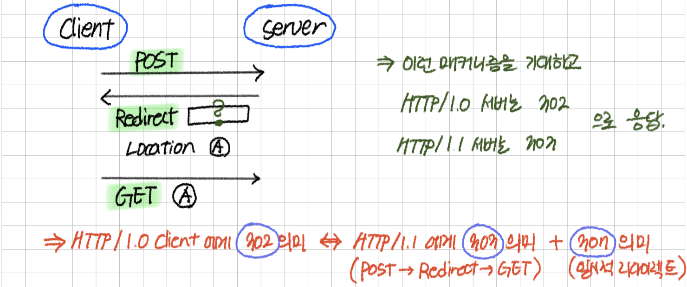

42 웹서브를 하는 팀이라면 한번쯤은 보는 것 같은 (내 뇌피셜임) **HTTP 완벽 가이드**([책 정보 링크](https://insightbook.co.kr/book/118))의 3장을 읽고 정리해보았다.

> 아래의 내용은 거의 대부분 책의 내용과 동일합니다.

## 🌟 3.1 메시지의 흐름

텍스트 메타 정보로 시작 → 선택적으로 데이터가 온다.

인바운드, 아웃바운드, 업스트림, 다운스트림 : 메시지의 방향을 의미

- 인바운드 : → 서버
- 아웃바운드 : 처리가 끝난 후 → 사용자 에이전트 (클라이언트)

원 서버로 인바운드로 이동하고 클라이언트로 아웃바운드로 이동하는 메시지

- 다운스트림: 모든 메시지는 다운스트림으로 흐른다. (수신자)
- 업스트림: 메시지의 발송자는 수신자의 업스트림.

## 🌟 3.2 메시지의 각 부분

메시지의 구성: 시작줄, 헤더블록, 본문

- 시작줄: 이것이 어떤 메시지인지
- 헤더 블록: 속성
- 본문: 데이터

**시작줄과 헤더**는 아스키 문자열.

**각 줄은 캐리지 리턴 (13) 과 개행 문자 (10) 로 구성된 두 글자의 줄바꿈 문자열로 끝난다. (CRLF)**

→ **견고한 애플리케이션이라면 캐리지 리턴이 없는 단순한 개행문자라도 받아들일 수 있어야 한다.** (51페이지) 오래된 HTTP 어플리케이션은 CRLF을 보내지 않는 경우도 있기 때문.

**본문** (엔티티 본문, 메시지 본문)은 데이터 덩어리.

**텍스트나 이진 데이터, 비어있을수도 있다. → 어떤 종류의 본문인지는 헤더에 나와있다.**

### ✨ 3.2.1 메시지 문법

모든 HTTP 메시지는 요청 메시지이거나 응답 메시지. 구조는 기본적으로 같다.

- 요청 메시지: 서버에 어떤 동작을 요구
- 응답 메시지: 요청의 결과를 클라이언트에게 돌려줌

```
**[요청 메시지]**
<메서드><요청 URL><버전>
<헤더>

<엔티티 본문>

**[응답 메시지]** (시작줄만 조금 다르다.)
<버전><상태 코드><사유 구절>
<헤더>

<엔티티 본문>
```

- **메서드**: 서버가 수행해야 하는 동작, GET, POST
- **요청 URL**: 요청 대상이 되는 리소스의 **완전한 URL** 또는 **URL의 경로 구성요소**
- **버전**:
- **상태코드**
- **사유 구절 (reason-phrase)**: 상태 코드에 매칭되는 문구. 오로지 사람이 읽기 위한 목적
- **헤더들**: 이름, 콜론(:), 선택적인 공백, 값, CRLF가 순서대로 나타나는 0개 이상의 헤더들. 헤더들의 목록은 CRLF로 끝나서 헤더 목록의 끝과 엔티티 본문의 시작을 구분한다.
    - ❓ 0개 이상의 헤더? 헤더가 없어도 되는건가 → HTTP 버전에 따라서는 헤더가 0개 있어도 괜찮은 것 같은데, **우리가 다룰 HTTP/1.1 같은 몇몇 버전에는 요청이나 응답에 특정 헤더가 포함되어 있어야  유효한 것으로 간주한다고 했으므로 ⇒ 우리의 경우에는 무조건 헤더 하나는 있어야 유효하다.**
    - ❓ 여기서의 CRLF도 캐리지 리턴 없이 개행 문자만 있어도 되는건가 → CLRF로 끝나지 않는 메시지도 받아들여야 한다는걸 보면 **그냥 모든 부분에서 CRLF 대신 단순 개행문자도 동일하게 처리해줘야 하는 것 같다.**
- 엔티티 본문: 본문이 있을수도, 없을수도 있음. 만약에 없으면 헤더의 끝인 CLRF로 메시지 끝남. (CLRF로 끝나지 않는 메시지도 받아들일 수 있어야 함)

### ✨ 3.2.2 시작줄

요청 메시지의 시작줄: 무엇을 해야 하는가

응답 메시지의 시작줄: 무슨 일이 일어났는가

- 요청줄: `메서드(공백)요청URL(공백)HTTP버전`
- 응답줄: `HTTP버전(공백)상태코드(공백)사유구절`
- 메서드 → 3.3에 몰아서 정리함
- 상태 코드 → 3.4에 몰아서 정리함
- 사유 구절 → 상태 코드와 일대일로 대응되는 문구. HTTP 명세에 사유 구절에 대한 엄격한 규칙이 없다.
- 버전 번호: 자신이 따르는 버전을 상대방에게 알려주기 위함. (대화 상대의 능력과 메시지 형식의 단서를 얻는다.)

### ✨ 3.2.3 헤더

(3.5에 몰아서 정리함)

### ✨ 3.2.4 엔티티 본문

HTTP 메시지의 화물

텍스트 뿐 만 아니라 이미지, 비디오, … 등 여러 종류의 데이터를 나를 수 있다.

### ✨ 3.2.5 버전 0.9 메시지

응답 메시지에 헤더 없이 오직 본문만 있던 버전.

~~생략~~

## 🌟 3.3 메서드

GET: 서버에서 문서를 가져오는 것

POST: 서버가 처리했으면 하는 데이터를 보내는 것

| 메서드 | 설명 | 메시지 본문 |
| --- | --- | --- |
| GET | 서버에서 어떤 문서를 가져온다 | ❌ |
| POST | 서버가 처리해야 할 데이터를 보낸다 | ⭕️ |
| DELETE | 서버에서 문서를 제거한다 | 🔺 (삭제한 파일에 대한 정보) |

### ✨ 3.3.1 안전한 메서드

요청의 결과로 서버에 어떤 작용(변화, 작업 등)도 없는 메서드

→ 어떤 메서드가 안전한 메서드가 될지는 웹 개발자에게 달려 있음.

### ✨ 3.3.2 GET

서버에 리소스를 달라고 요청하는 메소드 (HTTP/1.1 필수)

### ✨ 3.3.3 ~ 3.3.4 HEAD, PUT

HEAD: GET과 정확히 동일하게 행동하지만 서버는 응답으로 헤더만 돌려준다.

- 리소스를 가져오지 않고 그 정보만을 알기 위해
- 상태코드를 보고 그 리소스의 존재 여부를 알기 위해
- 리소스가 변경되었는지 알기 위해

사용한다.

HEAD 요청의 내용과 GET 요청의 헤더가 완전히 동일함을 보장해야 한다.

---

PUT: 서버에 문서를 “쓰는” 메서드

없는 문서라면 새로 만들어서 쓰고, 이미 존재하는 문서라면 그 안에 새로 쓴다.

콘텐츠를 변경할 수 있기 때문에 대부분의 웹서버는 사용자 인증 후에 PUT 메서드의 권한을 준다.

### ✨ 3.3.5 POST

서버에 입력 데이터를 “전송”하기 위해 사용

HTML form 태그를 지원하기 위해 사용된다.

POST 명령으로 전송된 데이터는 서버가 모아서 필요로 하는 곳에 보낸다.

### ✨ 3.3.6 ~ 3.3.7 TRACE, OPTIONS

TRACE: 클라이언트가 보낸 요청은 서버로 바로 갈수도 있지만 방화벽 같은 애플리케이션을 거쳐서 갈 수 있는데, 이 어플리케이션은 원본 요청을 수정할 수 있다. TRACE 메소드 응답의 엔티티 본문에는 실제 서버가 받은 요청의 내용이 그대로 들어있다. 주로 진단에 사용함.

OPTIONS: 특정 리소스에 대해 서버가 지원하는 메소드의 목록을 받아온다. 실제로 그 리소스에 접근하지 않고도 그것에 접근할 수 있는 최선의 방법을 알 수 있음.

### ✨ 3.3.8 DELETE

요청 URL로 지정한 리소스를 삭제할 것을 요청한다.

HTTP명세는 서버가 클라이언트에게 알리지 않고 요청을 무시하는 것을 허용 → **실제로 삭제가 수행되는 것을 보장하지는 않는다.**

→ ❓ 200 OK 를 보냈음에도 불구하고 삭제하지 않는 경우가 뭐가 있을까.. 권한?

### ✨ 3.3.9 확장 메서드

HTTP는 쉽게 확장할 수 있도록 설계되었기 때문에 서버마다 그들만의 메서드를 구현할 수 있는데, 이렇게 구현된 메서드를 확장 메서드라고 함.

## 🌟 3.4 상태 코드

`RFC 7230`

클라이언트에게 서버에서 무슨 일이 일어났는지 말해줌.

| 전체 범위 | 정의된 범위 | 분류 |
| --- | --- | --- |
| 100-199 | 100-101 | 정보 |
| 200-299 | 200-206 | 성공 |
| 300-399 | 300-305 | 리다이렉션 |
| 400-499 | 400-415 | 클라이언트 에러 |
| 500-599 | 500-505 | 서버 에러 |

인식할 수 없는 상태 코드를 받게 되면, 누군가가 현재 프로토콜의 확장으로 그 코드를 정의했을 수도 있다 ⇒ 그 상태 코드를 그것이 포함되는 범주의 일반적인 것으로 가정하고 다뤄야 한다.

### ✨ 3.4.1 100-199: 정보성 상태 코드

가치가 있는가에 대한 논란이 있음 (…)

| 상태 코드 | 사유 구절 | 의미 |
| --- | --- | --- |
| 100 | Continue | (요청의 Expect 헤더와 함께 사용) 요청의 시작 부분 일부가 받아들여짐. 클라이언트는 같은 “내용”의 요청을 다시 보내면 반드시 서버로부터 응답을 받을 수 있음을 보장받음 서버는 반드시 그 요청을 받아 응답해야 함 |
| 101 | Switching Protocols | (요청의 Upgrade 헤더와 함께 사용) 서버가 프로토콜을 바꾸었음을 의미 |

100 Continue에 대한 설명… (필요한 내용인지 모르겠다)

- 클라이언트와 100 Continue
  
    클라이언트가 100 코드를 기대하고 요청을 보낸다면, 그 요청 안의 헤더에는 `Expect: 100-continue` 라는 내용이 있어야 한다.
    
    처리 성공이 불확실한 큰 엔티티를 서버로 신중히 보내기 위한 목적.
    
    서버가 100 Continue 응답을 보낼 수 있다는 보장이 없기 때문에 (100 코드의 혼란 때문) 100 Continue를 받지 못하더라도 클라이언트는 엔티티를 보내야 한다. (타임아웃)
    
- 서버와 100 Continue
  
    `Expect: 100-continue` 를 받게 된 서버는 100 Continue 혹은 에러 코드로 답해야 한다.
    
    100 Continue 응답을 보내기 전에 같은 헤더의 엔티티를 받았다면 서버는 100 Continue에 대한 응답을 할 필요가 없다. 😵‍💫
    
    서버 측에서 100 Continue에 대한 응답 이후에 관련 엔티티 받지 않고 연결을 끊기로 했어도 응답 이후에 바로 연결을 끊어서는 안된다. 😵‍💫

### ✨ 3.4.2 200-299: 성공 상태 코드

여러가지 요청에 대한 성공 상태 코드를 반환한다.

| 상태 코드 | 사유 구절 | 의미 |
| --- | --- | --- |
| 200 | OK | 요청은 정상이고, 엔티티 본문은 요청된 리소스를 포함하고 있다. |
| 201 | Created | 개체를 생성하라는 요청(PUT 등)을 위한 것. (PUT 명령 구현 안해도돼서 생략함) |
| 202 | Accepted | ❓ 요청은 받아들여졌으나 서버는 아직 그에 대한 어떤 동작도 수행하지 않았다. 요청이 처리하기 적법해 보임을 보장. |
| 203 | Non-Authoritative Information | ❓ 엔티티 헤더에 들어있는 정보가 원래 서버가 아닌 리소스의 사본에서 왔다. 만약 엔티티 헤더가 원래 서버에서 온 것이라면 응답이 200이 되어야 할 요청. (선택 사항?) |
| 204 | No Content | 응답 메시지는 헤더와 상태줄을 표시하지만 엔티티 본문은 포함하지 않는다. 웹 브라우저를 새 문서로 이동하지 않고 새로고침 하고 싶을 때 (입력창 새고 등) 주로 사용 |
| 205 | Reset Content | 브라우저에게 현재 페이지에 있는 폼에 채워진 모든 값을 비우라고 함. |
| 206 | Partial Content | (요청의 Range 헤더와 함께 사용) 범위 요청이 성공했음을 의미. 반드시 헤더에 Content-Rage와 Date를 포함해야 하고, Etag 또는 Content-Location 중 하나도 반드시 포함해야 함. |
- ❓ 204와 205의 차이

### ✨ 3.4.3 300-399: 리다이렉션 상태 코드

| 상태 코드 | 사유 구절 | 의미 |
| --- | --- | --- |
| 300 | Multiple Choice | 클라이언트의 요청이 동시에 여러 리소스를 가리키는 경우. 그 리소스의 목록과 함께 반환. (어떤 서버가 하나의 문서를 여러 언어로 제공하는 등) |
| 301 | Moved Pernanently | 요청한 URL이 옮겨졌을 때. 응답의 Location 헤더에는 그 리소스의 새 위치를 포함해야 함. |
| 302 | Found | 301과 동일한 경우에 사용. 클라이언트에서는 응답으로 받은 URL을 한번만 사용하고, 이후에는 다시 요청했던 URL을 사용해야 함. |
| 303 | See Other | 리소스를 다른  URL에서 가져와아 한다는 것을 알려줌. 주로 POST 요청에 대한 응답으로 리소스의 위치를 알려주는 목적으로 사용. |
| 304 | Not Modified | 조건부 요청 중에서 GET 과 같은 조건부 요청을 보냈는데 → 리소스가 수정된 적이 없다면 → 이걸 보내는 것. 이 코드의 응답은 엔티티 본문을 가지면 안된다. |
| 305 | Use Proxy | 이 리소스는 반드시 프록시를 거쳐야 함을 알리고 Location에 프록시의 위치를 알려준다. |
| 306 | (사용 x) | (사용 x) |
| 307 | Temporary Redirect | 302와 완전 똑같음 (HTTP/1.1에서 사용하는 302 코드라 이해함) |

리다이렉션에 사용됨. 사용자가 직접 움직이지 않고 올바른 리소스로 이동하기 위함.

HEAD가 아닌 요청에 대해 리다이렉션 상태 코드의 응답을 할 경우에 본문에 리다이렉트 될 URL의 링크와 설명을 적는 것이 좋다.

301, 302, 307에 대하여 ⇒ HTTP/1.0, HTTP/1.1의 차이에 기반함



### ✨ 3.4.4 400-499: 클라이언트 상태 코드

| 상태 코드 | 사유 구절 | 의미 |
| --- | --- | --- |
| 400 | Bad Request | 클라이언트의 잘못된 요청 (잘못된 시작줄?) |
| 401 | Unauthorized | 리소스를 얻으려면 클라이언트가 스스로를 인증해야 함. (헤더에 관련 정보 함께 보냄) |
| 402 | Payment Required | 미래에 사용될 가능성을 위해 준비해둠 (?) |
| 403 | Forbidden | 요청이 서버에 의해 거부됨. 필요하다면 거부 이유를 엔티티 본문에 넣어도 되는데, 보통 이 상태 코드는 거절 이유를 숨기고 싶을 때 사용한다고 함. |
| 404 | Not Found | 요청한 URL을 찾을 수 없음. 클라이언트에서 사용자에게 보여주기 위한 엔티티를 포함하기도 한다. |
| 405 | Method Not Allowed | 요청한 URL을 지원하지 않는 메소드로 요청했을 때. 이 때 요청한 URL을 지원하는 메소드도 함께 알려주기 위해서는 Allow 헤더가 포함되어야 한다. |
| 406 | Not Acceptivle | 클라이언트 본인이 어떤 종류의 엔티티를 기대하는지 요청에 적었을 때, 요청받은 URL에 해당하는 리소스가 클라이언트가 받을 수 없는 경우. |
| 407 | Proxy Authentication Require | 401과 동일. 인증을 요구하는 프록시 서버를 위해 사용. |
| 408 | Request Timeout | 클라이언트의 요청을 완수하기에 시간이 너무 걸리는 경우. 타임아웃은 서버마다 다르지만 대다수의 요청을 처리할 수 있을 정도로 길다. |
| 409 | Confilt | 요청이 리소스에 대해 충돌을 일으킬 수 있는 경우. 응답 본문에 충돌에 대해 설명하는 내용을 포함시켜야 한다. |
| 410 | Gone | 404와 비슷한데 원래 리소스가 서버에 있었음을 나타내기 위해 사용하는 코드 |
| 411 | Length Required | 서버가 요청 메시지에 Content-Length 헤더를 요구했을 때 사용. |
| 412 | Precondition Failed | 클라이언트의 조건부 요청 중 하나가 실패했을 경우 |
| 413 | Request Entity Too Large | 서버가 처리할 수 있는, 처리하고자 하는 한계를 넘은 크기의 엔티티를 클라이언트가 요청한 경우 |
| 414 | Request URI Too Long | 서버의 한계를 넘는 길이의 URL을 포함한 요청을 클라이언트가 보낸 경우. |
| 415 | Unsuppoted Media Type | 서버가 지원하지 않는 타입의 엔티티를 받은 경우 |
| 416 | Request Range Not Satisfiable | 리소스의 특정 범위를 요청했는데 그 범위가 맞지 않는 경우 |
| 417 | Expectation Failed | 요청의 Expect 헤더에 담긴 내용이 서버가 처리할 수 없는 내용의 경우. |

### ✨ 3.4.5 500-599: 서버 에러 상태 코드

서버에서 문제가 발생한 경우. 

서버의 제한에 걸렸거나, 서버의 보조 구성 요소(게이트웨이 리소스 등)에 문제가 생겼을수도 있다.

| 상태 코드 | 사유 구절 | 의미 |
| --- | --- | --- |
| 500 | Internal Server Error | 서버가 요청을 처리할 수 없는 에러를 만났을 경우 |
| 501 | Not Implemented | 서버의 능력을 벗어난 요청을 한 경우 (지원하지 않는 메서드를 요청했다던가) |
| 502 | Bad Gateway | 프록시/게이트웨이처럼 동작하는 서버에서 다음 링크로부터 가짜 응답을 받은 경우. (부모 게이트웨이에 접속이 불가능할때 등) |
| 503 | Service Unavailable | 지금은 서버가 요청을 처리할 수 없지만, 나중에는 가능함을 의미. 언제 가능한지를 알고 있다면 Retry-After 헤더에 넣어서 응답할수도 있다. |
| 504 | Gateway Timeout | 408과 비슷한데 게이트웨이/프록시에서 온 응답이라는 점이 다르다. |
| 505 | HTTP Version Not Supported | 서버가 지원할 수 없는 버전의 프로토콜로 온 요청을 받았을 때 사용. |

## 🌟 3.5 헤더

자유롭게 자신만의 헤더를 만들어 낼 수 있다. (확장 헤더)

헤더 문법

- 이름, 콜론(쉼표라고 적혀 있는데 오타인듯?), **공백(없어도 된다)**, 필드 값, CRLF 🥹
  
    ```
    Content-type: image/gif
    Content-type:image/gif
    ```
    
- 긴 헤더를 여러 줄로 쪼개서 적을 수도 있다. 위쪽에서 이어지는 줄을 표시하기 위해서는 **최소** **하나의 스페이스 또는 탭**이 와야 한다. 🥹
  
    ```
    Server: Test Server
    (tab)Version 1.0
    Server: Test Server
    (space)Version 1.0
    Server: Test Server
    (space)(space)Version 1.0
    Server: Test Server
    (tab)(space)Version 1.0
    ```
    

### ✨ 3.5.1 일반 헤더

요청과 응답 양쪽에 나타날 수 있는 헤더

- 일반 정보 헤더
- 일반 캐시 헤더

### ✨ 3.5.2 요청 헤더

요청에 대한 부가 정보를 제공하는 헤더

- 요청 정보 헤더
- Accept 관련 헤더: 클라이언트가 어떤 내용들을 처리할 수 있는지 설명
- 조건부 요청 헤더: 날짜, 범위, 변경여부 등에 조건을 걸 수 있음.
- 요청 보안 헤더: HTTP 자체의 인증 체계를 위한 헤더
- 프록시 요청 헤더: 프록시의 기능을 돕기 위한 헤더

### ✨ 3.5.3 응답 헤더

응답에 대한 부가 정보를 제공하는 헤더

- 응답 정보 헤더
- 협상 헤더
- 응답 보안 헤더

### ✨ 3.5.4 엔티티 헤더

본문 크기와 콘텐츠 혹은 리소스 그 자체를 서술하는 헤더

- 엔티티 정보 헤더: 자신이 다루고 있는게 무엇인지. (Allow, Location)
- 콘텐츠 헤더: 콘텐츠에 대한 구체적인 정보
- 엔티티 캐싱 헤더: 언제 어떻게 캐시가 되어야 하는지에 대한 정보

---

끝. 시간이 부족한게 너무 아쉽다.