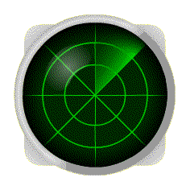

## 🚀 Cub3D

2차원 배열로 주어지는 맵을 1인칭 시점에서 보이는 3D 맵으로 그리고, 그 맵 안을 이리저리 움직일 수 있게 구현하는 과제이다.

사실 조금만 구글링을 해 보면 너무나도 잘 정리되어 있는 가이드들이 많아서 굉장히 깔끔하고 빠르게 과제를 해결할 수 있겠다고 생각했으나 생각보다도 스스로 고민해봐야 할 부분이 많아서 예상(7일...? 팀원의 생각은 어떤지 잘 모르겠지만 허허)보다는 좀 더 오랜 시간을 들여서 과제를 끝냈다.

이 과제의 절반 이상은 입체를 그려내는 방식인 레이캐스팅을 이해하는 데 있다고 해도 과언이 아니긴 한데, 이 내용에 대해서는 거의 모든 cub3d 가이드들에 정리가 되어 있는데다가 너무 잘 정리를 해 주셔서 내가 따로 적기가 민망하다...(잘 설명할 자신도 없고) 그래서 레이캐스팅과 관련된 내용은 참고했던 가이드의 링크로 참고하고, 특히 과제를 하면서 고민을 많이 했던, 그렇지만 가이드에서는 찾을 수 없었던 내용에 대해서만 적어 보려고 한다.

.. 뭔가 시작이 이상한데 아무튼 지금부터 과제를 진행한 흐름대로 정리.. 시작(?)

[과제 레포](https://github.com/326eunjin/cub3d)

## 🚀 레이캐스팅

프로그램의 실행 순서는 맵 파싱과 유효성 체크가 먼저겠지만 레이캐스팅 시에 사용되는 변수가 워낙 많기 때문에 효율적인 구조체 구성을 위해서 이 부분을 먼저 공부했다.

레이캐스팅이란 빛을 쏴서 물체의 표면을 확인하는 기법이다. [위키백과](https://www.google.com/search?q=raycasting&rlz=1C5CHFA_enKR964KR964&oq=raycasting&aqs=chrome..69i57j69i59j0i512l3j69i60l3.5199j0j7&sourceid=chrome&ie=UTF-8) 에도 정리가 잘 되어 있고 [나무위키](https://namu.wiki/w/%EB%A0%88%EC%9D%B4%EC%BA%90%EC%8A%A4%ED%8C%85) 에도 관련 문서가 있다.




레이더 사진 출처 : <https://commons.wikimedia.org/wiki/File:Radar2.gif>

레이더라고 생각하면 이해가 편했다.

화면 안에서 광선을 계속 쏴서 벽이 있는 좌표와 만나면 그에 맞게 벽을 그려주는 방법으로 cub3D의 맵을 그려주면 된다.

이렇게 벽을 찾아내는 방법이 레이캐스팅이고, 아래 가이드에서 등장할 DDA 알고리즘은 2차원 좌표 안에서 선분을 그려주는 알고리즘이다.

자세한 레이캐스팅 과정, 수식, 수식 유도과정은 아래의 (감사한) 가이드들로 대체하고, 나는 과제 할 때 몰라서 고생했던 부분에 대한 것만 정리하겠다.

📍 <https://github.com/365kim/raycasting_tutorial>

📍 <https://chichoon.tistory.com/421?category=862298>

### ✨ wallX 구하기

```c
double wallX; //where exactly the wall was hit
if (side == 0)
	wallX = posY + perpWallDist * rayDirY; // ?
else
	wallX = posX + perpWallDist * rayDirX; // ?
wallX -= floor((wallX));
```

lodev의 레이캐스팅 튜토리얼의 textured raycaster 이후부터 등장하는 `wallX`라는 변수를 구하는 코드이다.

저 `if-else` 문의 식이 어떻게 도출이 되는지 도저히 이해가 안가서 하루를 꼬박 날렸는데 하루 자고 질문글에 대한 답변 듣고 다시 생각해보니 단번에 이해가 되었다. 분명 그 전에는 아무리 설명을 들어도 이해가 안갔는데!

정답이라고는 할 수는 없지만, 내 나름대로 이해한 내용을 적어 보았다.


이렇게 정확하게 광선이 벽 좌표와 닿은 지점을 구하고 (`if - else` 문까지의 `wallX`) 그 값에서 정수 값을 빼 주면 벽의 너비를 1로 두었을 때의 상대적인 충돌 지점의 좌표를 알 수 있다. 

### ✨ texX 구하기

```c
//x coordinate on the texture
int texX = int(wallX * double(texWidth));
if(side == 0 && rayDirX > 0) // ?
	texX = texWidth - texX - 1;
if(side == 1 && rayDirY < 0) // ?
	texX = texWidth - texX - 1;
```

역시 lodev의 레이캐스팅 튜토리얼의 textured raycaster 이후부터 등장하는 `texX`를 구하는 코드이다.

첫번째 조건의 상황을 그림으로 그려보면 아래와 같다.


- A : 감소하는 방향 진행 → 감소하는 방향 출력 ⇒ 보정 필요 x
- B : 감소하는 방향 진행 → 증가하는 방향 출력 ⇒ 보정 필요 o
- C : 증가하는 방향 진행 → 증가하는 방향 출력 ⇒ 보정 필요 x
- D : 증가하는 방향 진행 → 감소하는 방향 출력 ⇒ 보정 필요 o

두번째 조건의 상황은 아래와 같다.


- A : 감소하는 방향 진행 → 감소하는 방향 출력 ⇒ 보정 필요 x
- B : 감소하는 방향 진행 → 증가하는 방향 출력 ⇒ 보정 필요 o
- C : 증가하는 방향 진행 → 증가하는 방향 출력 ⇒ 보정 필요 x
- D : 증가하는 방향 진행 → 감소하는 방향 출력 → 보정 필요 o 

실제로 저 보정 코드를 넣지 않고 출력되는 화면과, 상식적으로 출력되어야 하는 화면을 비교해보면 필요성이 명확하게 보인다.

그래서 이런 식으로 실제 좌표가 증가하는 방향과, 텍스쳐가 출력되어야 하는 방향이 다른 경우에는 `texX`의 좌표를 반대쪽으로 옮겨서 실제 방향과 역순으로 출력될 수 있도록 해 줘야 한다.

### ✨ 이미지 출력에 관하여 (feat. `mlx_get_data_addr`)

so_long Mandatory 부분만 한 나는 `mlx_get_data_addr` 함수를 한번도 써 본적이 없어서 (대강 공부는 했었지만 이해는 못하고 있었었다.) 위에서 Raycasting으로 구한 버퍼를 어떻게 이미지화해서 윈도우에 출력하는지 평가 전날까지도 완전히 이해를 못하고 있었다. (아마도 공부를 열심히 한 분, 혹은 fdf, fractol 과제를 하신 분들은 이미 이 함수를 써 본적이 있어 이해에 어려움이 없었을 것 같다... 하하)

벼락치기로 대강 이해한 내용이지만, cub3d에서 처음 이 함수를 본 나와 같은 분들도 있을 수 있으므로 과제에 필요한 정도로만 적어보려고 한다.

```c
cub->mlx->img.img = mlx_new_image(cub->mlx->mlx_ptr, SCREEN_WIDTH, SCREEN_HEIGHT);
cub->mlx->img.data = (int *)mlx_get_data_addr(cub->mlx->img.img, &cub->mlx->img.bpp, &cub->mlx->img.size_l, &cub->mlx->img.endian);
```

코드를 보면 이런 식으로 `mlx_new_image` 함수로 스크린 크기 (윈도우 크기)만큼의 이미지를 새로 "생성" 하고 `mlx_get_data_addr` 함수로 함수 명 그대로 이미지 데이터의 주소를 받아와서 그 데이터를 가지고 이런저런 작업을 하게 된다.

- `mlx_new_image`

  ```c
  void *mlx_new_image ( void *mlx_ptr, int width, int height );
  ```

  이 함수는 새로운 이미지를 메모리에 생성한다. width, heigth 크기의 이미지를 위한 공간을 메모리에 마련한다고 생각하면 될 듯 하다.

  반환하는 값은 그 이미지를 가리키는 포인터.

  이렇게 생성한 이미지에다가 유저는 새로 무언가를 그릴 수 있고, 이 이미지를 화면에 출력할수도 있다.

- `mlx_get_data_addr`

  ```c
  char *mlx_get_data_addr ( void *img_ptr, int *bits_per_pixel, int *size_line, int *endian );
  ```

  이미지에 대한 정보를 가지고 오는 함수이다. 인자 중에서 `bits_per_pixel`, `size_line`, `endian` 에 담기는 값들의 의미는 다음과 같다.

  - `bits_per_pixel` : 하나의 픽셀 컬러를 표현하는데 필요한 비트의 개수
  - `size_line` : 이미지의 한 줄을 저장하는데 필요한 바이트 수
  - `endian` : 이미지의 픽셀 컬러를 little endian으로 저장하는지 (0), big endian으로 저장하는지 (1)

  그리고 반환값은 그 이미지가 저장되어있는 메모리의 시작 주소이다.

그래서 이 함수들을 이용해서, 이미지의 크기와 동일한 buf 배열을 만들고, 레이캐스팅 마다 buf의 값, 즉 픽셀마다 찍어낼 색깔을 바꾸어주고, 그 buf의 내용을 위의 `mlx_get_data_addr` 함수로 받아온 메모리의 이미지 공간에 덮어씌워서 (기존 이미지를 새로 그림) 그 이미지를 출력해주는 방식으로 cub3d에서 1개의 이미지를 가지고 매번 새로 그려서 윈도우에 올려주는 것이었다...

나만 몰랐을 수도 있지만, ... 암튼 이런 과정으로 매번 다른 화면을 비출 수 있다.

## 🚀 파일 파싱

so_long 역시 비슷하게 맵을 읽어와야 하지만, so_long 과제와 달리 cub3D의 맵은 직사각형이 아니어도 괜찮다.

굉장히 당황스러울 수 있는데 어차피 레이캐스팅이 잘 구현되었고, 맵 유효성 조건 중 "맵은 벽으로 둘러싸여있어야 한다." 를 만족하는 맵이라면 벽 너머에는 뭐가 있든 실제 보여지는 화면에는 영향을 미치지 않는다. 따라서 나는 so_long에서 했던 것처럼 맵 파일을 두번 읽어서 첫번째에서 최대 너비와 높이를 구해서 2차원 배열을 할당하고, 두번째에서 실제 맵 모양대로 배열을 채워주었다. 이 때 빈 부분은 그냥 공백으로 채워주면 정사각형이 아닌 맵도 어렵지 않게 저장할 수 있다.

```c
void	parse_map_size(int fd, unsigned int *map_loc, t_cub *cub)
{
	char			*line;
	int				ret;

	pass_empty_line(fd, &line, map_loc);
	if (line == NULL)
	{
		close(fd);
		print_error("Missing map contents", cub);
	}
	while (line != NULL)
	{
		remove_new_line(&line);
		cub->map->map_height++;
		if (cub->map->map_width < (int)ft_strlen(line))
			cub->map->map_width = (int)ft_strlen(line);
		free(line);
		ret = pass_empty_line_map(fd, &line);
		if (ret == 1)
		{
			close(fd);
			free(line);
			print_error("Invalid map contents", cub);
		}
	}
	close(fd);
}
```

파싱 과정에서 가장 까다로웠던 부분은 "빈 문자열"에 대한 처리였던 것 같다.

map 내용을 제외하고는 개행이 얼마든지 들어갈 수 있으므로 (공백만으로 이루어진 문자열에 대해선 고민이 필요할 듯 하다. 우리의 경우에는 개행문자 1개로 이루어진 문자열과 동일하게 처리해주었다.) 개행문자가 들어갈 수 있는 부분에서는 문제없이 다음 줄을 넘어가야 하지만, 맵 중간에 있는 개행(맵 이후의 개행은 문제가 없다!)의 경우에는  에러로 처리해줘야 하기 때문에 일관적인 방식으로 개행문자를 처리할 수 없었다. 우리의 경우에는 함수를 2개로 나누어서 따로 처리해주긴 했는데 (`pass_empty_line`, `pass_empty_line_map`) 좀 더 생각해봤으면 더 좋은 방법이 있었을 것 같기도 하다. (아직은 잘 모르겠음)

## 🚀 파일 유효성 검사

사실 파싱 과정에서 유효성 검사의 대부분이 될 것이다. (이상한 식별자가 등장하는 경우, 식별자에 해당하는 정보가 많거나/적은 경우, 정보가 부족한 경우, 불필요한 개행이 들어간 경우, 등!)

그래서 맵에 대해서만 유효성 검사를 따로 한번 더 해 주었다. 추가적으로 필요한 항목은 맨데토리 기준 1, 0, N/S/W/E 외의 문자가 들어 있는지, N/S/W/E 가 2개 이상 들어 있는지, 벽이 닫혀 있는지만을 검사해주면 된다.

```c
void	check_map(t_cub *cub)
{
	int	i;
	int	j;
	int	player_flag;

	i = -1;
	player_flag = 0;
	while (++i < cub->map->map_height)
	{
		j = -1;
		while (++j < cub->map->map_width)
		{
			if (ft_strchr("10 NSEW", cub->map->map[i][j]) == NULL)
				print_error("Map can contain N, S, E, W, 1, 0, space", cub);
			check_closed(cub, i, j);
			if (ft_strchr("NSEW", cub->map->map[i][j]) != NULL)
			{	
				if (player_flag == 1)
					print_error("Maps must contain only one player", cub);
				init_pos_dir(i, j, cub, &player_flag);
			}
		}
	}
	if (player_flag == 0)
		print_error("Map must contain at least one player", cub);
}
```

이런 식으로 저장되어 있는 맵을 돌면서 (1) 현재 맵 요소가 "10 NSEW" 중 하나인지, (2) 벽이 닫혀 있는지 (벽이 닫혀있는지 확인은 현 요소가 '0'일 때 사방이 ' '인지만 확인해주면 된다.), (3) "NSEW" 중 하나가 한번 더 나왔는지, 마지막으로는 (4) "NSEW"가 적어도 한번 나왔는지를 확인해주는 방법으로 맵의 유효성을 확인해주었다.

[맵 테스터](https://github.com/humblEgo/cub3D_map_tester) 가 있으니 도움을 받으면 좋을 것 같고, 하지만 발생할법도 하지만 테스터에는 없는 테스트 케이스도 있기 때문에 직접 고민해보면서 예외처리를 해보는 것을 추천한다.

## 🚀 mlx_loop, mlx_hook

main 함수에서 호출해준 mlx 이벤트 함수들은 아래와 같다.

```c
mlx_loop_hook(cub.mlx->mlx_ptr, &main_loop, &cub);
mlx_hook(cub.mlx->win_ptr, KEYPRESS, 0, &key_press, &cub);
mlx_hook(cub.mlx->win_ptr, 17, 0, &press_x_button, &cub);
mlx_loop(cub.mlx->mlx_ptr);
```

일단 `mlx_loop` 함수로 이벤트를 기다리는 무한루프를 돌려 주었다. 

그리고 `mlx_loop_hook` 함수로 mlx_loop 동안 `main_loop` 라는 함수를 호출해주었다. `main_loop` 함수 안에서는 매번 레이캐스팅을 하는 함수와 (`cal_map`) 계산된 버퍼의 내용을 이미지로 옮겨 그려주는 함수 (`draw`) 가 호출된다.

마지막으로 `mlx_hook` 으로 키보드 입력에 대한 이벤트 훅을 걸어주었고, 윈도우의 x 버튼을 누르는 이벤트도 따로 처리를 해 주었다.

## 🚀 Bonus - mini map

서브젝트에 의하면 보너스 항목은 총 5가지가 있고, 이 5개 중에서 구현할 수 있는 것만 구현하면 부분점수를 받을 수 있다.

우리는 보너스를 할 생각이 전혀 없었는데 어느 날 팀원이 사정이 있어 1시간정도 클러스터에 늦게 온 날에 심심함 + 맵이 안보여서 답답했음의 이유로 홧김에 mini map 기능을 추가했다.

팀원이 도착하기도 전에 구현이 완료되었던 것을 보면 맵 파싱만 잘 되어 있었을 때 구현은 한시간도 안걸렸다. 심심하다면... 미니맵 정도는 구현해 보는 것도 좋을 것 같다.

화면에 출력되는 이미지는 버퍼에 저장되어있는 값이 옮겨지는 것이라고 했다. 따라서 파싱되어있던 맵의 정보를 버퍼의 적절한 위치에 찍어주는 `mini_map` 이라는 함수를 `main_loop` 에 추가해주었다. 맵 한칸에 픽셀 하나를 찍으면 굉장히 크기가 작기 때문에 적당한 크기로 확대해서 찍어주는 것이 좋다. 나는 1칸을 3*3 픽셀로 찍어주었는데 좀 작았다.

```c
int	main_loop(t_cub *cub)
{
	cal_map(cub);
	mini_map(cub);
	draw(cub);
	return (0);
}
```

 ## 🚀 끝

미니쉘을 같이 했던 동료와 어떻게 마음이 잘 맞아서 cub3D까지 함께하게 되었다. 팀과제여서 정말 다행이라고 생각한다.

이번에도 미니쉘처럼 노션에다가 문서를 관리했고, 일지도 썼다.


미니쉘이랑 달랐던 부분은 미니쉘은 담당 부분을 아주 명확하게 나누었다면 이번 Cub3D에서는 레이캐스팅 부분은 vscode live share를 켜서 짝코딩을 했고, 맵 파싱, 체크 부분도 함수 정도만 따로 짰을 정도로 거의 대부분의 과정에서 팀원과 컴퓨터를 함께 썼다. 맵에 관한 부분과는 달리 레이캐스팅 부분은 진입장벽이 꽤 높다고 생각하는데 이 부분을 팀원과 짝코딩을 했기 때문에 삽질의 시간을 (그나마) 줄일 수 있지 않았을까 하는 생각이 든다.

들리는 소문과 달리 나에게는 그렇게 쉽고 재미있는 과제는 아니었지만... cub3d가 아니었다면 3D 1인칭 시점 게임(이라고 하긴 좀 민망하지만)을 만들어 볼 일이 있었을까?? 장담하는데 절대 없었을 것 같다.

경험의 폭을 넓히는 측면에서 굉장히 의미있는 과제였다고 생각하고... 수학을 놓지 말아야겠다는 다짐도 해볼 수 있었다. 벡터의 덧셈도 가물가물하게 하는 내가 한심했다...