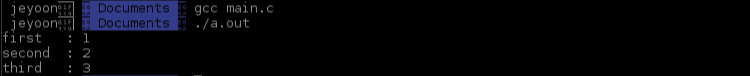

매운맛 과제로 악명높았던 ft_printf 과제인데 2021년 7월인가 업데이트가 되어서 적어도 **Mandatory part**는 엄청나게 순한맛이 되었다.

잘 사용하지 않는 "가변인자"라는 개념을 사용해서 함수를 구현해야 하기 때문에 관련된 지식을 먼저 공부해보았다.

## 🚀 가변인자?

`printf`, `scanf` 처럼 인자의 개수와 자료형을 다양하게 쓸 수 있는 함수들이 있다. 

이런 함수들을 가변인자 함수라고 하고, 고정적으로 명시된 함수 외에 그 가변적으로 사용할 수 있는 인자를 가변인자라고 한다. 

가변인자를 사용하기 위해서는 함수를 정의할 때 인자 부분에 표시를 해 줘야 하는데 서브젝트에 있는 것처럼,

```c
int ft_printf(const char *format, ...)
{
  ...
}
```

이런 식으로 `...` 을 사용해서 format 뒤에 인자들이 더 들어올 것이라는 표시를 해 주면 된다.

함수 내에서 가변인자를 사용하기 위해서는 매크로들을 사용해 줘야 하는데 대표적인 것 (그리고 서브젝트에서 허용하는 것)으로는 `va_start`, `va_arg`, `va_copy`, `va_end` 가 있고, 이 매크로들은 `stdarg.h` 헤더에 정의되어 있다.

### ✨ stdarg.h

`stdarg.h` 코드 : <https://github.com/freebsd/freebsd-src/blob/master/sys/sys/_stdarg.h>

#### va_list

`stdarg.h` 의 매크로를 사용할 때 쓰게 될 가변인자를 가리키는 주소를 저장하기 위해서 `va_list` 라는 자료형이 정의되어있다.

<details><summary>va_list의 정확한 정의(?)에 대한 생각</summary>
<div>
위의 opensource.apple.com의 코드에는 char * 로 되어있긴 한데,,, 과제를 진행하면서 여러군데에서 찾아보고 실제로 코드를 구현하면서 내린 결론은 컴파일러에 따라서 구현되는 방식이 다르기 때문에 그냥 <strong>가변인자의 주소를 가리키기 위한 어떤 자료형</strong>으로 이해하는 것이 마음이 편하겠다는 것이다. (그리고 평가자 분들도 이 점을 이해해주신 것 같다. 아주 다행..)
</div>
</details>

참고: <https://stackoverflow.com/questions/12855271/which-is-the-definition-of-va-list>

#### va_start

```c
va_start(va_list ap, format);
```

`va_list` ap 가 마지막 고정인수 다음 인수의 시작, 즉 첫번째 가변인수의 시작 주소를 가리키도록 초기화하는 매크로이다.

작동방식에서 가변인자함수의 필수 요구사항들을 알 수 있는데 다음과 같다.

1. 마지막 고정인수를 기준으로 하여 `va_list` 변수를 초기화하기 때문에 가변인자함수에는 반드시 적어도 1개 이상의 고정인수가 있어야 한다.
2. 마지막 고정인수의 끝 그 이후엔 모두 가변인자로 간주한다. 따라서 함수 인자의 순서는 모든 고정인수 끝에 가변인자가 들어와야 한다.

#### va_end

```c
va_end(va_list ap);
```

사용이 끝난 `va_list` ap  가 `NULL`을 가리키도록 하고 사용을 종료하는 매크로이다. 

단순히 이 동작을 하는 매크로라서 굳이 사용하지 않아도 동작에 문제가 없을 수도 있지만 예기치 못한 문제를 방지하기 위하여 매뉴얼에도 `va_start`와 짝을 이루어서 사용하는 것을 권하고 있다.

#### va_copy

```
va_copy(va_list dest, va_list src)
```

dest에 src를 복사한다.

이 때 src는 `va_start`로 초기화되어있어야 하고, dest는 반드시 `va_start`로 초기화되어있지 않아야 한다.

이렇게 복사된 dest는 src와는 별개로 동일한 가변인자목록을 `va_arg`를 이용하여 조회할 수 있고, 이 역시도 사용이 끝났을 경우에는 `va_end`를 이용하여 무효화 해줘야 한다.

#### va_arg

~~이 녀석 때문에 거의 하루를 다 쓴 것 같다. 근데 결론도 허탈해서 더 슬프다.~~

```c
va_arg(va_list ap, TYPE);
```

`va_arg`의 호출은 ap에서부터 TYPE 자료형의 크기만큼 읽어서 TYPE 자료형의 가변인수를 반환하고, ap를 증가시켜 다음 가변인자의 시작을 가리키도록 한다.

평가 중에 이 내용을 말로 설명하려고 하니 좀 어려워서 급하게 그림을 그려봤다. 


이 그림에서 같은 색으로 형광펜이 칠해진 부분은 `va_arg`를 호출하는 쪽에서 책임을 지고 통일해야 하는 부분이다. 만약에 이 부분에서 문제가 생겼다면 `va_arg`는 random error를 뱉는다고 한다.

내가 고민한 이유는 대체 `va_arg`가 어떻게 작동하는건지 이해가 잘 안가서였다. 분명 위에서 많은 자료들에서 말하고있는 그 작동 방법을 잘 이해하긴 했는데 내 프로젝트에서는 위와 같은 방식으로 잘 작동하지 않았기 때문이다.

프로젝트 내에서 가변인자를 읽어오는 `va_arg` 매크로를 호출할 때 함수의 인자로 전달받은 `va_list` 변수를 이용했다. 내가 사용한 방법과 비슷하게 간단히 코드를 짜면 다음과 같다.

```c
#include <stdio.h>                                                                                                                                          
#include <stdarg.h>
 
void print_var(va_list ap)
{
	int b = va_arg(ap, int);
	printf("second\t: %d\n", b);
	return ;
}
 
void variadic_function(char *test, ...)
{
	va_list ap;
	va_start(ap, test);

	int a = va_arg(ap, int);
	printf("first\t: %d\n", a);

	print_var(ap);
 
	int c = va_arg(ap, int);
	printf("third\t: %d\n", c);

	return ;
}

int main()
{
	variadic_function("test", 1, 2, 3);
	return (0);
}
```

`variadic_function` 내부에서 `va_arg` 를 호출하고, `va_list`를 인자로 전달하여 함수 외부에서 `va_arg`를 호출하고, 그 다음에 다시 함수 내부에서 `va_arg`를 호출한다.

`va_list` 변수 자체의 주소를 전달 한 것이 아니기 때문에 만약 `va_list`가 흔히 알려진 대로 `char *`형이라면 call by value로 값이 전달되어 출력 결과가

```
first	: 1
second	: 2
third	: 2
```

로 나올 것 같은데 과카몰리 ssh 환경에서는 아래와 같이 나온다.



그런데 m1 맥북에서 동일한 코드를 돌려보면 처음 예상과 같은 결과가 나온다.


다른 분들의 코드를 보니 `va_list` 변수를 그대로 인자로 넘겨준 분도 있고 주소로 넘겨준 분도 있어서 엄청 혼란을 겪다가 [이 글](https://stackoverflow.com/questions/56412342/where-is-builtin-va-start-defined)을 보고 그냥 이 내용을 이해하는 것은 내 영역이 아니라는 결론을 (지금까지는) 내렸고, 평가받을 때도 내가 이해한대로 설명을 드렸다. (다행히 모두 납득을 해 주셨다..)

아무튼, 결론은 `va_arg` 매크로를 사용해서, 지금까지 읽은 가변인자 바로 다음 인자를 읽을 수 있다는 것이다!

## 🚀 함수 구현하기

printf로 어떤 서식지정자로 출력을 시도하느냐에 따라서 같은 인자를 주더라도 컴파일에러가 뜰 수도, 아니면 적절하게 변환이 되어서 출력될 수도 있다. 이런 경우들은 테스터가 있긴 하지만 그래도 일일이 체크를 해 주는게 좋을 것 같다.

여러가지 새로운 정보들에 대한 고민과, printf에 대한 생각만 정리가 되면 실제 구현 자체는 적어도 mandatory part는 굉장히 깔끔했다. 코드를 모두 올리긴 어려우니 설계하면서 대강 그려본 flow chart만 올려본다.


## 🚀 테스터

21년 7월에 과제가 변경되었기 때문에 변경된 과제에 맞게 업데이트 된 테스터를 사용해야 한다.

내가 아는 테스터는 아래의 3개이고 가능하면 모두 돌려보고 제출하기!

- <https://github.com/chronikum/printf42_mandatorytester>
- <https://github.com/paulo-santana/ft_printf_tester>
- <https://github.com/Tripouille/printfTester>