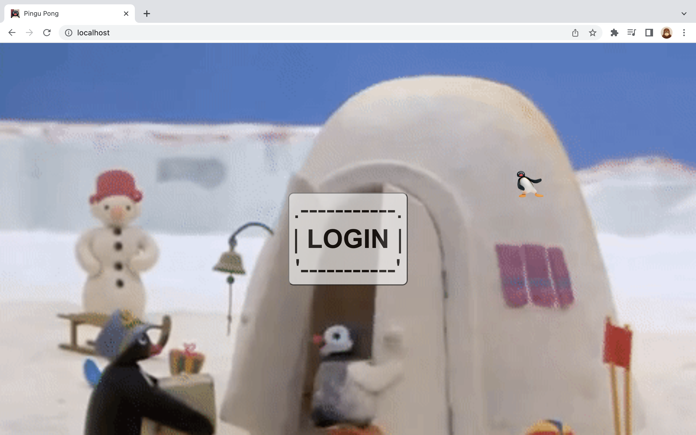
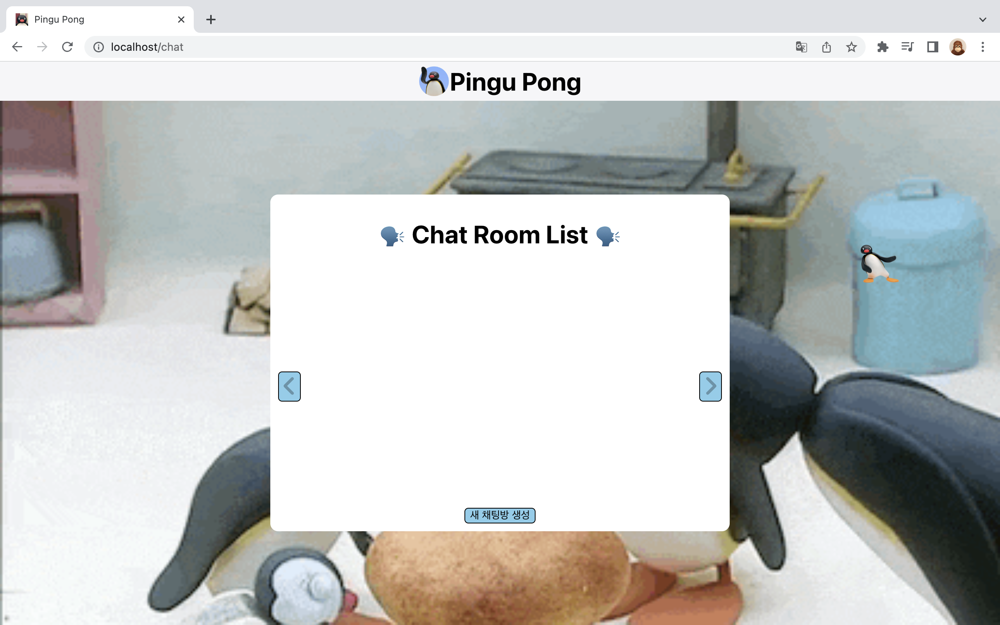

트센 통과하고 적는 트센정복 2...

역시 이것저것 삽질한 내용들을 순서 없이 적습니다.

## 🌟 조건에 따라 클릭이벤트 달거나 해제하기

로딩 중인 경우에는 클릭 이벤트 핸들러를 걸지 않고, 로딩이 끝난 이후에 클릭 이벤트를 달아야 하는 상황이 생겼다.

완전히 새로운 버튼을 만들어야 하나? 하고 생각했었는데 조건에 따라서 `onClick={}` 안에 `undefined`를 넣거나, 이벤트 핸들러를 넣어주면 되었다.

```typescript
<CardButton onClick={loading ? undefined : clickHandler}>
  {loading ? <Loader /> : <span>{props.userName}</span>}
</CardButton>
```

괜찮은 방법인지는 모르겠지만... 이런 식으로 로딩 조건에 따라서 핸들러를 달아 주었다.

## 🌟 삼항 연산자 `조건 ? a : b` 의 a와 b는 하나의 부모 요소로 감싸져 있어야 한다.

42 과제에는 애초에 삼항 연산자를 사용할 수 없게 되어있기도 하지만, (맞나?) 삼항 연산자가 편하긴 하지만 가독성 측면에선 완전 꽝이라고 생각했었기 때문에 별로 좋아하지 않았는데, 조건부 랜더링을 위한 가장 편하고 보기 쉬운 방법이 삼항 연산자를 사용하는 것이라 어쩔 수 없기 안쓰던 삼항 연산자를 마구마구 쓰게 되었다.

안쓰던 것을 쓰다 보니 쓸때마다 삽질을 좀 했는데, 삽질의 대부분의 원인 중 하나는 `조건 ? a : b`의 a와 b는 하나의 부모 요소로 감싸져 있어야 한다는 것을 몰랐기 때문이었다.

jsx 규칙이 여기에도 적용이 되는건지는... 잘 모르겠지만 아무튼 2개 이상의 태그를 넣어줘야 한다면 빈 태그로 감싸서 넣어주도록 하자!

## 🌟 뒤로가기와 새로고침 감지하기

게임 중에는 가능하면 게임만 할 수 있도록 뒤로가기와 새로고침 동작을 제한할 필요가 있었다.

### ✨ 뒤로가기

뒤로가기 동작은 popstate 이벤트를 감지해서 처리했다. (참고 : https://developer.mozilla.org/ko/docs/Web/API/Window/popstate_event)

```typescript
window.history.pushState(null, "", window.location.href);
window.addEventListener("popstate", preventGoBack);
```

이런 식으로 이벤트 리스너를 달아주고

```typescript
function preventGoBack(e: PopStateEvent) {
  window.history.pushState(null, "", window.location.href);
  // console.log("뒤로 가기!!");
  toast.error("게임 중엔 불가합니다!");
}
```

이런 식으로 뒤로 가기 동작이 발생하면 동작시키지 않고 토스트 에러 메시지만 띄우게 처리했다.

(사실 react-router-dom v6 이전에는 useHistory를 사용할 수 있었는데 업데이트로 인해서 사용할 수 없게되어서 직접 window의 history를 사용했었던 것이다. 근데 지금 정리하면서 찾아보니 react-router-dom의 history 기능만을 제공하는 history 라이브러리를 설치하여 사용하는 방법도 있는 것 같다. (참고 : https://monsters-dev.tistory.com/26))

### ✨ 새로고침

제출 직전까지 고생했던 새로고침 처리...

사실 이상적으로 생각했던 것은 아예 어떤 경우에서도 새로고침 시도를 무효화하는 것이었는데 실제로는 아예 무효화하지는 못하고 새로고침 전에 Warning 창을 띄우고 새로고침을 시켜버리는 (우리의 경우에서는 새로고침시에 게임을 지게 하고 로비로 리다이렉트시켜주었다.) 방법으로 처리했다.

사용자가 어떤 방법으로든 현재 페이지를 떠나려고 하면 (창을 닫거나, 새로고침을 하거나 등) beforeunload 이벤트가 발생한다. (참고 : https://developer.mozilla.org/en-US/docs/Web/API/Window/beforeunload_event) 그리고 "이 페이지를 떠나겠습니까?" 이런 류의 alert을 띄우고 싶다면 [`preventDefault()`](https://developer.mozilla.org/en-US/docs/Web/API/Event/preventDefault) 를 호출하면 된다.

```typescript
function beforeUnloadHandler(e: BeforeUnloadEvent) {
  e.preventDefault();
  e.returnValue = "";
  navigate(RoutePath.lobby);
}
```

이런 식으로 처리해줬다.

사실 게임 중의 경우에는 이런 식으로 Lobby로만 보내버리면 문제가 없어서 처리 이후에는 그렇게 어렵지 않았는데, 문제는 도전장 수락 대기 중 이런 기다리는 상황에서 새로고침을 하는 경우에 그것을 감지해서 로비로 보내는 작업이 굉장히 어려웠다ㅜㅜ

절대 괜찮은 방법은 아니라고 생각하지만, 우리 경우에서는 게임 매칭 페이지, 도전장 수락 대기 페이지 모두 state 객체를 넘겨주면서 리다이렉트를 시켰기 때문에 location 객체의 state의 값을 확인해서 정상적인 경로로 진입한 페이지인지, 아니면 새로고침으로 진입한 페이지인지를 판별했다. 

```typescript
if (!location.state) {
  navigate(RoutePath.lobby);
}
```

## 🌟 이벤트 리스너 clean up의 중요성

부끄럽지만 이전까지는 이벤트 리스너를 **해제**해야 한다는 개념에 대해서 전혀 모르고 있었다.

블락당한 채팅방에 입장하려고 시도하는 경우에 블락당한 채팅방인지 여부를 소켓으로 받는 이벤트 리스너를 달아주었는데, 연속으로 입장하려고 하면 이벤트 핸들러 함수(이 경우에는 토스트 메시지를 띄우는 것이었다.)가 2번, 4번, 8번 이런 식으로 중복으로 호출되는 문제가 있었다. 이 문제는 조건에 따라서 이벤트 리스너를 달아주는 방식에서, 조건이 여러번 만족하게 될 경우에는 이벤트 리스너 역시 여러 번 달리기 때문이었기 때문에 **이벤트 핸들러 함수 내에서 이벤트 리스너를 해제하는 방식**으로 문제를 해결해주었다.

사실 clean up은 대부분 컴포넌트 언마운트 시에 해주는 것 같고 대부분의 경우에서 나도 언마운트시에 소켓 이벤트 외에 윈도우 이벤트 등 모든 이벤트 리스너들을 해제해주는 동작을 넣어주었지만, 위에서 적은 조건에 따라 이벤트를 감지해야 하는 경우에는 언마운트 과정에 들어가지 않기 때문에 핸들러 함수 내에서 이벤트 리스너를 해제해주었다.

```typescript
useEffect(() => {
  return (() => {
    socket.off('/api/check/secret');
    socket.off('youBan');
    socket.off('youPass');
  })
}, [socket]);

function clickHandler(e: React.MouseEvent<HTMLElement>) {
  /* 비밀방 여부 확인 */
  socket.emit('/api/check/secret', props.roomName);
  socket.on('/api/check/secret', (data) => {
    socket.off('/api/check/secret');
    if (data) {
      socket.emit('getUser', {roomName: props.roomName})
      /* ban 여부 확인 */
      socket.on('youBan', () => {
        socket.off('youBan');
        toast.error("금지당한 채팅방입니다!");
      })
      // ... 생략
  })
};
```

## 🌟 Outlet으로 레이아웃 구성하기

로그인 전 화면



로그인 후 화면



이런 식으로 로그인 후에만 헤더를 넣어주고 싶었다.

react-router-dom의 Outlet 태그를 사용하면 자식 컴포넌트들을 받아서 랜더링 할 수 있었고, 이를 이용해서 레이아웃을 구성해서 라우팅 해 주었다.

```typescript
export default function Routing() {
    return (
        <Routes>
            <Route path={RoutePath.root} element={<LoginLayout/>}>
                <Route path="" element={<LoginPage/>}/>
                <Route path={RoutePath.fa2} element={<FA2Page/>}/>
                <Route path={RoutePath.profile} element={<ProfileInitPage/>}/>
            </Route>
            <Route path={RoutePath.root} element={<MainLayout/>}>
                <Route path={RoutePath.lobby} element={<LobbyPage/>}/>
                <Route path={RoutePath.chat} element={<ChatLobbyPage/>}/>
                {/*... 생략*/}
            </Route>
        </Routes>
    )
}
```

이렇게 LoginLayout과 MainLayout을 만들어주고 하위 컴포넌트들로 상세 페이지들을 연결해주었다.

```typescript
function LoginLayout() {
    return (
        <>
        <LoginLayoutWrapper>
            <Outlet/>
        </LoginLayoutWrapper>
        </>
    );
}

function MainLayout() {
    return (
        <>
        <Header/>
        <CustomToastContainer/>
        <MainLayoutWrapper>
            <Outlet/>
            <ProfileModal/>
        </MainLayoutWrapper>
        </>
    );
}
```

그리고 이렇게 Outlet 태그로 자식 컴포넌트들을 받아 랜더링 하게 했다.

## 🌟 끝

심하게 얼레벌레 끝낸 마지막 과제... 사실 일단 기능구현을 완료해서 어떻게든 동작하게 만들자!! 가 목표였기 때문에 더 그랬던 것 같다 (데드라인이 촉박했음) 처음부터 구조를 잘 설계하고, 공부도 탄탄히 한 뒤에 구현에 돌입했다면 더 좋았겠지만 이렇게 하면서 또 엉망진창 코드를 리팩토링 하는 경험을 쌓는다는 생각을 하니... 이것도 이런대로 괜찮다는 생각이 드는 것 같기도 하고;;

3월부터 리팩토링에 돌입할 계획인데 그때쯤 또 새로운 내용들을 정리하게 되지 않을까 싶다

암튼 끝!!! 한달 반동안 고생 많았다@@
