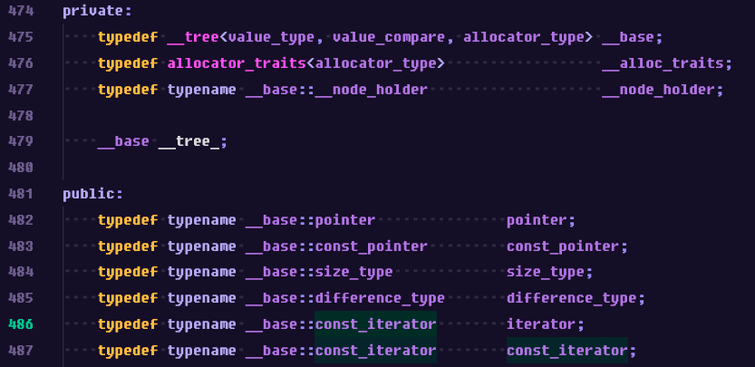

~~분명히 mandatory만 하려고 했는데 테스터를 돌리기 위해서는 set이 필요한터라 없이 돌리는 방법을 찾는 것 보다는 set을 구현하는게 더 빠를 것 같아서 ... 암튼 정신차려보니 set도 구현했더라 레전드 일복~~

C++ 컨테이너만 3년을 넘게 쓴 이 사람이 아직도 컨테이너에 대해서 모르는 사실이 있었다는 점이.. 정말 자만의 끝을 달리고 있었다.

오늘도 나만 몰랐을 수도 있는 굉장히 충격적인 사실을 알게 되어 후다닥 정리해보려고 한다.

## 🌟 Set의 iterator는 const_iterator이다

Set은 요소인 Key의 값이 바뀌면 트리 구조가 깨지기 때문에 Key의 값을 임의로 수정할 수 없도록 설계되어 있다. (근데 어차피 삽입, 삭제하면 트리구조 와장창 깨지는데... 😑)

위와 같은 맥락에서 iterator로 접근한 값도 수정하면 안되므로 (수정이 안되게 만들어야 하므로) set의 iterator는 기본적으로 const_iterator이다.

나는 지금까지도 모르고 있었지만... cppreference에도 너무 명확하게 적혀 있고 set 헤더파일을 봐도 너무 명확하게 typedef 되어 있더라..

[](https://en.cppreference.com/w/cpp/container/set)



따라서 실제 구현과 가장 비슷하게 구현하기 위해서는 우리의 set의 iterator도 모두 const_iterator를 사용하게 해야겠지만, 내 구현 방식에서는 set에서 const_iterator를 _tree의 erase 함수 같은 변경 함수에 전달하면 제대로 동작하지 않았기 때문에 **set에서 사용하는 tree의 value_type을 const로 설정해서 const가 아닌 iterator로 접근하더라도 const referece, const pointer를 반환하게 만들어주었다.**

## 🌟 map의 insert 함수는 값의 업데이트를 발생시키지 않는다

위에서 tree의 value_type으로 const 타입을 넣게 되면서 알게 된 사실인데,,,

map의 insert 함수는 **동일한 키가 존재하지 않는 경우에만 노드를 삽입한다.**

나는 위의 문장을 "동일한 키가 존재하는 경우에는 새로 노드를 삽입하지 않고 기존 노드를 업데이트한다." 라고 이해했었는데 알고보니 **동일한 키가 존재하는 경우에는 아무 것도 하지 않는다.** 가 맞는 동작이었다.

```cpp
void test_insert() {
	std::map<int, char> test_map;
	test_map.insert(std::make_pair(1, 'a'));
	std::cout << "key : 1 , value : " << test_map.at(1) << std::endl;
	// 중복된 키를 다른 값으로 넣어봄
	test_map.insert(std::make_pair(1, 'b'));
	std::cout << "key : 1 , value : " << test_map.at(1) << std::endl;
	/** 출력
	 * key : 1 , value : a
	 * key : 1 , value : a
	 */
}
```

그래서 기존 insert 함수에서 값이 존재하는 경우에 하던 `기존 value = 새로운 value` 작업을 삭제해주었고. 이렇게 하니 const 타입의 value도 잘 컴파일이 되었다.

~~이제 세그폴트 잡아야함...~~
