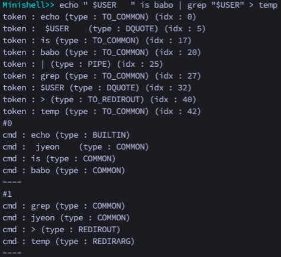
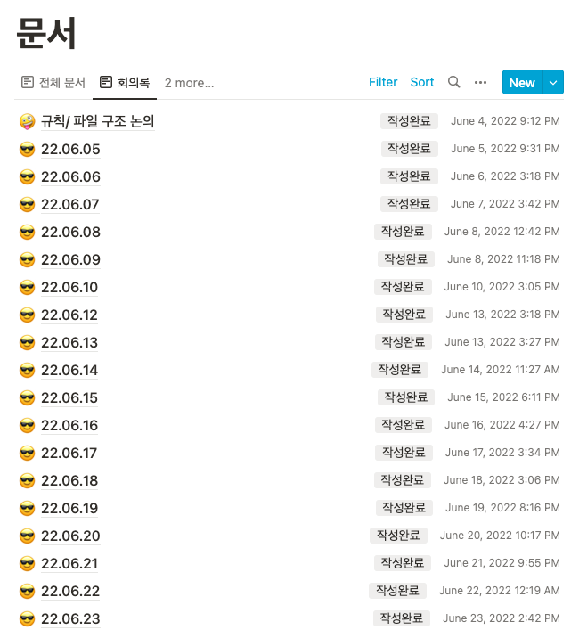

## 🚀 Minishell


본과정에 들어오자마자 어떤 과제가 있을까 쭉 훑어보았을 때 minishell이라는 과제가 직접 쉘을 만드는 과제라는 걸 알고 '이거 진짜 미친과제네..?' 하는 생각을 했는데... 내가 그 미친 과제를 통과하게 되다니 기분이 엄청 이상하다.

사실 혼자였으면 절대 못했을 것 같은데 다행스럽게도 2인 팀과제인데다가 운이 좋게도 나와 생각이 잘 맞는 너무 좋은 팀원을 만나게 되었고, 거의 비슷한 시기에 같은 과제를 시작한 팀을 알게 되어서 서로 정보 공유하면서 (서로의 쉘 터트리기(...)) 으쌰으쌰 잘 진행한 덕분에 통과하게 된 것 같다.

---

이 과제는 말그대로 bash의 미니 버전을 만드는 과제이다.

서브젝트에는 아주 기본적인 내용만 나와있고, 서브젝트에 나오지 않은 내용은 요구사항이 아니라는 문구가 적혀있긴 하지만 서브젝트에 명시되어 있지 않은 내용을 입력했을때 실제 bash와 동일한 결과가 나오지 않는 상황과 segmentation fault와 같은 비정상 종료가 되는 상황은 엄연히 다르기 때문에 어쨌든 아주 다양한 경우들을 실제 bash과 비교해보면서 이 경우는 구현을 할지, 아니면 에러로 처리할지 등의 고민을 팀원과 계속 해야 한다.

2서클에 있었던 minitalk과 pipex라는 과제가 minishell을 진행하기 전 사전 지식을 공부하기 위해서 만들어진 과제라고 알고 있었는데 실제로 과제를 진행해보니 minitalk에서 공부했던 시그널 처리와, pipex를 진행했던 사람이 공부했을 파이프와 프로세스, 리다이렉션 개념이 아주아주 중요하게 사용이 되었었다. 팀원을 구할 당시에는 아무 생각이 없었으니 누구든 괜찮으니 팀을 이루고 싶다... 하는 생각이었는데 운이 좋게도 pipex를 진행했던 팀원을 만나게 되어서 (!!) 파트 분배도, 실제 구현 과정도 비교적 순탄하게 (쉽진 않았다.) 진행되었던 것 같다.

아무튼 그래서 2명의 팀원 각자의 역할을 아래와 같이 분배했고, 지금부터 내가 담당했던 부분에 대한 내용들을 쭉 정리해 보려고 한다.

- 나 : 입력 내용 파싱, heredoc 구현, 시그널 처리
- 팀원 : 빌트인 함수 구현, 파이프, 리다이렉션 구현

[과제 레포](https://github.com/326eunjin/minishell)

## 🚀 Parse


간단히 그리면 이런 흐름이다.

### ✨ Prompt 구현하기

```c
void	read_cmd_line(char **line)
{
	set_main_signal();
	*line = readline("\033[0;36mMinishell>> \033[0m");
	if (*line == NULL)
	{
		ft_putstr_fd("\x1b[1A", 1);
		ft_putstr_fd("\033[12C", 1);
		ft_putstr_fd("exit\n", 1);
		exit(0);
	}
}
```

입력은 `readline` 함수를 이용해서 입력받는다.

`readline` 함수는 간단히 말하면 STDIN으로 입력받는 `get_next_line` 함수라고 할 수 있다. 개행, 혹은 EOF가 입력될때마다 그 전까지 입력받았던 문자열을 반환한다. 이렇게 반환된 문자열은 내부에서 **할당된** 문자열이기 때문에 사용이 끝난 뒤에는 반드시 free해줘야 memory leak이 발생하지 않는다.

서브젝트 요구사항 중에 prompt에 아무것도 입력되지 않은 상태에서 Ctrl + D를 입력하면 종료해야 한다는 내용이 있다. 그 부분을 구현한 부분이 5번째 라인 부터의 내용이다. 아무것도 입력되지 않은 상태에서 Ctrl + D를 입력하면 EOF가 전달되어 빈 문자열이 반환될 것이므로, 반환된 문자열이 `NULL`인 경우에는 exit이라는 문구를 출력하고, minishell을 종료해주었다.


이렇게 빈 프롬프트에서 Ctrl + D를 입력하면 위 그림처럼 프롬프트 옆에 바로 exit이 출력되고 종료가 되는데 만약 그냥 `line == NULL`일 때 바로 exit을 출력해주면 프롬프트 아래에 exit이 출력될 것이다. 그래서 **커서를 한 줄 올리고 왼쪽으로 프롬프트 출력만큼 이동한 뒤에** exit을 출력하는 작업이 필요하다. 이 작업이 바로 7, 8번 라인의 내용이다. 관련된 자세한 내용은 이쪽에서 확인할 수 있다. (<https://rottk.tistory.com/entry/%EC%BD%98%EC%86%94-%EB%8B%A4%EB%A3%A8%EA%B8%B0-Escape-Sequence-C>)

나는 잘 모를 때 이 코드를 작성했던 것이라 질문 답변에 달려있는 대로 `\x1b`과 `\033` 을 따로 써 줬는데 어차피 둘이 같은것이므로 굳이 이렇게 적을 필요는 없었을 것 같다.

### ✨ Token으로 만들기

```c
char *to_types[] = {"TO_COMMON", "TO_REDIRIN", "TO_REDIROUT", "TO_HEREDOC", "TO_APPEND", "PIPE", "DQUOTE", "QUOTE", "DOLLAR"}; // 디버깅용

int	make_token_list(t_token_node **token_head, char *line)
{
	int					idx;
	enum e_token_type	type;

	idx = 0;
	while (line[idx] != '\0')
	{
		while (line[idx] != '\0' && (line[idx] == ' ' || \
			line[idx] >= 9 && line[idx] <= 13))
			idx++;
		if (line[idx] == '\0')
			return (TRUE);
		type = get_token_type(line, idx);
		if (type == TO_APPEND || type == TO_HEREDOC)
			idx++;
		if (type != TO_COMMON)
		{
			if (add_spacial_token(token_head, type, &idx, line) == FALSE)
				return (FALSE);
			idx++;
		}
		else
			if (add_common_token(token_head, line, &idx) == FALSE)
				return (FALSE);
	}
	return (TRUE);
}
```

이렇게 입력받은 `line`을 해석할 수 있는 가장 작은 단위인 token으로 만들기로 하고, 그 token들을 연결하는 연결리스트를 만들어주었다.

`line` 을 처음부터 돌면서, 처리해야 하는 특수문자 (`$`, `|`, `<`, `<<`,` >`, `>>`, ~~`"`, `'`~~) 인 경우에는 따로 처리해서 잘라주고, 그 외에는 공백이 등장하기 전까지 쭉 잘라서 추가해주었다.

(22.09.21 추가)

따옴표를 위와 같은 방식으로 처리하면 따옴표 내부에 앞뒤 공백이 있는 경우 처리가 상당히 어려워진다.

이 문제를 제출 직전에야 다른 카뎃분의 도움을 받아서 알게되고 후다닥 고쳤는데.... 그 고쳤던 것을 까먹고 정리를 안했더니 이 글을 보시고 과제를 하고 계신 카뎃분께서 질문 디엠을 보내주셨다... ~~당연히 내가 블로그에 잘 써놨겠거니 생각하고 블로그대로 (그러니까 실패했던 방법(...)) 설명을 드렸었는데 ... 으악 다시 생각해도 너무 죄송하다.. 죄송합니다...~~

그래서! 따옴표를 가장 우선순위로 두고 quote면 다음 quote가 올 때 까지, dquote면 다음 dquote가 올 때 까지의 모든 내용들을 하나의 토큰으로 만들고, 타입은 토큰을 감싸고 있던 따옴표의 타입으로 설정해주었다. 말이 장황하게 긴데 위에 설명한 내용으로 한 토큰화 결과는 아래와 같다.


### ✨ Command line list 만들기

```c
int	make_cmd_list(t_cmd_line_list **cmd_line_list, \
	t_token_node *token_head, char *line)
{
	int				idx;
	t_token_node	*curr_token;

	if (cmd_check(*cmd_line_list, token_head) == FALSE)
		return (FALSE);
	(*cmd_line_list)->cmd_heads = (t_cmd_node **)malloc(sizeof(t_cmd_node *) * \
		(*cmd_line_list)->size);
	if ((*cmd_line_list)->cmd_heads == NULL)
		return (FALSE);
	ft_memset((*cmd_line_list)->cmd_heads, 0, sizeof(t_cmd_node *) * \
		(*cmd_line_list)->size);
	idx = 0;
	curr_token = token_head;
	while (idx < (*cmd_line_list)->size)
	{
		if (cut_cmd_line(&((*cmd_line_list)->cmd_heads[idx]), \
			&curr_token, line) == FALSE)
			return (FALSE);
		idx++;
		if (idx < (*cmd_line_list)->size && curr_token == NULL)
			return (parse_error(4));
	}
	if (check_cmd((*cmd_line_list)->cmd_heads, (*cmd_line_list)->size) == FALSE)
		return (FALSE);
	return (TRUE);
}

int	cut_cmd_line(t_cmd_node **curr_cmd_head, \
	t_token_node **curr_token, char *line)
{
	while (*curr_token != NULL && (*curr_token)->type != PIPE)
	{
		if ((*curr_token)->type == DQUOTE || (*curr_token)->type == QUOTE)
		{
			if (add_quote_cmd(curr_cmd_head, curr_token, \
				(*curr_token)->type, line) == FALSE)
				return (FALSE);
		}
		else if ((*curr_token)->token[0] == '$')
		{
			if (add_dollar_cmd(curr_cmd_head, curr_token, line) == FALSE)
				return (FALSE);
		}
		else
			if (add_common_cmd(curr_cmd_head, curr_token, \
				(*curr_token)->type, line) == FALSE)
				return (FALSE);
		*curr_token = (*curr_token)->next;
	}
	if ((*curr_token) != NULL)
		*curr_token = (*curr_token)->next;
	return (TRUE);
}

int	check_cmd(t_cmd_node **cmd_heads, int size)
{
	int			idx;
	int			flag;
	t_cmd_node	*curr;
	char		*temp;

	idx = 0;
	while (idx < size)
	{
		flag = FALSE;
		curr = cmd_heads[idx];
		while (curr != NULL)
		{
			if (check_redir(&curr) == FALSE)
				return (FALSE);
			if (flag == FALSE && curr->type == COMMON && \
				(is_builtin(&curr) == TRUE))
				tolower_str(curr->cmd);
			if (flag == FALSE && curr->type == COMMON || curr->type == BUILTIN)
				flag = TRUE;
			curr = curr->next;
		}
		idx++;
	}
	return (TRUE);
}
```

실행 부분에서 보다 편하게 실행하기 위해서 만든 토큰들을 다시 파이프 단위로 자른 뒤에 `cmd_line`이라는 배열로 만들어 주고, 그 배열들의 목록인 `cmd_line_list`를 만들어주었다.

`cmd_line` 배열을 만들면서 따옴표와 쌍따옴표 처리를 해 주고, $?와 $[환경변수 이름] 입력을 치환해주는 작업을 했다.

마지막으로는 cmd 노드 하나하나에 대한 타입을 지정해주었다. 우리 팀에서는 실행 부분에서 쓰이는 타입들을 `COMMON`, `REDIRIN`, `REDIROUT`, `HEREDOC`, `APPEND`, `REDIRARG`, `BUILTIN`, `OPTION`으로 정의해서 이 타입들을 `check_cmd` 함수에서 결정해주었다.

지금 이렇게 정리하니까 되게 간단해보여서 살짝 허무한데 괜히 많은 팀들이 명령줄 파싱 부분과 함수 구현 파트로 나눠서 작업하는게 아니다. 테스트 해 봐야 할 경우의 수가 너무 많기 때문에 이것저것 많이 입력해보고 실행 파트 팀원과 지속적으로 소통하면서 최적의 자료구조와 문법구조를 찾는 노력이 필요할 것 같다.

---

(22.09.21 추가)

다른 요소들은 간단한데 따옴표는 변수가 많다고 생각해서 조금 복잡하게 처리했다... 위에서 볼 수 있는 `add_quote_cmd` 함수의 내부를 보면 아래와 같이 생겼다.

```c
int	add_quote_cmd(t_cmd_node **cmd_head, t_token_node **curr_token, \
	enum e_token_type type, char *line)
{
	if (type == QUOTE)
	{
		if (need_join(*curr_token, line, 1) == TRUE)
			join_quote(cmd_head, curr_token, line);
		else
		{
			if (new_quote(cmd_head, curr_token, line) == FALSE)
				return (FALSE);
		}
	}
	else
	{
		if (need_join(*curr_token, line, 1) == TRUE)
			join_dquote(cmd_head, curr_token, line);
		else
			if (new_dquote(cmd_head, curr_token, line) == FALSE)
				return (FALSE);
	}
	return (TRUE);
}
```

따옴표 종류를 나눠둔 이유는 당연하게도 두 따옴표의 처리 방식이 다르기 때문이고, join 여부를 확인한 것은 기존 따옴표와 연달아 있을 경우에는 따옴표를 떼어내고 연달아서 출력을 해 줘야 하기 때문이다.


quote 타입에 $ 기호도 함께 들어가있기 때문에 dquote 타입의 cmd를 만드는 `make_new_str` 함수 내에서 $기호를 바꾸어주는 작업까지 같이해주었다. (너무 복잡해서 개인적으로는 실패한 설계라고 생각한다... 😢)

아무튼 위의 내용을 기반으로 최종적으로 만들어진 cmd list는 아래와 같다.



### ✨ Heredoc

다른 리다이렉션은 다른 팀원의 영역이었지만 heredoc을 입력받는 부분 자체는 명령어 실행 전 파싱 단계에서 수행이 되어야 하기 때문에 내가 처리해주었다.

heredoc은 `cat << EOF` 이런 형식으로 사용하게 되는데 이렇게 하면 여러 줄의 입력을 cat 쪽으로 입력할 수 있다.


이런 식으로 작동한다. heredoc에 대한 자세한 설명은 이쪽을 참고하면 좋을 것 같다. (<https://jjeongil.tistory.com/1577>)

실제 bash에서는 어떻게 heredoc이 동작하는지 잘 모르겠지만, 나는 임시파일을 생성해서 heredoc으로 입력받은 내용들을 적어주고, 실행부분에서는 마치 redirection in으로 임시파일을 읽는 것처럼 처리할 수 있게 해 주었다.

이렇게 실행하는 방식은 빨리 생각해 낼 수 있었는데 입력을 받는 방법에서 상당히 고전을 했었다. 우리의 minishell에서는 기본적인 입력을 readline 함수로 받고 있다. readline 함수에는 프롬프트에 출력할 문자열을 설정할 수 있는데 문제는 기본적으로 출력해주는 프롬프트와 (minishell) heredoc에서 사용하는 프롬프트(>)가 다르다는 점이었다. 프롬프트를 내 임의적으로 설정할 수 있다면 정말 좋았겠지만... 안타깝게도 그 기능의 함수는 허용함수가 아니기 때문에 우리는 그저 직전 readline에서 사용했던 프롬프트를 계속해서 쓸 수 밖에 없고 이런 식으로 하면 heredoc을 한번 실행하고 나면 프롬프트를 다시 변경할 수 없다.

이런 이유로 heredoc에는 기존에 구현해뒀던 `get_next_line` 함수를 사용하시는 분도 계시고 어차피 heredoc 입력은 history에 저장할 필요가 없기 때문에 이런 식으로 구현해도 상관은 없겠으나, `get_next_line`을 사용하면 커서 이동 부분에서 조금 디테일한 설정이 필요해보이기도 했고, 그냥 `readline` 쓰고 싶어서 (이 이유가 가장 컸다.) 이런저런 방법을 고민해 보다가 그냥 heredoc 입력만 따로 자식 프로세스에서 처리해주기로 했다. 근데 이렇게 하면 시그널 처리가 조금 번거롭다는 단점은 있다...

```c
int	heredoc_child(char *delimiter)
{
	int		fd;
	char	*line;

	set_heredoc_signal();
	line = NULL;
	fd = open("ejang.jeyoon", O_RDWR | O_CREAT | O_TRUNC, 0666);
	if (fd < 0)
	{
		parse_error(5);
		finish_heredoc(&line, fd, 1);
	}
	while (1)
	{
		line = readline("> ");
		if (line == NULL)
			move_heredoc_curser(fd);
		if (ft_strcmp(line, delimiter) == 0)
			finish_heredoc(&line, fd, 0);
		if (write_heredoc(fd, line) == FALSE)
			finish_heredoc(&line, fd, 1);
		free(line);
	}
	line = NULL;
	finish_heredoc(&line, fd, 0);
}
```

heredoc 자식프로세스에서 실행되는 함수이다.  7번째 라인에서 임시 파일을 열어주고, 아래의 무한루프에서 EOF가 입력되거나, 구분자 (delimiter) 가 들어오기 전까지 계속 읽어주면 된다. 간단~!

## 🚀 Signal

마지막으로 시그널 처리를 해 주었다.

사실 minitalk 하면서 시그널 처리에 그렇게 어려움을 겪지 않았기 때문에 왜 앞서 이 과제를 했던 사람들이 시그널 처리가 너무 힘들었다,,, 라고 하는지 이해가 잘 안갔는데 지금 나도 가장 고생했던 부분 중 하나로 시그널 처리를 꼽을 수 있을 것 같다.

### ✨ signal handler

```c
void	sigint_handler(int sig)
{
	pid_t	pid;

	pid = waitpid(-1, NULL, WNOHANG);
	if (sig == SIGINT)
	{
		if (pid == -1)
		{
			ft_putendl_fd("", STDOUT_FILENO);
			rl_replace_line("", 0);
			rl_on_new_line();
			rl_redisplay();
			g_state.exit_status = 1;
		}
		else
		{
			g_state.exit_status = 130;
			ft_putendl_fd("", STDOUT_FILENO);
		}
	}
}

void	sigquit_handler(int sig)
{
	pid_t	pid;

	pid = waitpid(-1, NULL, WNOHANG);
	if (sig == SIGQUIT)
	{
		if (pid == -1)
		{
			rl_on_new_line();
			rl_redisplay();
		}
		else
		{
			g_state.exit_status = 131;
			ft_putstr_fd("Quit: ", STDOUT_FILENO);
			ft_putnbr_fd(sig, STDOUT_FILENO);
			ft_putendl_fd("", STDOUT_FILENO);
		}
	}
}

void	sig_heredoc_handler(int sig)
{
	(void)sig;
	ft_putendl_fd("", STDOUT_FILENO);
	exit(130);
}
```

우리가 처리해야 하는 시그널은 Ctrl + C (SIGINT), Ctrl + \ (SIGQUIT)이다. 상황에 맞게 각각 signal 함수로 시그널 핸들러 함수를 걸어주면 되겠다.

시그널 핸들러 함수에서는 `waitpid` 함수의 반환값을 이용해서 자식프로세스의 존재 여부를 확인하고, 자식프로세스가 있는 경우와 없는 경우를 각각 따로 bash의 결과와 비슷하게 처리해주면 되겠다.

### ✨ readline library

단순히 `readline` 함수는 그냥 컴파일시에 readline 헤더의 위치만 잘 설정해주면 (`-lreadline`) 컴파일이 잘 되는데 다른 readline 헤더의 함수들인 `rl_replace_line`, `rl_on_new_line`, `rl_redisplay` 같은 녀석들은 따로 readline library를 설치해줘야 한다.

`brew install readline` 으로 readline 라이브러리를 설치하고, `brew info readline`으로 컴파일 옵션을 받아오자.


내 m1 맥북 기준으로는 이곳에 설치되어 있긴 한데 클러스터 맥과는 다르니 확인이 필요하다.

이 minishell 프로젝트를 내 맥에서만 컴파일하면 그냥 나오는대로 Makefile에 넣어주면 되겠지만 일단 무엇보다	 내 팀원 자리에서도 문제 없이 컴파일이 되어야 하는데 내 쪽에서만 작동되는 경로로 컴파일 옵션을 넣어두면 곤란해진다.

```makefile
$(NAME)	:	$(OBJS)
			@make -C $(LIBFT_DIR) all
			@$(CC) $(CFLAGS) -L$(LIBFT_DIR) -lft -lreadline -L${HOME}/.brew/opt/readline/lib -o $@ $(OBJS)
			@printf "✅ \033[0;32m$(NAME) was created.\033[0m\n"

%.o	:	%.c
		@$(CC) $(CFLAG) -I${HOME}/.brew/opt/readline/include -c $< -o $@
```

따라서 이런 식으로 ${HOME}을 변수로 넣은 채로 컴파일 옵션을 넣어주면 내 맥에서도, 팀원 맥에서도, 잘 컴파일이 될 것이다. (m1 맥북만 안된다... 허허)

## 🚀 끝!!

(한달치 내용이라 후기가 좀 길수도 있습니다...🥲)

거의 매일매일 클러스터에 출석했지만 3주나 걸렸다. 약간 피씬 2회차 하는 것 같았다. (소름돋게도 기간도 얼추 비슷하다 ㄷㄷ)


5월과 비교되는 6월의 출석로그... 사실 지난 일이니까 하는 말이지만 4월까지만 해도 42과정에 별로 애정을 못느끼던 상황이었고, 필로소퍼를 한창 진행하던 중에도 미니쉘 팀원 바로 안구해지면 걍 7월에 블랙홀 빠져야겠다고 생각하던 참이었다. ㅋㅋ 그러나 운 좋게도 필로소퍼 진행 중에 미니쉘 팀원을 구할 수 있었고, 운 좋게도 pipex를 진행했던 팀원이라 파트 분배도 어려움이 없었고, 운 좋게도 팀원분이 나와 생각이 잘 통해서 힘든 미니쉘 과제를 힘들지만 즐겁게 마무리 할 수 있었고, 운 좋게도 비슷한 시기에 시작해서 비슷한 시기에 미니쉘을 끝낸 팀을 알게 되어서 같이 힘낼 수 있었다. 그냥 진짜 운이 좋았던 것 같기도 하고, 42 떠나지 말라는.. 운명 뭐 그런거 같기도 하고 (..?) 허허 결론적으로는 앞으로 과제 다시 열심히 하기로 했다. 그동안 방황하던 시간도 있어서 놀 시간이 없기 때문에 빨리빨리 과제 통과하는 것을 목표로 하고 있다. 목표는 이번주 내에 넷프렉티스 통과해서 정리글을 올리는 것이다. 얼른 얼른 합시다~!

미니쉘은 42에서 처음으로 하게 되는 팀과제이다. 다른 팀은 어떤 식으로 했는지는 모르겠지만 우리 팀은 매일매일 옆자리에 앉아서 바로바로 막히는 부분이나 결정해야 할 일이 있으면 바로 물어보고, 어떤 식으로 처리하는게 서로에게 편한지를 바로바로 결정했다. 그리고 가능하면 집 가기 전에 일지 형식으로 오늘 한 것, 오늘 서로 얘기하면서 결정한 것, 현재 처해있는 문제상황 및 해야 할 일 들을 정리했다.



이런 식으로 노션에 정리했는데 이렇게 하니까 님 뭐하고 있어요? 왜 이거 처리하고있어요? 이러는 소통 오류가 없어서 너무너무 좋았다. 그리고 제출 전 마지막 주에는 각자 파트에서 어렵거나 까다로운 파트들만 남아 있었기 때문에 거의 페어프로그래밍으로 문제를 해결했다. 이렇게 하니 코드 한줄 짜는데는 시간이 좀 걸렸지만 그래도 혼자 삽질하는 시간이 줄어서 엄청 효율적이었다고 생각한다.

---

아쉬웠던 점이 있다면 막판에 코드 일부를 좀 엎으면서 (정말 끔찍했다) 기존에 생각해두었던 구조가 망가지고 함수 분리를 잘 하지 못했던 점? 설계의 중요성을 다시 한번 체감할 수 있었다.

그리고 역시 norminette를 처음부터 고민하면서 코드를 짜는 편이 구조 설계에도, 이후 norminette를 맞추는 데에도 도움이 되는 것 같다. 나는 처음부터 norminette 맞춰가면서 진행했음에도 불구하고 막판에는 일단 동작부터 시키자! 하는 느낌으로 마구잡이로 짰는데 함수를 뒤에 분리하자니 겹치는 함수가 좀 생겼었다. 코드가 너무 지저분했다는 점이 좀 아쉽다.

아쉬움도 남지만 후련함이 더 크다. 고생한 만큼 결과도 나쁘지 않았던 것 같아서 좋고, 얻은 것도 많아서 너무 좋다!!!