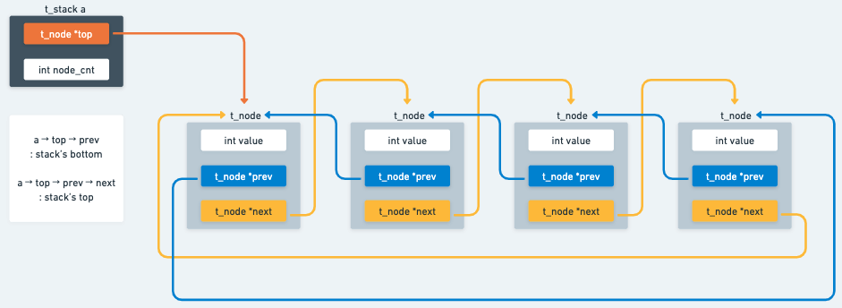
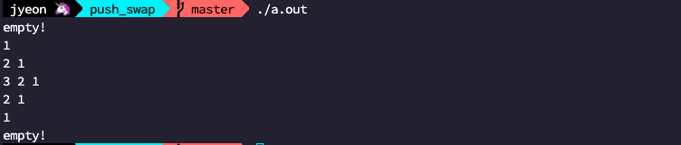
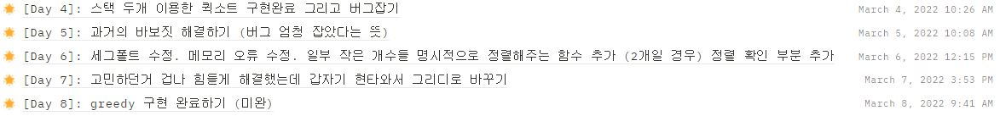
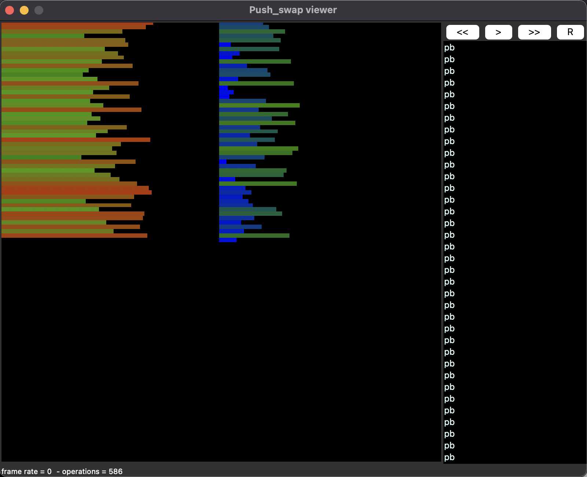
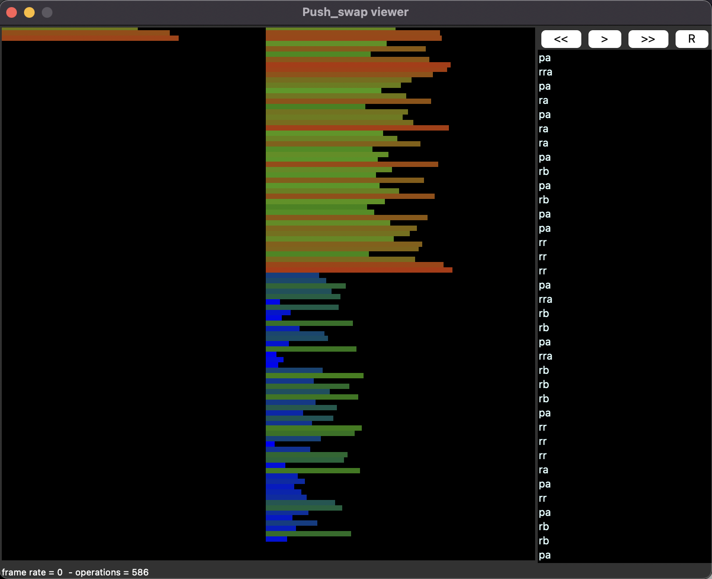
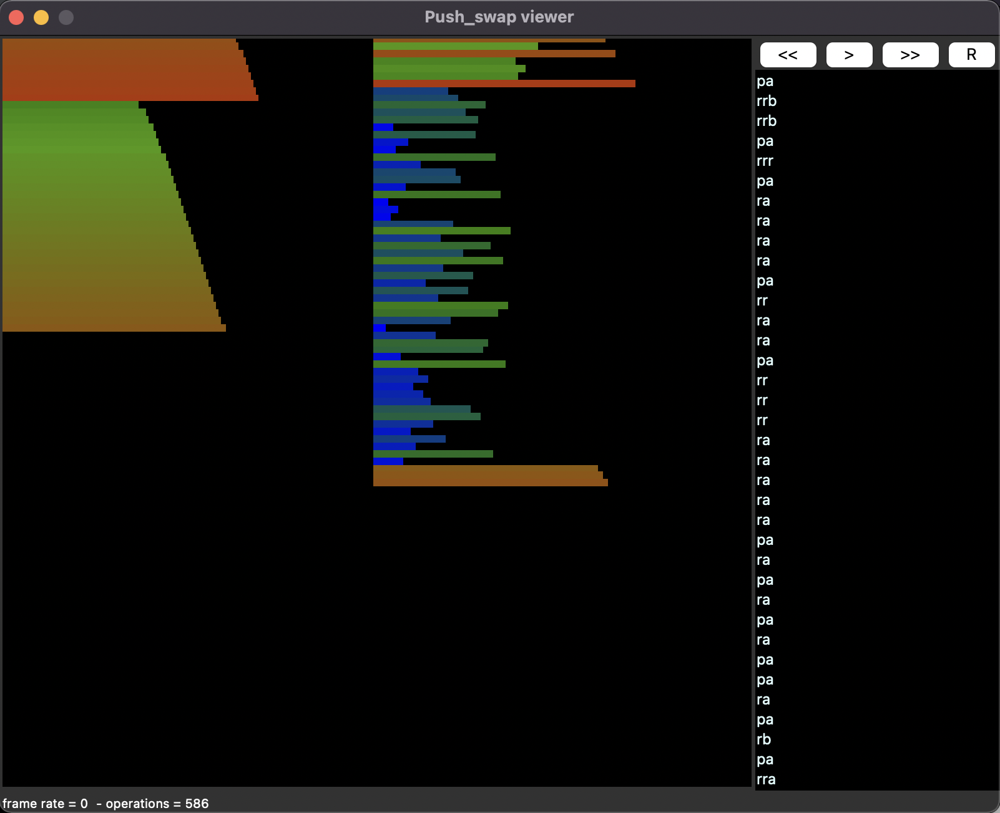
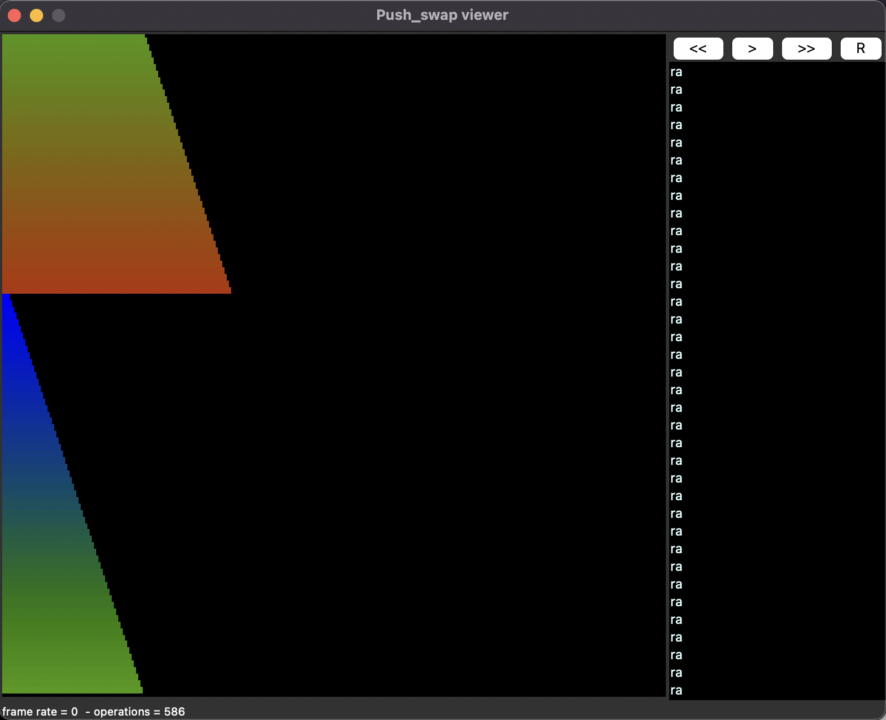

## 🚀 intro

정렬 알고리즘에 대해서 공부하는 과제이다. 

스택을 구현하고, 정렬 알고리즘을 구현하고, 메모리 관리에 대해서 공부할 수 있는 과제였다.

## 🚀 해결 순서

앞서서 했던 과제들은 사실 해야 할 일이 명확히 정해져 있어서 그냥 마음가는대로 (?) 하나씩 해결해가면 자연스럽게 전체적으로 과제가 해결이 되었었는데 push_swap은 해야 할 일이 너무 많아서 그냥 무턱대고 시작을 하니까 이것도 필요하고, 저것도 필요한 상황이 많아지면서 너무 혼란스러웠다.

그래서 이번 과제를 하면서는 어떤 순서로 문제를 해결해 나갈지 계획을 세우고, 그 순서대로 과제를 차근차근 진행해 나갔다.

1. 서브젝트 이해하기 
2. STACK 구현하기 - 자료구조 구현, `push`, `pop` 함수 구현
3. 서브젝트의 명령어 구현하기 - `sa`, `sb`, `ss`, `pa`, `pb`, `ra`, `rb`, `rr`, `rra`, `rrb`, `rrr`
4. 인자 전처리 구현하기 - 정수 변환, 오류 입력 처리
5. sort 구현하기

이렇게 일주일 정도 안에 해결을 해야겠다 계획을 세우긴 했는데 중간에 sort 알고리즘도 바꾸고, 하루에 하나씩 하기는 좀 무리였고, 좀 밍기적 거리기도 했고 (적다보니까 변명같은데 할 말은 없다;;) 그래서 총 2주 정도 걸린 것 같다.

## 🚀 1. 서브젝트 이해하기

스택 2개를 가지고 원소들을 이리저리 옮겨가면서 오름차순 정렬하는 과제이다. 

원소들을 옮길 때 서브젝트에서 정의해 준 명령어들을 사용해서 옮겨줘야 하고, 그 때 사용하는 명령어의 개수를 최소로 하는 그 목록을 출력하는 것이 이 과제의 최종 목표이다. 

## 🚀 2. STACK 구현하기

서브젝트에서는 스택이라고 말하긴 했지만 사용할 수 있는 명령어를 보면 스택보다는 순환 큐에 더 가깝다는 생각이 든다.  그래도 서브젝트에서 스택이라고 했으니 스택을 구현하고, 스택에서 사용할 `push`와 `pop` 명령어를 구현해줬다. 

스택은 원형 이중 연결 리스트로 구현해줬다.  나는 rotate 연산을 보다 쉽게 하기 위해서, 그리고 탐색을 보다 쉽게 하기 위해서 원형, 그리고 이중 연결 리스트로 구현을 한건데 굳이 원형 연결리스트로 구현하지 않고 스택의 정보를 저장할 구조체에 top과 bottom 을 모두 저장하게 해서 시작과 끝을 조정해가면서 rotate 연산을 구현하신 분도 계신 듯 하다. 이거는 어떤 쪽이 편하냐에 따라 선택하면 될 듯 하다!

연결리스트 구현을 다 했으면 이제 push 와 pop 구현하기... 사실 원형 이중 연결리스트로 스택을 구현하게 되면 push와 pop구현이 좀 골치아파진다. 아무튼 



스택은 위 그림과 같은 구조로 구현했고



간단한 테스트 결과 잘 되는 것을 확인할 수 있었다.

## 🚀 3. 서브젝트의 명령어 구현하기

### ✨ `sa`, `sb`, `ss`

각 stack의 top에 있는 2개의 요소를 swap

굳이 pop과 push를 해 줄 필요 없이 그냥 value만 swap해주면 된다.

### ✨ `pa`, `pb`

각 스택의 top을 다른 스택에 push하고, 현재 stack에서는 pop하기

### ✨ `ra`, `rb`, `rr`, `rra`, `rrb`, `rrr`

top을 상황에 맞게 바꾸어주면 된다.

## 🚀 4. 인자 전처리 구현하기

서브젝트에서 오류 입력에 대한 처리를 요구하긴 했는데 그 기준이 굉장히 모호해서 생각할 수 있는 입력에 대해서는 모든 처리를 해 줬어야 했다. (막상 평가표에서는 그렇게 빡빡하게 검토하진 않았지만 평가자에 따라서는 다양한 케이스를 검토할수도 있을 것 같다ㅎㅎ)

내가 처리해준 예외 입력들은
- 인자가 없는 경우 => 아무것도 출력하지 않는다. (error가 아니다!)
- 인자에 숫자가 아닌 문자가 있는 경우 => error
- 부호만 있는 경우 => error
- 1개의 인자에 공백을 기준으로 여러 개의 정수가 있는 경우 => 공백을 기준으로 파싱해줘야 한다.
- 정수 범위를 벗어나는 경우 => error
- 중복된 인지가 입력된 경우 => error

가 있다. 

다른 예외 케이스들은 처리하는게 그렇게 어렵지는 않았는데 4번째 예외인 공백을 기준으로 파싱하는 부분이 좀 어렵긴 했다.

많이 쓰시는 방법으로는 기존 libft에서 만들어뒀던 `ft_split`을 사용하시는 것 같았는데 나는 메모리 관리가 좀 어려울 것 같아서 그냥 바로바로 stack에 push해주는 방법을 사용했다.

마지막 예외 케이스인 중복인자의 경우에는 중간값으로 피봇을 설정하기 위해서 미리 입력받은 인자들을 정렬해뒀기 때문에 그 정렬된 배열에서 인접한 2개의 원소들을 비교하면서 중복된 것이 있는지 판단하는 방법으로 중복 인자 여부를 확인해주었다.

## 🚀 5. sort 구현하기

### ✨ 서론

좋은 정렬 알고리즘을 생각해보려 했으나 쉽지 않았다. 그래서 이런저런 가이드들을 많이 찾아봤는데 대부분 quick sort, 아니면 merge sort를 이용한 가이드들이 많았다. 그래서 나도 대세를 따라 quick sort로 구현을 하고, 2~5개 정렬까지 모두 구현하고, 명령어 최적화까지 갔는데... 갑자기 현타가 왔다. 



현타온날의 일일 기록...

미리 저장해둔 명령어를 최적화하는 부분에서 엄청 지쳤던 것 같다. 어차피 실질적인 시간 복잡도를 고려해야 하는 과제가 아니기 때문에 (이 생각은 동료평가 때 반박당하긴 했다..ㅎㅎ)  굳이 디버깅도 어려운 quick sort를 이용해서 정렬을 해야 하는지, 그마저도 최선의 정렬 방법이 아니기 때문에 이후에 명령어 최적화를 해 줘야 하는데? 이런 여러가지 생각 때문에 다시 다른 방법이 없나 열심히 찾아봤다. 

그리고 발견한 greedy algorithm을 사용한 push_swap 가이드.... <https://techdebt.tistory.com/27>

가이드를 너무 잘 써주신 덕분에 이해도 너무 잘 되었고, 구현과 디버깅 과정도 quick sort에 비해서는 더 쉽다고 판단을 했고, 항상 최선의 선택을 하기 때문에 만점도 넉넉하게 받을 수 있다. 

그래서 나도 위의 가이드를 참고해서, 이미 정렬된 stack을 회전시켜가면서 원소를 삽입하기 위한 최선의 선택을 하는 greedy algorithm으로 정렬 구현을 해 줬다.

### ✨ 구현하기

[과제 레포](https://github.com/yoouyeon/42Cursus/tree/main/push_swap)

전반적인 push_swap의 동작을 해 주는 함수는 `ft_push_swap` 함수이다.

```c
void ft_push_swap(t_varlist *varlist)
{
	if (is_sorted_a(varlist))
		return ;
	if (varlist -> a -> size <= 5)
	{
		sort_a_less_five(varlist);
		return ;
	}
	divide_two(varlist);
	while (varlist -> a -> size > 3)
		pb(varlist -> a, varlist -> b);
	if (varlist -> a -> size == 2)
		sort_two_a(varlist);
	else
		sort_three_a(varlist);
	while (varlist -> b -> size > 0)
		rotate_and_pa(varlist);
	rotate_last(varlist);
	return ;
}
```

이 함수에서는 피봇 하나를 사용해서 먼저 a 스택의 원소들 중에서 비교적 작은 원소들을 b 스택으로 보낸 뒤에, (`divide_two` 함수)

a 스택을 정렬해주고,

b 스택의 모든 원소들을 a 스택으로 보낼 때까지 최적의 명령어 개수로 보낼 수 있는 b의 원소를 찾아서 `pa` 해 주는 함수(`rotate_and_pa`)를 호출해준다. 

다음은 b의 원소의 개수만큼 호출이 되는 `rotate_and_pa` 함수인데,

```c
void rotate_and_pa(t_varlist *varlist)
{
	int cnt_ra;
	int cnt_rb;
	cnt_ra = 0;
	cnt_rb = 0;
	get_ro_cnt(varlist, &cnt_ra, &cnt_rb);
	rotate_stack_a_b(varlist, &cnt_ra, &cnt_rb);
	rotate_stack_a(varlist, &cnt_ra);
	rotate_stack_b(varlist, &cnt_rb);
	pa(varlist -> a, varlist -> b);
}
```

`get_ro_cnt` 함수에서 최소 명령어로 b -> a 로 옮길 수 있는 그 최적의 원소를 각 스택의 top으로 위치시킬 수 있는 `ra` 횟수와 `rb` 횟수를 구해 준 다음에

동일한 방향으로 돌릴 수 있다면 같이 돌려주는 편이 더 효율적이므로 (`rr`, `rrr`) 가능하다면 같은 방향으로 돌릴 수 있을 때까지 같이 돌려주고 (`rotate_stack_a_b`)

그다음에 남은 횟수만큼 a스택과 b 스택을 돌려주게 되면 (`rotate_stack_a`, `rotate_stack_b`)

`pa`를 했을 때 b의 원하는 원소를 a의 원하는 위치에 넣을 수 있게 된다.

```c
void get_ro_cnt(t_varlist *varlist, int *cnt_ra, int *cnt_rb)
{
	t_node *temp;
	int b_idx;
	int new_cnt_ra;
	int new_cnt_rb;
	temp = varlist -> b -> top;
	b_idx = 0;
	while (b_idx < varlist -> b -> size)
	{
		new_cnt_ra = get_cnt_ra(varlist, temp -> value);
		if (b_idx > varlist -> b -> size / 2)
			new_cnt_rb = (varlist -> b -> size - b_idx) * -1;
		else
			new_cnt_rb = b_idx;
		if (b_idx == 0 || is_new_best_way(*cnt_ra, *cnt_rb, new_cnt_ra, new_cnt_rb) == 1)
		{
			*cnt_ra = new_cnt_ra;
			*cnt_rb = new_cnt_rb;
		}
		temp = temp -> next;
		b_idx++;
	}
}
```

`get_ro_cnt` 함수에서는 b의 모든 원소들을 탐색하면서

현재 a 스택에 넣고자 하는 그 원소의 자리를 a스택의 top으로 두기 위해 필요한 `ra`의 횟수를 구하고, (`get_cnt_ra`)

`rb`의 횟수를 구하고,

그 둘을 조합해서 만들 수 있는 최선의 명령어의 개수가 기존의 명령어의 개수보다 적을 경우(`is_new_best_way`)에는 업데이트를 해주는 과정을 계속해서 반복하면서 최선의 선택을 찾는다.

rotate 명령어 횟수를 찾을 때에는 서브젝트에서 rotate 명령어와 reverse rotate 명령어 두개를 구분하여 정의해줬기 때문에 만약 현재 스택의 크기의 절반 이상의 횟수만큼 rotate를 해줘야 할 경우에는 reverse rotate를 하게 해서 좀 더 명령어의 호출 횟수를 줄여주었다.

이 과정을 b에 원소가 없을 때까지 계속 반복하면 정렬이 완료된다.

### ✨ visualizer

위의 정렬방법을 push_swap visualizer로 돌려보았다. (<https://github.com/o-reo/push_swap_visualizer>)






1. pivot을 기준으로 a와 b 스택에 절반으로 나누어주었다.

2. 하드코딩으로 정렬이 가능한 수만 남기고 모두 b 스택으로 넘겨주었다.

3. a 스택을 돌려가면서 적절한 위치에 b의 원소를 넣어주었다.

4. 모든 원소가 a 스택에 들어오면 과제에서 요구했던 대로 가장 작은 원소가 top에 오도록 스택을 회전시켜준다.


## 🚀 결론과 반성

quick sort 로 구현했을때에는 명령어를 저장해두었다가 출력 시에 최적화하는 과정이 필요했고, 그마저도 나는 pivot을 하나만 썼기 때문에 만점 기준을 맞추는것이 꽤 까다로웠는데 greedy 방식으로 구현하니 만점 기준은 넉넉하게 맞출 수 있었다. 

사실 나는 이 과제가 요구하는 바가 "출력되는 명령어의 개수를 최소화하는 것"이라고 생각했기 때문에 시간복잡도에 대해서는 별로 고민하지 않았었는데 동료평가때 한 평가자님이 이 서브젝트에 복잡도에 대한 고민을 할 수 있는 과제라는 언급이 되어 있다는 점을 짚어 주셨다. 하하 

일단 정렬 알고리즘을 구현하는 과제이고, 알고리즘을 공부하면서 시간복잡도는 뺄 수 없는 주제이기 때문에 내가 구현한 알고리즘의 시간복잡도는 어느정도 나올지 고민을 해 봤으면 더 좋지 않았을까 하는 생각을 했고, 나중에 평가를 다니다 나랑 같은 방식으로 푸신 분이 계시다면 시간복잡도에 대해서 한번 여쭤봐야겠다는 생각을 했다ㅋㅋ