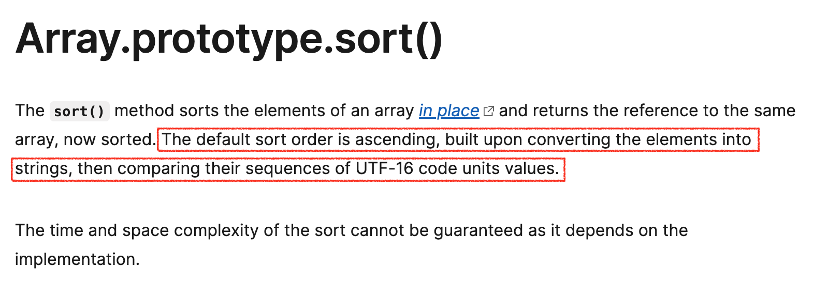

[최솟값 만들기](https://programmers.co.kr/learn/courses/30/lessons/12941)

## 🌟 문제

길이가 같은 배열 A, B 두개가 있습니다. 각 배열은 자연수로 이루어져 있습니다.
배열 A, B에서 각각 한 개의 숫자를 뽑아 두 수를 곱합니다. 이러한 과정을 배열의 길이만큼 반복하며, 두 수를 곱한 값을 누적하여 더합니다. 이때 최종적으로 누적된 값이 최소가 되도록 만드는 것이 목표입니다. (단, 각 배열에서 k번째 숫자를 뽑았다면 다음에 k번째 숫자는 다시 뽑을 수 없습니다.)

예를 들어 A = `[1, 4, 2]` , B = `[5, 4, 4]` 라면

- A에서 첫번째 숫자인 1, B에서 첫번째 숫자인 5를 뽑아 곱하여 더합니다. (누적된 값 : 0 + 5(1x5) = 5)
- A에서 두번째 숫자인 4, B에서 세번째 숫자인 4를 뽑아 곱하여 더합니다. (누적된 값 : 5 + 16(4x4) = 21)
- A에서 세번째 숫자인 2, B에서 두번째 숫자인 4를 뽑아 곱하여 더합니다. (누적된 값 : 21 + 8(2x4) = 29)

즉, 이 경우가 최소가 되므로 **29**를 return 합니다.

배열 A, B가 주어질 때 최종적으로 누적된 최솟값을 return 하는 solution 함수를 완성해 주세요.

## 🌟 풀이

길이가 같은 배열의 원소들을 한쌍씩 짝지어서 곱해준 값들의 누적합의 최솟값을 구하는 문제이다.

최종 합이 작으려면 큰 값을 가장 작은 값과 곱해주는 것이 유리하므로, 두 배열을 각각 오름차순과 내림차순으로 정렬해서, 한 배열의 가장 작은 값과 다른 배열의 가장 큰 값을 곱해주는 방식으로 누적합의 최솟값을 구해야 겠다는 것을 생각해내는 것은 어렵지 않았다... 다만 이상한 곳에서 삽질을 좀 했던게 문제...(부족한 자바스크립트 실력이 Level2에서 드러나다...)

---

for문에서 여러 변수를 사용하고 싶다면 아래와 같이 해 주면 된다.

```js
/**
* A: [1, 4, 2]
* B: [5, 4, 4]
*/
for(let i = 0, j = 0; i < A.length && j < B.length; i++, j++) {
	console.log(A[i], B[i]);
}

/**
* 1 5
* 4 4
* 2 4
*/
```

근데 배열이니만큼 인덱스로 접근하는 것 보다는 iterator로 접근하고 싶어서 `for ... of ...` 구문에서도 2개의 배열에 동시에 접근이 가능한지 찾아봤는데 JS에서는 불가능했고, 파이썬에서는 가능했다.

```python
a = ["a", "b", "c", "d", "e"]
b = [1, 2, 3, 4]

for i in zip(a, b):
    print(i)
    
# ('a', 1)
# ('b', 2)
# ('c', 3)
# ('d', 4)
```

zip 함수를 쓰면 좀 편해질 것 같아서 reduce 메소드로 허접하게 만들어보았다... (reduce 연습겸 만들어본거 맞음)

```js
function zip(A, B) {
  const len = Math.min(A.length, B.length);	// 길이가 작은 것 기준으로 잘려서 만들어짐
  const ret = A.reduce((acc, cur, i) => {
    acc.push([cur, B.at(i)]); // 계속해서 배열에 넣어준다
    return acc;	// '누적'이기 때문에 리턴을 해 주지 않으면 undefined가 됩니다.
  }, []);
  return ret;
}

function solution(A, B) {
  // ... 생략
  const AB = zip(A, B);	// 👏
  for (let [a, b] of AB) {
      answer += a * b;
  }
  return answer;
}
```

이렇게 미리 합쳐놓고 순회하면 좋지 않을까 하고 생각했던 것은 A와 B의 길이가 다른 경우를 고려한 생각이었는데,,, 조심해서 나쁠 건 없지만 다시 보니 문제 조건에 A와 B의 길이가 같다고 명시되어 있으므로 미리 합치지 않고도 reduce 메서드로 한번에 값을 구해줄 수도 있다.

```js
answer = A.reduce((acc, cur, idx) => {
  acc += cur * B[idx];
  return acc;
}, 0);
```

---

[Array.sort()](https://developer.mozilla.org/en-US/docs/Web/JavaScript/Reference/Global_Objects/Array/sort) 메서드는 배열의 원소들을 기본적으로는 오름차순, 비교함수를 콜백함수로 전달하면 그 기준에 따라서 정렬해주는 함수이다. 이 "기본적으로"가 당연히 숫자에도 적용될 줄 알았는데 알고보니 sort 함수의 기본 정렬 방식이 element들을 모두 string으로 바꾼 뒤에 정렬하는 방식이기에 숫자의 경우 의도한 대로 동작하지 않았다...



따라서 숫자를 오름차순 정렬하는 경우에도 콜백함수로 비교 함수를 넣어줘야지 의도한대로 정렬이 된다.

```js
const arr = [43, 18, 79, 5, 111];
console.log(arr.sort());	// [ 111, 18, 43, 5, 79 ]
console.log(arr.sort((a, b) => a - b));	// [ 5, 18, 43, 79, 111 ]
```

## 🌟 코드

```js
/* 자바스크립트에서도 zip 함수를 쓰고 싶어요 버전 */

function solution(A, B) {
  let answer = 0;
  A.sort((a, b) => a - b); // 오름차순 정렬
  B.sort((a, b) => b - a); //  내림차순 정렬
  const AB = zip(A, B);
  for (let [a, b] of AB) {
      answer += a * b;
  }

  return answer;
}

function zip(A, B) {
  const len = Math.min(A.length, B.length);
  const ret = A.reduce((acc, cur, i) => {
    acc.push([cur, B.at(i)]);
    return acc;
  }, []);
  return ret;
}
```

```js
/* reduce로 한줄로 끝내버리는 버전 */

/* A, B가 길이가 다를 경우에 대한 예외처리가 되어있지 않음 */
function solution(A, B) {
  let answer = 0;
  A.sort((a, b) => a - b); // 오름차순 정렬
  B.sort((a, b) => b - a); //  내림차순 정렬
  answer = A.reduce((acc, cur, idx) => {
    acc += cur * B[idx];
    return acc;
  }, 0);

  return answer;
}
```

