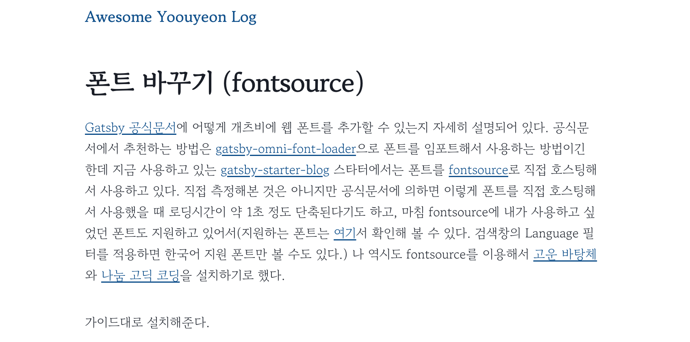
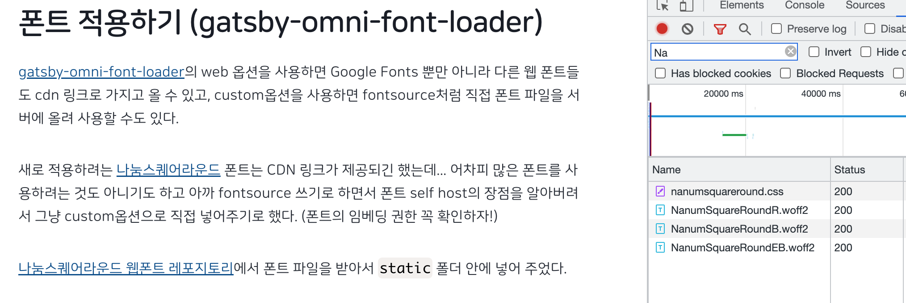

## 폰트 적용하기 (fontsource)

[Gatsby 공식문서](https://www.gatsbyjs.com/docs/how-to/styling/using-web-fonts/)에 어떻게 개츠비에 웹 폰트를 추가할 수 있는지 자세히 설명되어 있다. 공식문서에서 추천하는 방법은 [gatsby-omni-font-loader](https://github.com/codeAdrian/gatsby-omni-font-loader)으로 폰트를 임포트해서 사용하는 방법이긴 한데 지금 사용하고 있는 [gatsby-starter-blog](https://www.gatsbyjs.com/starters/gatsbyjs/gatsby-starter-blog) 스타터에서는 폰트를 [fontsource](https://github.com/fontsource/fontsource)로 직접 호스팅해서 사용하고 있다. 직접 측정해본 것은 아니지만 공식문서에 의하면 이렇게 폰트를 직접 호스팅해서 사용했을 때 로딩시간이 약 1초 정도 단축된다기도 하고, 마침 fontsource에 내가 사용하고 싶었던 폰트도 지원하고 있어서(지원하는 폰트는 [여기](https://fontsource.org/fonts)서 확인해 볼 수 있다. 검색창의 Language 필터를 적용하면 한국어 지원 폰트만 볼 수도 있다.) 나 역시도 fontsource를 이용해서 [고운 바탕체](https://fontsource.org/fonts/gowun-batang)와 [나눔 고딕 코딩](https://fontsource.org/fonts/nanum-gothic-coding)을 설치하기로 했다.

가이드대로 설치해준다.

```shell
yarn add @fontsource/gowun-batang
yarn add @fontsource/nanum-gothic-coding
```

그리고 설치한 폰트들을 `gatsby-browser.js` 파일에 임포트 해 준다.

고운 바탕체는 기본 굵기인 400 외에도 700을 지원하기 때문에 추가적으로 임포트 해 주었다. (이렇게 추가해주지 않으면 굵게 표현해야 하는 상황에 weigt 400 폰트를 브라우저 자체적으로 굵기를 키워서 보여주는데 이렇게 하면 따로 추가해 주는 것 보다 선명도가 미묘하게 떨어진다.)

```javascript
// custom typefaces
import "@fontsource/montserrat/variable.css"
import "@fontsource/merriweather"

import "@fontsource/gowun-batang"
import "@fontsource/gowun-batang/700.css" // Weight 700.
import "@fontsource/nanum-gothic-coding"
```

> 이 아래부터는 제가 사용하고 있는 gatsby-starter-blog 스타터 기준으로 진행됩니다.

전역적으로 적용되는 폰트는 `style.css` 파일 안에 변수로 정의되어 있었다.

```css
:root {
    /* ... 생략 */
    --fontFamily-sans: "MontserratVariable", system-ui, -apple-system,
    BlinkMacSystemFont, "Segoe UI", Roboto, "Helvetica Neue", Arial, "Noto Sans",
    sans-serif, "Apple Color Emoji", "Segoe UI Emoji", "Segoe UI Symbol",
    "Noto Color Emoji";
    --fontFamily-serif: "Merriweather", "Georgia", Cambria, "Times New Roman",
    Times, serif;
    --font-body: var(--fontFamily-serif);
    --font-heading: var(--fontFamily-sans);
    /* ... 생략 */
}

body {
    font-family: var(--font-body);
    font-size: var(--fontSize-1);
    color: var(--color-text);
}

h1,
h2,
h3,
h4,
h5,
h6 {
    font-family: var(--font-heading);
    margin-top: var(--spacing-12);
    margin-bottom: var(--spacing-6);
    line-height: var(--lineHeight-tight);
    letter-spacing: -0.025em;
}
```

나는 제목과 본문의 폰트를 굵기만 다르고 동일하게 적용할 것이고, 고운 바탕체는 세리프체이므로 `--fontFamily-serif`에 `"Gowun Batang"`을 추가해주고 `--font-heading`에 `--fontFamily-serif`의 값들을 넣어 주었다.

```css
--fontFamily-serif: "Gowun Batang", "Merriweather", "Georgia", Cambria, "Times New Roman",
Times, serif;
--font-body: var(--fontFamily-serif);
/* --font-heading: var(--fontFamily-sans); */
--font-heading: var(--fontFamily-serif);
```

쨘 이렇게 바꾸고 적용까지 했는데!



내가 생각했던 분위기와 너무 달라서 폰트를 바꾸기로 했다...

## 폰트 적용하기 (gatsby-omni-font-loader)

새로 적용하려는 [나눔스퀘어라운드](https://hangeul.naver.com/font/nanum) 폰트는 fontsource로 설치할 수 없기 때문에 [gatsby-omni-font-loader](https://github.com/codeAdrian/gatsby-omni-font-loader)를 사용해서 추가해주었다.

gatsby-omni-font-loader의 web 옵션을 사용하면 Google Fonts 뿐만 아니라 다른 웹 폰트들도 cdn 링크로 가지고 올 수 있고, custom옵션을 사용하면 fontsource처럼 직접 폰트 파일을 서버에 올려 사용할 수도 있다.

새로 적용하려는 폰트는 CDN 링크가 제공되긴 했는데... 어차피 많은 폰트를 사용하려는 것도 아니기도 하고 아까 fontsource 쓰기로 하면서 폰트 self host의 장점을 알아버려서 그냥 custom옵션으로 직접 넣어주기로 했다. (폰트의 임베딩 권한 꼭 확인하자!)

[나눔스퀘어라운드 웹폰트 레포지토리](https://github.com/innks/NanumSquareRound)에서 폰트 파일을 받아서 `static` 폴더 안에 넣어 주었다.

```
└── static
    └── fonts
        └── NanumSquareRound
            ├── NanumSquareRoundR.eot
            ├── NanumSquareRoundB.eot
            ├── NanumSquareRoundEB.eot
            ├── ...
            └── nanumsquareround.css
```

readme의 설명에 따라 플러그인을 설치하고, `gatsby-config.js`의 plugin 배열에 아래와 같이 추가해주었다.

```shell
yarn add gatsby-omni-font-loader react-helmet
```

```javascript
{
    resolve: "gatsby-omni-font-loader",
    /* Plugin options */
    options: {
        /* Font loading mode */
        mode: "async",
        /* Enable font loading listener to handle FOUT */
        enableListener: true,
        /* Self-hosted fonts config. Add font files and font CSS files to "static" folder */
        custom: [
            {
            /* Exact name of the font as defied in @font-face CSS rule */
            name: "NanumSquareRound",
            /* Path to the font CSS file inside the "static" folder with @font-face definition */
            file: "/fonts/NanumSquareRound/nanumsquareround.css",
            },
        ],
    }
}
```

> 이 아래부터는 제가 사용하고 있는 gatsby-starter-blog 스타터 기준으로 진행됩니다.

그리고 fontsource의 설정과 동일하게 `src/style.css` 의 변수를 수정해주었다. (따로 `gatsby-browser.js`에서 import를 다시 해 줄 필요는 없다.)

나눔스퀘어라운드 폰트는 산세리프 폰트이므로 `--fontFamily-sans`에다 `"NanumSquareRound"`를 추가해주었고, 지원하는 폰트 굵기가 300, 400, 700, 800 이므로 `--fontWeight-normal`(본문), `--fontWeight-bold`(bold, h2~h6), `--fontWeight-black`(h1)의 값을 각각 400, 700, 800으로 변경해주었다.

```css
--fontFamily-sans: "NanumSquareRound", "MontserratVariable", system-ui, -apple-system,
BlinkMacSystemFont, "Segoe UI", Roboto, "Helvetica Neue", Arial, "Noto Sans",
sans-serif, "Apple Color Emoji", "Segoe UI Emoji", "Segoe UI Symbol",
"Noto Color Emoji";
--font-body: var(--fontFamily-sans);
--font-heading: var(--fontFamily-sans);
--fontWeight-normal: 400;
--fontWeight-bold: 700;
--fontWeight-black: 800;
```

적용되었다! 나눔스퀘어라운드 폰트는 좀 둥글둥글한편이라 좀 티가 나는데 다른 고딕 계열 폰트들은 예리한 사람이 아니라면 적용 여부를 판단하기가 조금 어려울 수도 있기 때문에 network 탭에 들어와서 실제로 폰트들이 잘 불러져 왔는지를 확인해보는 것이 좋다. (나는 폰트 파일들을 올리는걸 까먹어서 404 에러가 났었다..😓)


