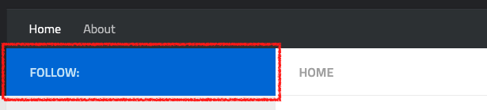
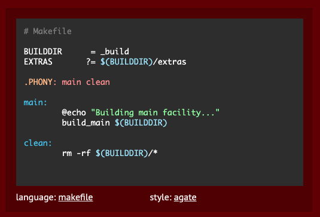
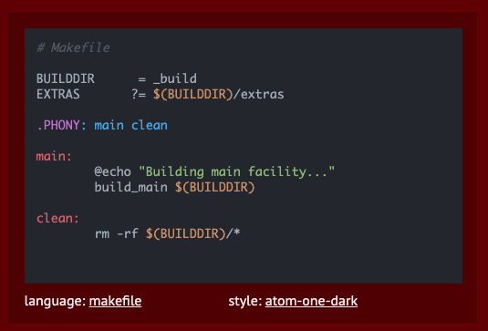
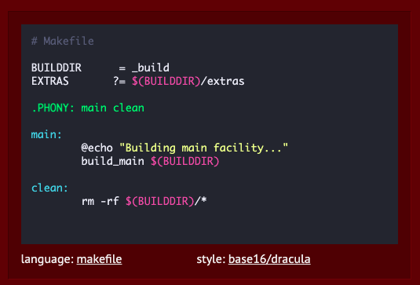
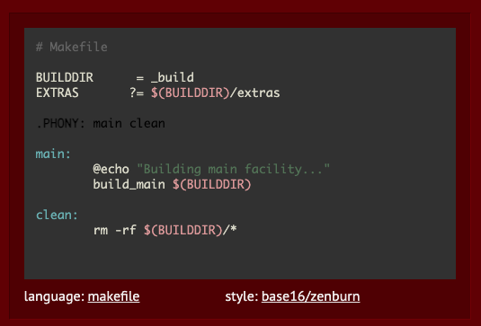
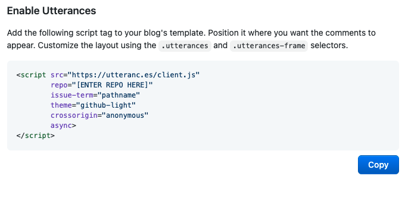

기존의 [Icarus](https://github.com/ppoffice/hexo-theme-icarus) 테마에서 [Hueman](https://github.com/ppoffice/hexo-theme-hueman) 테마로 블로그 테마를 바꾸어줬다.

기본 테마는 취향에도 안맞고 필요한 기능은 없고 불필요한 기능은 있는 (...) 그런 상태라 이곳저곳 건드려가며 입맛에 맞게 바꿔줬다.

Hexo 테마 커스텀하는 한국어 글은 많이 보이지가 않았던거 같아서 (그런 이유로 일일이 코드 뜯어보면서 수정해줬다.) 내가 변경한 내용을 좀 정리해보려고 한다.

## 🚀 Hueman 테마 적용하기
아래에 정리할 테마 커스텀은 Hueman 테마를 기준으로 한다. 따라서 기본적으로 적용되어있는 landscape 테마에서 Hueman 테마로 변경해줘야 한다. 테마 적용방법은 정말 간단하고 그마저도 [공식문서](https://github.com/ppoffice/hexo-theme-hueman/wiki/Installation)에 너무나도 자세하게 설명되어 있기 때문에 정리하지는 않겠다. 나도 이거보고 설치해줬다.

## 🚀 커스텀해보자
### ✨ 소셜 링크 제거하기
기본적으로 Hueman 테마에는 SNS 계정을 링크할 수 있는 Social Link 부분이 있다.



그런데 나는 원래 SNS 잘 안하기도 하고 기술블로그에 링크할만한 SNS 계정도 없어서 그냥 이 부분을 아예 삭제해주고 싶었다.

이 부분에 대한 태그는 `hueman/layout/common/` 폴더의 `sidebar.ejs` 파일에 있다.
```JS
<!-- <div class="sidebar-top">
	<p><%= __('sidebar.follow') %>:</p>
		<ul class="social-links">
			<% for (var i in theme.customize.social_links) { %>
				<% if (theme.customize.social_links[i]) { %>
				<li>
					<a class="social-tooltip" title="<%= i %>" href="<%- url_for(theme.customize.social_links[i]) %>" target="_blank" rel="noopener">
						<i class="icon fa fa-<%= i %>"></i>
					</a>
				</li>
				<% } %>
			<% } %>
		</ul>
</div> -->
```
위 내용을 주석처리 해 주면 소셜링크 부분이 사라진다.

### ✨ 코드 하이라이트 색상 변경하기
[공식문서](https://github.com/ppoffice/hexo-theme-hueman/wiki/Theme#highlight)에도 나와있는 내용이긴 하지만 블로그의 코드블록의 하이라이트 테마를 바꿀 수 있다.

`hueman/source/css/_highlight` 폴더에 사용가능한 테마들이 있고, 골라서 `hueman/_config.yml` 파일에 적어주면 되는데 테마 컬러들은 [https://highlightjs.org/](https://highlightjs.org/)에서 맛보기로 볼 수 있다.

나는 다크 테마를 선호해서 다크 테마들 중에서 후보를 골라보았는데






테마 컬러도 그렇고 좀 뮤트한게 예쁠 것 같아서 zenburn 테마로 골라줬다.

### ✨ utterances 적용하기

댓글 기능을 제공하는 여러 서비스들 중에서 utterances가 가장 깔끔하다는 생각이 들어서 hexo 블로그 시작부터 쭉 utterances를 사용하고 있었는데 Hueman 테마에는 기본적으로는 utterances를 지원하지 않는 것 같다. (기본 `_config.yml` 파일에 없음.)

[https://utteranc.es/](https://utteranc.es/) 링크에서 설명하는대로 따라 하면 아래와 같은 스크립트 코드가 생성된다. 그 코드를



`hueman/layout/comment` 폴더에  `utterances.ejs` 파일을 생성하여 붙여넣어준다.

같은 폴더의 `index.ejs` 파일에 아래 코드를 넣어준 후에

```JS
<% if (post.comments) { %>
    <section id="comments">
    <% if (theme.comment.disqus) { %>
        <%- partial('comment/disqus') %>
    <% }  else if (theme.comment.utterances.enable){ %>
        <%- partial('comment/utterances')%>
// 이하 생략
```
`hueman/_config.yml` 파일에서 Comment 부분을 아래와 같이 수정해 주면 utterances가 포스트 하단에 적용된다.
```yaml
# Comment
comment:
    utterances:
        enable: true
    disqus: # enter disqus shortname here
```
### ✨ 각 영역의 색깔 바꿔주기
소셜링크, 드래그했을 때 하이라이트되는 부분, 하이퍼링크 부분의 색깔은 `hueman/_config.yml` 파일의 테마 부분에서 적용할 수 있다.

하지만 부족함을 느낀다면... `hueman/source/css/_variables.styl` 파일의 각 변수들의 값을 지정해줌으로써 메인 배경, 사이드바 배경, 네비게이션 바 배경 등의 색깔을 임의로 지정해줄 수 있다.

```css
// Colors
color-default = #555
if hexo-config("customize.theme_color")
    color-theme = convert(hexo-config("customize.theme_color"))
else
    color-theme = #3b8dbd
color-grey = #aaa
color-header-background = #26272b
color-main-background = #fff
color-background = #eaeaea
color-mobile-nav-background = #191919
color-border = #ddd
color-border-light = #eee
color-nav-foreground = rgba(255,255,255,0.7)
color-nav-background = #33363b
color-nav-hover-background = rgba(0,0,0,0.1)
color-sidebar-background = #f0f0f0
color-sidebar-text = #777
color-sidebar-text-dark = #444
color-footer-background = #33363b
```

나는 색깔만 바꿔줬기 때문에 Colors 부분만 수정해줬는데 `_variables.styl` 파일에는 폰트나 레이아웃 사이즈 같은 것들도 수정할 수 있게 되어 있어서 더 필요하다면 좀 더 자기에게 맞게 수정해 볼 수도 있을 것 같다.

---

폰트를 수정할 수 있다는 사실을 알게 되니 기본 폰트에서 한글과 영문 폰트 차이가 있는게 거슬리기 시작했다.</br>
근데 폰트 부분은 중요한 부분이라 그런지 Hueman 테마와 관련된 게시글이 많아서 다행히도 시행착오 없이 폰트를 변경할 수 있었다.</br>
도움을 받은 글들을 링크해 뒀으니 폰트가 거슬리는 다른 분들께도 도움이 되었으면 좋겠습니다.

[https://futurecreator.github.io/2018/06/12/hexo-change-font-on-hueman-theme/](https://futurecreator.github.io/2018/06/12/hexo-change-font-on-hueman-theme/)

[https://d2fault.github.io/2018/02/21/20180221-hexo-change-font-hueman-theme-version/](https://d2fault.github.io/2018/02/21/20180221-hexo-change-font-hueman-theme-version/)
