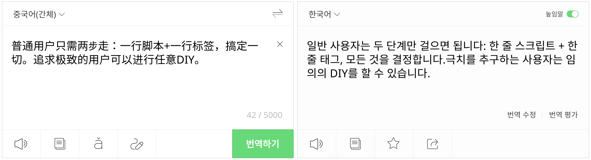
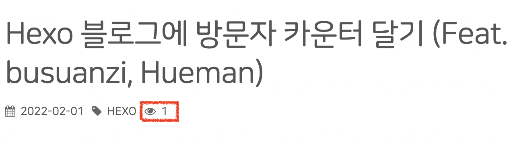

## 🚀 intro

~~공부하기 싫을 때마다 하는~~ 헥소 블로그 커스터마이징

원래는 개인 기록용 블로그라는 느낌이 커서 (지금도 그렇긴 하지만) 방문자에 대한 생각을 전혀 하지 않고 있었다. 근데 얼마 전에 그동안 문제가 있어서 게시되지 않던 구글 애드센스 광고가 드디어 달리기 시작했고 (그 문제는 바로 나의 오타였다... 오타를 몇개월동안 알아채지 못했음..ㅎ) 문득 생각나서 구글 애널리틱스에 들어가봤는데 의외로(!) 방문자가 좀 있어가지고 방문자 카운터를 달고싶다... 라는 생각이 갑자기 들었던 것 같다.

정적 블로그에 방문자수 카운터를 다는 가장 흔한 방법이 아마도 hits 배지를 사용하는 것 같은데 ([HITS 공식 사이트](https://hits.seeyoufarm.com/)) Hits 배지 디자인이 아무래도 내 블로그 테마와는 썩 어울리지 않아 보여서 나는 예전에 icarus 테마를 사용할 때 봤었던 **busuanzi**로 카운터를 달기로 했다.

## 🚀 busuanzi

[[busuanzi 공식 사이트]](http://ibruce.info/2015/04/04/busuanzi/)

사이트에 들어가보면 알겠지만 중국어로 되어 있다. 중국어를 전혀 모르는 나에겐 언어의 장벽이 좀 크지만... 개발하신 분이 말씀하셨듯이 두 줄만 추가하면 기본적인 카운터를 달 수 있다.



진짜임.

### ✨ step 1. 스크립트 코드

일단 첫번째로 스크립트 코드를 넣어준다.

```html
<script async src="//busuanzi.ibruce.info/busuanzi/2.3/busuanzi.pure.mini.js"></script>
```

공식에서는 footer나 header에 삽입하라고 하고, 실제로 둘 중 어느곳에도 삽입해도 잘 되지만 나는 헤더에 넣는 것이 더 익숙해서 헤더에 넣어 주었다.

### ✨ step 2. 사이트 방문자 카운터

두번째로는 사이트 방문자 카운터 코드를 원하는 위치에 넣어준다. 카운팅 하는 두가지 알고리즘이 있는데 ID만 잘 지켜서 원하는 대로 넣어주면 된다.

1. pv 방식: 1명의 사용자가 n개의 포스트를 확인한다면 n번으로 카운트하기

   ```html
   <span id="busuanzi_container_site_pv"> 
       view <span id="busuanzi_value_site_pv"></span>
   </span>
   ```

2. uv 방식: 1명의 사용자가 n개의 포스트를 확인하더라도 1번으로 카운트하기

   ```html
   <span id="busuanzi_container_site_uv"> 
     visiter <span id="busuanzi_value_site_uv"></span>
   </span>
   ```

이렇게 해 주면 기본적인 블로그 방문자 카운터를 달 수 있다. 참 쉽죠?

### ✨ step 3. (option) 게시글 조회수

게시글 조회수 카운터도 달 수 있다. 마찬가지로 ID만 잘 지켜서 원하는 위치에 달아주면 된다.

```html
<span id="busuanzi_container_page_pv"> 
  view <span id="busuanzi_value_page_pv"></span>
</span>
```

### ✨ step 4. (option) DIY

자체적으로 제공하고 있는 디자인이 없기 때문에 엄청 깔끔할 뿐 아니라 규칙만 잘 지킨다면 원하는대로 응용할수도 있다. 아까 개발자분의 말씀에서 극치의~~ 이 부분이 이 말인 것 같다.

아까부터 공식 문서에 계속 등장하는 말이 있는데 ID를 잘 지키라는 말이다. 각각의 ID를 가진 요소들에는 역할이 정해져 있어서 꼬이면 안된다는 것 같다. 그 각각의 ID의 역할은 아래와 같다.

- `busuanzi_value_site_pv` : 방문 횟수의 값을 나타낸다. 필수적인 요소이다. (당연함.)
- `busuanzi_container_site_pv` : 엑세스 오류가 발생한다거나, 카운팅 서비스의 시간 초과 (3초 가량의 시간 제한이 있는 듯 하다.)가 발생할 경우에 그 오류를 핸들링 하기 위한 컨테이너인 것 같다. 없어도 상관은 없지만 있는게 좋다. (이 컨테이너의 역할을 모르고 그냥 없앴더니 카운터 숫자가 자꾸 사라지는 문제가 있었다...)

위의 ID만 잘 지킨다면 CSS를 추가하든, 뭘 추가하든 자유롭게 꾸밀 수 있다.

## 🚀 Hueman 테마에 적용하기

내가 현재 사용하고 있는 hueman 테마에 적용해보았다.

### ✨ 사용 설정(?)하기

그냥 냅다 코드를 넣어도 되지만 나중에 수정할 일을 고려해서 `_config.yml` 파일에 추가를 해 줬다.

```yaml
# Plugins
plugins:
    busuanzi: true  # count visiters
```

그리고 `themes/hueman/layout/common/head.ejs` 파일에 아래의 코드를 추가해 줬다.

```ejs
<% if (theme.plugins.busuanzi) { %>
        <script async src="//busuanzi.ibruce.info/busuanzi/2.3/busuanzi.pure.mini.js"></script>
<% } %>
```

그러면 일단 준비 끝.

### ✨ 방문자 카운터

`_config.yml` 에서 플러그인에 busuanzi를 추가해 줬기 때문에 플러그인 폴더 안에 있는 script 파일을 확인해주었다. (`themes/hueman/layout/plugin/scripts.ejs`)

```ejs
...
<% } else if (typeof(isFooter) !== 'undefined' && isFooter) { %>
    <% if (theme.plugins.statcounter && theme.plugins.statcounter.on) { %>
        <%- partial('plugin/statcounter') %>
    <% } %>
		<%# 추가한 코드 시작 %>
    <% if (theme.plugins.busuanzi) { %>
        <%- partial('plugin/busuanzi') %>
    <% } %>
		<%# 추가한 코드 끝 %>
<% } else { %>
...
```

footer와 관련있어 보이는 부분에 busuanzi를 추가하는 코드를 추가했다.

그리고 같은 plugin 폴더에 `busuanzi.ejs` 파일을 만들어 uv 방식의 사이트 방문자 카운터 코드를 넣어 줬다. (사실 이 카운터를 넣는 데에는 불필요한 과정인 것 같긴 한데 모든 플러그인들이 이런 방식으로 들어가 있길래.. 나도 이렇게 해 줬다.)

```ejs
<span id="busuanzi_container_site_uv">
	Visitors <span id="busuanzi_value_site_uv"></span> 
</span>
```

그러면 이렇게 footer 부분에 카운터가 표시된다.


### ✨ 조회수 카운터

게시글 조회수는 기존 포스트 레이아웃에서 태그 옆에다 아래 사진처럼 달아주기로 했다.



포스트와 관련된 레이아웃 파일들은 `themes/hueman/layout/common/post` 에 있는데 그 중에서도 `counter.ejs` 파일에 포스트 조회수 카운터 코드를 넣어 주었다. 

```ejs
<% if (theme.plugins.busuanzi) { %>
   <div class="article-view-counter">
      <i class="fa fa-eye"></i>
      <span id="busuanzi_container_page_pv"> 
         <span id="busuanzi_value_page_pv"></span>
      </span>
   </div>
<% } %>
```

설정에 따라서 이 위치에 들어오게 될 다른 카운터들도 있는 것 같아서 (애초에 counter.ejs 파일이 존재했다는것에서부터가...) 나중에 설정을 바꾸게 되면 어떻게 될 진 모르겠으나 아직까진 다른 카운터를 넣을 생각이 없으므로 이렇게 해 두면 될 듯 하다!
