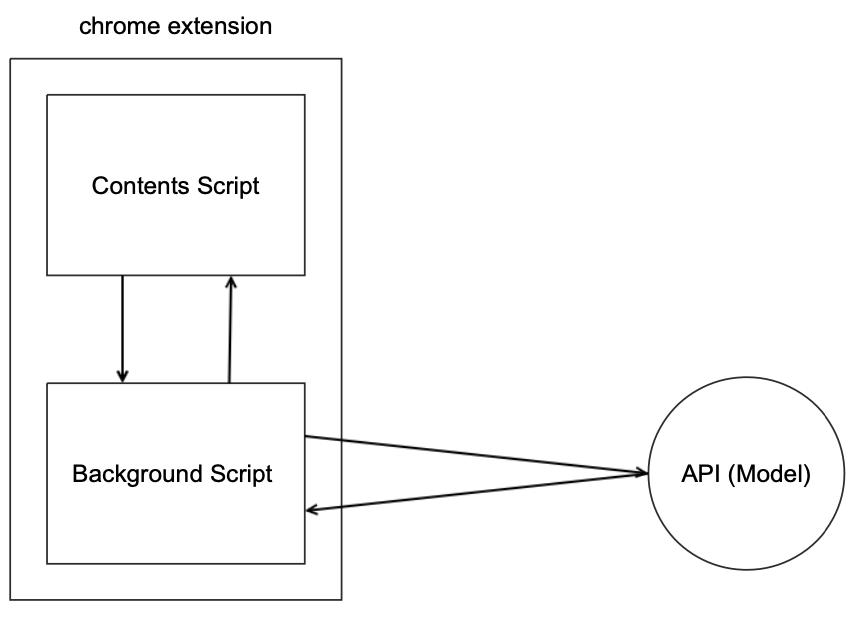

이번 1학기부터 캡스톤디자인, 즉 졸업프로젝트를 진행하고 있었다.

벌써 2학기의 중간이 다가오고 있는 만큼 중간 회고라고 하기에는 좀 늦은 것 같긴 하지만 그래도 처음으로 한 그룹 프로젝트이기 때문에 지금까지 했던 내용들을 타임라인 순서대로 기록하여 돌이켜 보려고 한다.

(퇴고 아직 x 약간 여유가 생기면 차근차근 퇴고하겠습니다...)

## 🚀 프로젝트 시작

"AI + 프론트엔드 + 분야 고민중" 이렇게 3명의 학생이 모여서 프로젝트 주제를 고민하던 중에 지도형 프로젝트 (교수님께서 제시하신 주제를 갖고 프로젝트를 진행하는 방식) 목록 중에 "딥러닝을 이용한 뉴스 사이트 애드블록" 이라는 주제가 있었다.

좋은 주제를 생각해보지 못하던 차에 우리 모두의 관심 분야에 모두 속하는 주제인 것 같아서 우리의 졸업 프로젝트 주제는 "딥러닝을 이용한 뉴스 사이트 애드블록"이 되었다.

주제 선택 후에 같은 주제를 선택한 다른 한명의 학생이 팀에 들어오게 되어서 총 4명으로 프로젝트를 시작했다.

### ✨ 각자 공부하기

우리의 메인 주제는 인공지능이 되었는데 기존에 AI를 공부하던 학생 외에는 인공지능에 대한 지식이 거의 전무한 상태였으므로 (나도 전공으로 인공지능 수업을 듣긴 했지만 완전 이론적으로 배웠기 때문에 실전에서는 어떻게 적용해야 할 지 전혀 감이 없었다.) 일단은 한 책을 가지고 인공지능 속성 스터디를 함으로써 기본적인 맥락 정도는 파악하고 본 프로젝트에 돌입하기로 했다.

책은 유명한 두잇 시리즈의 'Do it! 딥러닝 입문' [(링크)](http://www.easyspub.co.kr/20_Menu/BookView/325/PUB) 을 사용했고 매주 맡은 부분을 공부하고, 그 내용을 팀원들에게 발표하고 질문하는 방식으로 진행했다.

공부 자료 정리한 깃허브 [링크](https://github.com/kyungmin123/Adblock_with_DeepNetwork/tree/main/Deep_learning_study)

스터디 이후 솔직히 너무 속성으로 공부한 것이라 아주 자세한 내용은 이해하기 힘들었지만 앞으로 우리 프로젝트에서 어떤 작업을 해야 할 지 정도는 대충 예상해볼 수 있었다.

### ✨ 역할 분배하기

공부를 끝내고 배운 내용을 간단히 적용해보는 미니 프로젝트를 시작하려는 중에 AI 메인 코더를 담당하고자 했던 초기 멤버가 개인 사정으로 이탈하는 큰 시련이 닥쳤다.

이로써 남은 팀원들은 총 3명이 되었는데 절망스럽게도 AI 관련 프로젝트를 보거나 경험해 본 사람이 한명도 없었다.

원래 계획은 AI 파트 2인 + 웹 파트 (프론트 / 백) 2인으로 진행하고자 했었는데 현재 상태로는 남은 한명의 학생이 AI 분야를 담당하기 어려울 것이라는 판단 하에 AI 파트 2인 + 웹 파트 1인 (나) 이런 식으로 역할을 분배했다.

---

개인적으로는 한 분야를 담당하는 사람이 나 혼자뿐이었다는 점이 굉장히 아쉬운 부분이었다.

다른 분야를 담당하는 팀원과 소통하는 경험은 해 볼 수 있었지만 같은 코드를 함께 코딩하는 경우는 없었어서 이번에도 나 혼자서 내멋대로 코드를 짠 경향이 있었다.

아무래도 나도 관련 분야에 대한 지식이 별로 없었기 때문에 혼자서 삽질하는 경우도 많았고 프로그램이 돌아간다 하더라도 완성도가 매우 떨어졌다,

사소한 부분인 것 같았지만 같은 업무의 동료가 매우 중요함을 (아주 뼈저리게) 깨달을 수 있는 경험이었다.

### ✨ 프로젝트 내용과 일정 계획 확정짓기

기본적인 틀은 "딥러닝을 이용한 뉴스 사이트 애드블록"이었지만 구체적인 구현 계획이 하나도 없는 상태였었다.

교수님께서 주신 기존 프로젝트 예시는 웹 페이지를 캡쳐하여 ➡️ 그 좌표 상에서 광고의 이미지의 위치를 마스킹하여 광고를 가리는 방식이었다 (스크롤 x / 실제 프로그램으로 구현하는 과정 x).

하지만 의논 결과 이런 방식으로는 웹 페이지의 전체를 캡쳐한 후에 모델에 입력해야 하므로 실시간으로 가려져야 하는 애드블록 프로그램의 특성상 작동 속도에서 경쟁력이 없을 것이라고 판단했다.

따라서 웹 페이지에서 움직이지 않는 이미지 (jpg, png 등) 를 사용하는 태그들에서 src 정보를 수집하여 각각의 이미지를 모델에 입력시킨 후에 그 결과에 따라서 해당하는 태그를 가리는 방식으로 작동하는 프로그램을 만들기로 했고, **크롬 확장 프로그램** 으로써 동작하는 프로그램으로 만들기로 했다.

교수님께서 소개해 주신 프로젝트의 모델은 광고 이미지 / 광고가 아닌 이미지 이렇게 2개의 카테고리를 두고 구분하는 이진분류 모델이었으나 우리는 1년 단위의 프로젝트이니만큼 이진분류로는 목표가 부족하다고 판단하여 각 광고의 주제 (성인 광고/사행성 광고/교육 광고 ... ) 들을 카테고리화 하여 모든 광고를 가리는 것이 아닌 사용자가 관심있는 광고는 남길 수 있는 다중분류 모델을 목표로 하기로 했다. (뒤에 가서 말하겠지만 우리의 능력을 아주 과대평가하여 목표를 아주 잘못 잡은 것이었다..)

바로 본 프로젝트에 돌입하기에는 모든 팀원이 맡은 분야에 대해서 이론적으로만 알고 있고 실제로 코드로 구현해 본 적이 없기 때문에 일단은 이진분류를 하는 프로그램을 만드는 미니 프로젝트를 먼저 진행하기로 했고, 이 프로젝트에서 어느정도 완성도있는 결과물이 나오면 다중분류를 하는 본 프로젝트로 들어가기로 했다.

## 🚀 미니 프로젝트 (이진분류)

사실 내 입장에서는 이진분류를 하는 경우나 다중분류를 하는 경우나 사용자의 옵션 선택을 받고, 저장하고, 불러오는 기능의 차이 말고는 작동 방식의 차이는 크게 없기 때문에 미니 프로젝트에서부터 본 프로젝트에 적용될 수 있는 전반적인 크롬 확장 프로그램의 작동 방식, 크롬 확장 프로그램에서 딥러닝 모델을 사용할 수 있는 방식에 대해서 공부를 하기 시작했다.

개발 기록 정리하고 있는 노션 [링크](https://www.notion.so/Web-note-dc47ac732a4b47d49736c0d6d489ba3a)

지금 어느정도 프로그램이 돌아가는 상태이긴 하지만 여전히 잘 모르겠다. 열심히 공부한다고 하긴 했는데 혼자서 모든 과정을 해야 했기 때문에 (변명이라고 할 수도 있겠으나 사실이다...) 아래에 적을 내용에도 여전히 잘못 알고 있는 부분, 엄청 비효율적으로 생각한 부분이 있을 수 있다. 여전히 프로젝트는 진행중이고, 개선 방법에 대해서 꾸준히 고민하고 있는 상태이기 때문에 마지막 최종 회고에서는 보다 보기 좋은 내용을 넣을 수 있게 되길 바랍니다..

처음에 나 혼자서 가볍게 크롬 확장프로그램 개발을 할 수 있을 것이라 생각했던 이유는 프론트단만 구현하면 될 것이라고 생각했기 때문이다. 정확히 AI 모델을 배포하는 방식을 몰랐기 때문인데 너무 당연하게 모델은 파일 형태로 저장되기 때문에 확장 프로그램 상에서 그 파일을 열어서 입력해주면 확장 프로그램에서 모델을 활용할 수 있을 것이라 생각했다. 정말 바보같은 생각이었는데 팀원 모두가 관련 경험이 전무했기 때문에 이 부분에 대해서 아무도 고민을 못했던 탓이라고 생각한다...

아무튼 그래서 확장 프로그램에서 케라스 모델을 활용하기 위해서 API 형태로 모델을 배포해야만 했었다.

~~근데 지금 확인해보니까 Keras.js 라는 라이브러리가 있는 듯 하다. 지금 살짝 충격적이라 자세히 알아보지는 않았는데 만약에 js에서 케라스 모델을 사용할 수 있게 된다면... 지금까지 내가 한 삽질은 뭐가 되는 걸까?~~

### ✨ 확장 프로그램

프로그램이 적용될 동아일보의 경우에는 `img` 태그와 `div`태그 내에서 이미지들이 사용되고 있었다.

처음에는 단순히 Background Script에서 `getElementsByTagName` 메소드를 이용해서 태그들을 수집하도록 했었는데 일부 태그들이 수집되지 않았었다. 원인은 `iframe`으로 삽입된 경우에 태그들이 그 안으로 스크립트가 삽입되지 않았던 것이었고, 웹 페이지의 세부 DOM을 읽고 변경하는 경우엔 backgrond scripts가 아닌 content scripts를 사용해야 하는 것이었던 것이다. [(관련 문서)](https://developer.chrome.com/docs/extensions/mv3/content_scripts/)

그래서 해당 내용을 content script로 옮겨 주었고 manifest.json의 내용을 수정하여 프로그램의 content scripts들이 모든 iframe 내부까지 삽입되어 태그 정보를 읽을 수 있도록 수정해주었다.

```js
// adblock.js (content scripts)
let imgs = document.getElementsByTagName("img");
...
```

```json
// manifest.js
"content_scripts": [
        {
            "matches": ["<all_urls>"],
            "all_frames": true,
            "js": ["adblock.js"],
            "match_about_blank": true
        }
    ]

```

`iframe` 내부의 태그를 읽기 위해서 모든 url에 스크립트가 삽입되게 한 것은 아무리 생각해도 좋은 방법은 아닌 것 같다.

부끄럽지만 일단 결과로써 프로그램이 돌아가는 것을 보여야 했기 때문에 이런 방식으로 문제를 해결했지만 남은 프로젝트 기간에 좀 더 보완하여 완성도 있는 결과를 만들고 싶다...

---

앞에서 말했듯이 모델을 활용하기 위해서 태그 내부의 이미지 링크를 갖고 API 요청을 보내야 했다. 하지만 모든 태그를 읽기 위해서 사용한 content scripts에서는 외부에 메시지를 보내는 권한은 없었기 때문에 backgroud sciprt로 메시지를 보내고, background에서 API 요청을 보낸 뒤에, 역순의 과정을 한번 더 거치는 방법을 사용했다. (참고: https://stackoverflow.com/questions/53405535/how-to-enable-fetch-post-in-chrome-extension-contentscript)

말로 구구절절 적었는데 정리해보면 다음과 같다.



```js
// content script
chrome.runtime.sendMessage({url: imgurl},
	...
)
```

```js
// background script
chrome.runtime.onMessage.addListener(
	...
)
```

이런 식으로 메시지 교환을 할 수 있다.

### ✨ API

글을 쓰면서 점점 이 과정이 과연 필요한 부분이었는지 의심이 들긴 하지만... 일단 했으니 기록해본다.

미리 변명 아닌 변명을 해 보자면 (ㅜㅜ) 앞서 한 작업들은 조금이라도 접해본 내용이었지만 지금부터 적을 내용은 살면서 처음으로 해보는 일이었다. 내가 봐도 너무 허접하고 이게 발표할 수준은 맞나 싶어서 발표할때도 말 그대로 쥐구멍에 들어가고 싶은 심정이었다. 그래도 이 엄청난 삽질을 하면서도 내가 배운 내용은 분명히 있었을 것이기 때문에... 정리해 보도록 하겠습니다.

아무것도 몰랐기 때문에 단순하게 생각했다. 일단 나는 파이썬으로 학습하고 저장된 모델을 사용해야 하는 것이기 때문에 API 구현도 파이썬을 이용해야 할 것이라고 생각했고, Django와 Flask 두개의 후보가 있었지만 이 당시에는 장고에 대해서 아무것도 몰랐기 때문에 비교적 간단한 Flask를 사용해서 구현했다.

아주 다행스럽게도 Flask를 사용해서 AI API를 구현한 사례는 종종 보였기 때문에 감사히 생각하면서 코드를 많이 참고했다. (참고한 코드들 중 하나: https://github.com/jrosebr1/simple-keras-rest-api/blob/master/run_keras_server.py)

모델에 입력하기 위해서 전처리 하는 부분은 AI 팀원분이 짜 주셨고 그 외의 부분만 내가 구현해서 로컬서버에서 돌리는 과정까지는 ~~그나마~~ 무난히 성공했다.

---

API를 배포하기 위해서 선배님들(...) 이 사용하신 서비스들의 종류가 많았지만 나는 그나마 간단해 보이는 Heroku를 이용해서 API를 배포했다. 

역시나 많은 선배님들의 기록을 참고했습니다. 감사합니다... (참고: https://ebbnflow.tistory.com/220, https://an-onymous.tistory.com/entry/2020-NEW-Flask-App-HEROKU%EC%97%90-%EB%B0%B0%ED%8F%AC%ED%95%98%EA%B8%B0)

겪었던 문제들은 자잘하게 엄청 많았지만 특히 고생했던 부분을 몇개만 정리해보면 이정도가 될 듯 하다.

1. tensorflow의 용량이 너무 커서 heroku 기본 용량을 초과한 문제

   tensorflow-cpu 버전으로 변경해주면 해결된다. 원래 버전은 기본적으로 gpu를 사용한다는 것 같은데 내 상황에서는 그렇게 높은 성능이 필요하지 않으므로 cpu만 사용하는 tensorflow-cpu버전을 이용해서 용량을 낮추어 주었다.

2. NameError: name 'model' is not defined

   ```python
   if __name__ == '__main__':
       model = load_model("모델경로")
       app.run(debug=True, host= '0.0.0.0', port='4000')
   ```

   이런 식으로 서버가 로드될 때 한번만 모델을 로드하도록 해 주었는데 `model` 변수를 찾지 못하는 오류가 계속 발생했다. 다른 선배님들 코드에는 문제 있었다는 언급이 없었어서 엄청 고생했는데

   그냉 아래처럼 코드 상단부에 전역 스코프에 해당하는 부분에서 모델을 로드했더니 해당 오류가 발생하지 않았었다. 

   ```python
   from flask import Flask, jsonify, request
   from flask_restful import Resource, Api
   from flask_cors import CORS
   
   # 생략
   
   app = Flask(__name__)
   api = Api(app)
   CORS(app)
   
   model = load_model("모델경로")
   
   # 이하 생략
   ```

   아무리 봐도 코드 최하단에서 모델을 로드했던 것이 원인인 것 같긴 한데... 정확한 원인은 아직도 잘 모르겠다.

3. heroku 배포 시에 원인모를 에러가 자꾸 발생한다면

   `heroku logs --tail` 명령어로 로그를 확인해보자. 생각보다 엄청 상세하게 나온다.

### ✨ 미니 프로젝트 결과

지금 보니 결과 화면을 캡쳐를 못해놨다 🤦‍♀️

[깃허브](https://github.com/kyungmin123/Adblock_with_DeepNetwork/tree/main/chrome_extension/ver_2.1)

지금 생각해보면 당시는 너무 얼렁뚱땅 프로젝트를 했었던 터라 결과는 모르겠고 일단 돌아가니까 기뻐서 다중분류로 넘어갔었던 것 같다.

그 이후의 어마어마한 삽질의 시간을 생각하면 이래서는 안됐었다. 🤦‍♀️

## 🚀 본 프로젝트 (다중분류 ➡️ 이진분류)

### ✨ 본 프로젝트에서 추가된 내용

미니 프로젝트에서는 동아일보를 대상 사이트로 선정하였으나 학습 데이터 수집 과정에서 아무래도 동아일보는 광고의 종류가 다양하지 않다고 판단하여 보다 데이터 수집이 용이해 보이는 스포츠 조선으로 대상 사이트를 변경하였다.

앞서 적었듯이 내가 담당한 부분에서는 본 프로젝트와 미니프로젝트의 내용이 옵션을 다루는 부분 외에는 크게 다르지 않았기 때문에 본 프로젝트에 들어가면서는 그냥 미니 프로젝트에서 해결하지 못했던 오류들 해결하고, 코드 개선하는 동시에 옵션 기능 추가하는 방식으로 진행했었다.

사용자에게 입력을 받는 부분은 확장 프로그램 팝업 화면에서 구현했다. 

```json
"browser_action": {
        "default_title": "Adblocker with deep Learning",
        "default_popup": "option.html"
    }
```

이렇게 manifest.json 파일의 browser action 부분에 설정해 주면 크롬 툴바 부분의 아이콘을 눌렀을 때 팝업 페이지가 뜨게 할 수 있다.

---

사용자의 입력은 체크박스 형태로 받았고, 그 입력값은 `chrome.storage` API를 사용해서 저장하고 활용했다. (참고: https://developer.chrome.com/docs/extensions/reference/storage/)

깃허브 [링크](https://github.com/kyungmin123/Adblock_with_DeepNetwork/tree/main/chrome_extension/ver_3.0%20%EC%9D%B4%ED%9B%84)

급하게 기능만 구현하느라 CSS도 썩 맘에 들지 않고 사용자의 기존 선택이 페이지에 보이지 않고 매번 체크해제된 체크박스만 보인다는 문제점이 있었으나 옵션 페이지가 더 이상 쓸모없어져서 해결하지는 않았다.

### ✨ 목표 변경

팀원 3명 모두 팀으로 하는 장기 프로젝트를 처음 해 본 것이기 때문에 체계적이지 못했다는 문제점이 있었다.

광고이미지/광고가 아닌 이미지를 구별하는 이진 분류가 잘 돌아간다고 판단하고 다중분류로 단계를 확장한 것이지만 이제 와서 객관적으로 판단해보면 충분히 완성도 있는 결과가 나오지는 않는 것이었다.

결론적으로는 팀의 역량에 맞지 않은 너무 높은 주제 (다중분류) 를 선택하는 바람에 완성도를 높이는 과정이 굉장히 힘들었었고 중간 시연 (9월 말) 한달 전이 되어서야 우리의 문제점을 파악하고 다시 2개의 카테고리 (광고 / 광고가 아닌 것)로 분류하는 것을 완성도 있게 만드는 것을 목표로 삼았다.

### ✨ 시연

위와 같은 이유로 9월 30일에 교수님들 몇분을 모시고 진행된 중간 시연에서는 2개의 카테고리로 분류하는 프로그램을 보여드렸다.

나름 객관적인 자료와 체계적인 의사결정과정을 보여드렸다고 생각했는데 결국 중요한 것은 완성도였다.

아직은 프로그램의 목적이 한 눈에 보이지 않을 정도로 완성도가 떨어진다는 평가를 받았고 실전은 냉혹하구나(...) 하는 것을 깨달았다.

### ✨ 프로그램 실행 결과

.jpeg)

깃허브 [링크](https://github.com/kyungmin123/Adblock_with_DeepNetwork/tree/main/chrome_extension/ver_5.0/binary)

## 🚀 반성...

일단 개발 쪽으로 보면 이미지의 url을 수집하지 못하거나, 처리하지 못하는 경우들이 종종 있었어서 아쉬웠다.

url을 받았을 때 대부분의 경우에는 url에 이미지의 확장자가 드러나 있는데 확장자가 드러나 있지 않은 경우들이 있다. 확장자가 드러나 있지 않은 모든 경우에서 그렇다고는 할 수는 없지만 일부에서 `Image.open` 함수를 사용했을 때 오류가 나는 상황이 발생했었다.

아직 정확한 원인을 찾지 못해서 해결하지 못한 부분이 아쉽다...

그리고 이미지가 직접적으로 사용된 태그만을 지우는 바람에 이미지 자체만 사라지고 그 외 관련된 글자들은 사라지지 않는다는 점이 좀 아쉽다.

상위 태그를 찾아 삭제하는 방법을 이런저런 방법으로 시도해 보고 있는데 각 광고마다 삽입되어 있는 방식이 달라서 난항을 겪고 있다.

만약에 가능하다면 판단 결과에 따라 광고 태그 자체를 가려서 보다 깔끔한 결과 화면을 만들어 보고 싶다.

또 자바스크립트에서 keras 모델을 사용하는 방법을 정확하게 공부하지 못한 점도 아쉽다.

지금 조금만 찾아봐도 JS에서 Python으로 학습시킨 keras 모델을 활용한 예시가 종종 보이는데 왜 당시에는 찾아보지 않았는지...

남은 프로젝트 기간동안 이 방법 또한 시도해 볼 예정이지만 만약에 무리없이 잘 적용이 된다고 하면 정말 한심한 상황이 될 것 같다...

---

프로젝트 진행 부분에서도 아쉬운 부분들이 많았다.

일단 먼저 체계적이지 못했다는 점이다.

팀원 모두가 각자 개발하는 것에 익숙했기 때문에 상황을 정리하고, 보고하는 과정이 많이 없었다.

소프트웨어 공학 수업에서 그렇게 강조를 했거늘... 그저 부끄러울 뿐이다.

2학기 들어서야 두 AI 팀원 둘이서 의사소통 과정에 문제가 있었음을 확인했고, 본인의 의사결정 프로세스나 현재 하고 있는 작업 등을 기록으로 남기면 좋을 것 같아서 노션 워크스페이스를 공유하자는 의견을 내서 현재까지도 잘 이용하고 있다.

팀 노션 [링크](https://suave-fascinator-d1f.notion.site/Adblock-with-DeepNetwork-dbb35fd198994846bb5638b358d48ec4)

이런 얘기들을 진작에 나눴으면 더 빨리 노션 워크스페이스를 만들고, 작업 속도도 빨랐을것이라 생각하니 너무 아쉽다.

다음으로는 깃허브를 잘 활용하지 못했던 점이다.

나는 지금까지 깃허브를 혼자서 사용했기 때문에 커밋 메시지를 포함해서 죄다 내 맘대로 사용하고 있었다.

다른 팀원들도 마찬가지였고 심지어는 이번에 깃허브를 처음 접해보는 팀원도 있었다.

이러다 보니 뭔가 깃허브를 구글드라이브처럼 사용해버린(?) 그런 모양새가 되었다.

커밋 메시지 규칙을 정하고 폴더 체계도 미리 정해놓았으면 좀 더 보기좋고 유용하게 깃허브를 활용할 수 있지 않았을까 하는 생각이 든다.

---

처음으로 장기 프로젝트를 하면서 가장 마음에 새기게 된것은 **기록**과 **의사소통** 이었다.

어떤 생각으로 이런 작업을 하게 되었는지, 어떤 흐름으로 작업을 하고 있는지 모든 것을 최대한 자세하게 기록해두니 내가 하고있는 것에 어느정도 확신도 생겼고 이후에 팀원에게 설명할 때에도 많은 도움이 되었다.

또한 지속적으로 다른 팀원의 상황을 점검하고, 동시에 자신의 상황도 점검하면서 문제가 발생했을 때 빠르게 발견하여 빠르게 해결하는 것이 중요했다.

이런 것들을 너무 늦게 깨달았다는 것이 슬프지만... 얼마 남지 않은 프로젝트 기간 동안만큼은 이대로 잘 진행해서 최대한 좋은 결과를 만들어내야겠다...🥲
