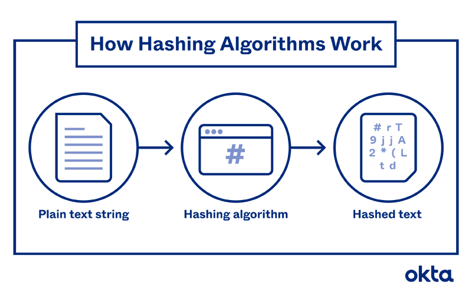

## 토큰

로그인에 토큰을 사용하는 이유 : 매번 요청을 보낼 때 마다 요청 보낸 쪽의 신원을 확인하기 쉽지 않다. (매 요청마다 로그인을 새로 한다고 생각하면 ...) 그래서 최초 로그인 시에 토큰을 발급하여 전달하고, 그 이후의 로그인이 필요한 모든 요청에 발급받은 토큰과 함께 요청하면 신원을 확인하여 요청을 처리할 수 있음.

## 토큰을 만드는 기술 : JWT

JWT : JSON Web Token

- HEADER : 암호화 규칙 (alg), 타입 (typ)
- PAYLOAD : 유저 정보나... 그런 것 담고 있는 데이터 조각 (당연하게도 패스워드는 여기에 포함되면 안된다.) → sub, name, iat ?
- SIGNITURE : 암호화를 위한 데이터

## 토큰을 암호화하는 방식 (Hashing)

참고 : <https://www.okta.com/identity-101/hashing-algorithms/>

~~정리중~~

## JWT 유효성 검증 방식

~~정리중~~

## 보안 문제

### 발생할 수 있는 보안 문제

- 시크릿 키 노출
- 데이터 복호화로 인한 정보 노출
- 토큰 탈취

*토큰을 메모리에 저장하는 경우 (스토리지에 저장하지 않는 경우) 가끔 업데이트된 값을 사용하지 못하는 경우가 있다. → 함수 라이프사이클에 대해서 생각해 볼 것*

### 토큰 탈취

JWT 토큰을 어디에 보관해야 안전할 것인가 (ㅜㅜ)

- 제일 안전한 방식 : 재접근 할 수 없는 런타임 메모리에 저장 → 본인도 재접근 할 수 없기 때문에 뭐 할때마다 로그인을 해야 합니다... (보안과 사용성을 바꿈)
- 로컬 스토리지에 저장 / 쿠키에 저장 → XSS (Cross Site Scripting) : Script Injection 통해서 값을 확인할 수 있다... 도메인 별로 저장하기 때문에 이런 문제가 발생한다.
- CSRF (스팸 사이트) : 내가 구운 쿠키를 나인 척 하는 녀석한테 준다.

이런 문제들에 대해서는 FE에서는 단독으로 해결할 수 있는 방법이 없다. → 시스템 구조 변경으로 보완하기

### Refresh Token

Access Token을 재발급하기 위해서 사용하는 토큰. Access Token은 짧은 시간동안만 유효하다.

Access Token은 발급되어 메모리에 저장된다. 메모리에 저장하면 금방 휘발된다는 단점이 있었지만 휘발되면 Refresh Token으로 재발급하면 되니까 문제 없음. 이 Refresh Token은 Access Token보다는 유효기간이 길다.

악성 사이트는 access token을 뜯어갈 수 없다. (메모리에 저장되어 있으니까. 만약에 메모리에 접근해서 (코드에 접근해서?! 뜯어간다면 이제 로그인만의 문제가 아님...)) Refresh Token은 뜯어갈 수 있다. 하지만 기존 access Token이 유효한데 refresh를 시도한다면 문제로 간주하고 모두 연결을 끊어버리므로 refresh token의 사용을 제한할 수 있다.

근데 만약에 access token이 만료된 차에 우연찮게 refresh token이 탈취되었다면...? 어쩔 수 없다. 완벽하게 안전한 방법을 만들기는 쉽지 않다.

## ETC

### HTTP, curl

프로토콜이다. (너무 잘 알고 있음...ㅜ)

헤더 안에 쓰는 **`Bearer`** : Token 표준 기술. [RFC 문서](https://www.rfc-editor.org/rfc/rfc6750)에도 있다.

curl : 커맨드라인 안에서 http 요청을 보낼 수 있는 tool

### 정답이 있는 문제와 없는 문제

- 정답이 있는 문제
  - React와 Jquery를 같이 써도 되는가 → 안됨
  - useState를 써야 하는가 useRef를 써야 하는가 → 상황에 따라 확실한 답이 있음
  - 어떻게 요소를 중앙에 정렬하는가 → 확실한 방법이 있음
- 정답이 없는 문제
  - 얼마나 보안을 챙겨야 하나요 → 정도에 따라 다름 (합의 후 결정해야 함)
  - 어떤 UI를 써야 하나요 → 협의를 해야 함.
  - 어떤 테스트 코드를 짜야 하나요 → 어떤 테스트가 좋은 테스트인가요 → 왜 테스트를 하려 하는가요 같은 것들을 먼저 생각해 보고 결론을 내려 보면 된다. (이건 정답이 있냐 없냐의 문제가 아니고 애초에 별로 좋지 않은 질문이다..)

정답이 없는 문제에 대한 답을 찾을 때 대부분은 레퍼런스를 찾으러 간다. → 이 사람은 어떻게 했더라. 그렇기 때문에 우리도 이렇게 해야 한다. ➡️ 이런 식으로 결론을 내리는 것은 우리의 상황에서는 맞지 않을 수 있다. (정답이 없기 때문에)

### 무물보

배워야 하는 것 ? 전체적인 라이프사이클을 먼저 공부하고 안쪽으로 들어갈 것

스스로 프론트엔드 개발자로서의 가치를 높인다고 생각하고 공부하고 준비할 것. (공채와 수시채용을 가리지않고 모두 지원할 수 있는 사람이 된다면 베스트인데 아무래도 어렵죠)

주변의 잘하는 개발자들한테 위축되지 말고 배울 것