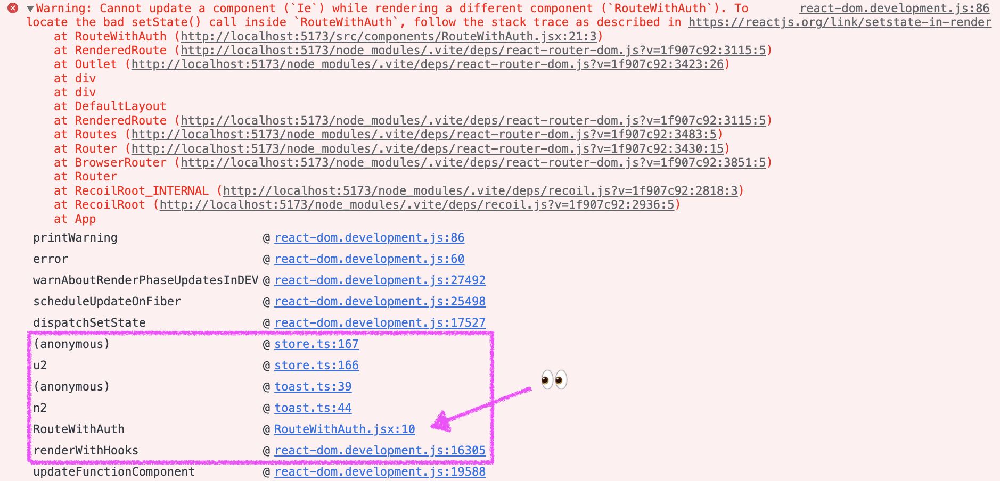
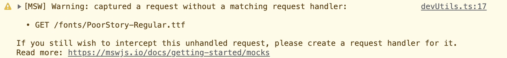

## Warning: Cannot update a component (`A`) while rendering a different component (`B`).

```
Warning: Cannot update a component (A) while rendering a different component (B). To locate the bad setState() call inside B, follow the stack trace as described in https://reactjs.org/link/setstate-in-render
```

에러 메시지에 적혀 있는 대로 stack을 확인해보았다.



문제가 된다는 `RouteWithAuth` 컴포넌트 안에는 `setState()` 함수가 없어서 의아했었는데, toast 메시지를 출력하기 위해서 사용한 'react-hot-toast' 라이브러리의 `toast` 함수를 쓰면서 `setState()` 함수가 호출되는 것이었다. (간단히 타고 들어가서 확인해 본 바로는 `Toaster` 컴포넌트 → `useToaster` 훅 → `useStore` 훅 → `useState` 훅 → `setState()` 함수)

RouteWithAuth 컴포넌트 내부는 이렇게 생겼는데,

```js
import { Navigate, Outlet } from 'react-router-dom';
import { toast } from 'react-hot-toast';
import { useUser } from '../utils/useUser';

export function RouteWithAuth({ auth }) {
  const { user, loading, error } = useUser();

  if (error) {
    toast('로그인이 필요한 페이지입니다.', { type: 'error' });
    return <Navigate to='/login' />;
  }
  if (loading) {
    return <></>;
  }
  if (user.role < auth) {
    toast('권한이 없는 페이지입니다.', { type: 'error' });
    return <Navigate to='/' />;
  }
  return <Outlet />;
}

```

에러 메시지를 보고 추정하기로는 `RouteWithAuth`가 랜더링 되는 중에, 조건문의 `toast` 함수로 인해서 외부의 `Toaster` 컴포넌트가 업데이트되면서 생기는 문제라고 생각해서 `RouteWithAuth` 랜더링과 관련없는 `toast` 함수 호출 로직들을 모두 `useEffect` 훅으로 감싸 주었다.

```js
useEffect(() => {
  if (error) {
    toast('로그인이 필요한 페이지입니다.', { type: 'error' });
  }
  if (user.role < auth) {
    toast('권한이 없는 페이지입니다.', { type: 'error' });
  }
}, [error, user]);
```

이렇게 했더니 문제 해결 완룡 😘

고치고 나서 생각해보니 외부의 state 외에도 어떤 식으로든 외부 component를 변경하는 것 또한 side-effect인데 왜 지금까지 별 생각 없이 랜더링 로직 안에 그대로 넣었었는지 모르겠다... 이렇게 구독하고 있지 않은 상태를 update 한다던가 하는 작업들은 신경써서 `useEffect` 안으로 감싸주자. (구독하고 있는 상태 update의 경우에는 `useEffect` 내부에 넣을 때 무한루프가 발생하지 않도록 주의하자!)

## [MSW] Warning: captured a request without a matching request handler

MSW를 사용해서 로그인 API를 Mocking하여 사용하고 있었는데 자꾸 거슬리는 Warning이 떴다...



당연히 font 파일이나 svg 파일 요청의 경우에는 Mocking 대상이 아니기 때문에 캡쳐를 하지 않게 하는게 맞아보였다.

MSW의 getting start 문서의 [Start worker](https://mswjs.io/docs/getting-started/integrate/browser#start-worker) 부분에는 아래와 같이 간단하게 worker를 시작시켰는데,

```js
// src/index.js
import React from 'react'
import ReactDOM from 'react-dom'
import App from './App'

if (process.env.NODE_ENV === 'development') {
  const { worker } = require('./mocks/browser')
  worker.start()
}

ReactDOM.render(<App />, document.getElementById('root'))
```

[start()](https://mswjs.io/docs/api/setup-worker/start) 함수의 옵션이 꽤 많았다. 그 중에서 unhandled request와 관련된 옵션이 `onUnhandledRequest` 옵션이고, 기본값이 `"warn"` 이기에 경고가 계속 나는 것이었다.

- `"bypass"` : 처리되지 않은 요청을 있는 그대로 수행한다.
- `"warn"` : 처리되지 않은 요청에 경고(Warning)를 출력한다.
- `"error"` : 처리되지 않은 여청에 에러를 출력한다.
- Custom Callback

따라서 아래와 같이 옵션을 설정해주었더니 console에 거슬리는 warning 메시지가 뜨지 않았다.

그런데 내 경우에는 요청을 보내는 부분이 많지 않고, 모두 컨트롤이 가능했기에 warning을 아예 제거했지만 (매번 요청이 font와 svg 파일이었음ㅜㅜ), 의도치않은 요청을 보내는 것을 확인해봐야 하는 경우도 있을 수 있기 때문에 warning 옵션을 제거하는 것이 좋은 방법이 아닌 것 같긴 하다... 😇