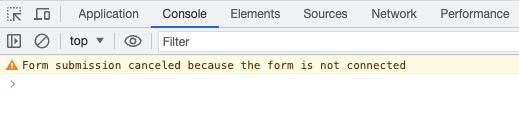
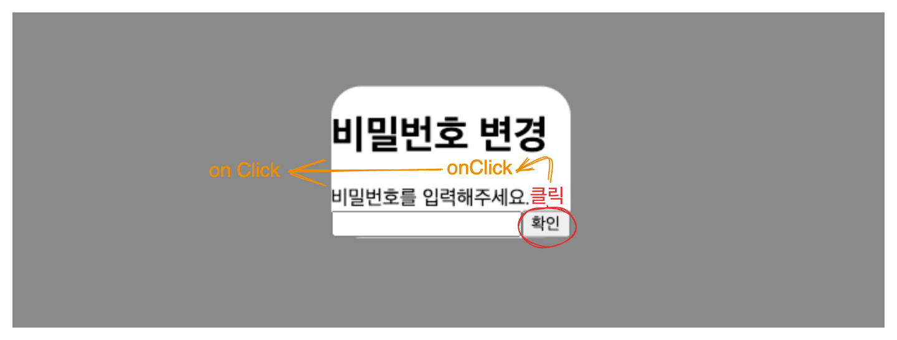

## Form submission canceled because the form is not connected

```tsx
export function ChangePasswordModal({ resetModal }: ModalProps) {
  function onSubmit(e: React.FormEvent<HTMLFormElement>) {
    e.preventDefault();
    console.log("비밀번호 변경");
    const formData = new FormData(e.currentTarget);
    const password = formData.get("password");
    console.log("비밀번호 변경", password);
  }

  return (
    <ModalContainer resetModal={resetModal}>
      <h1>비밀번호 변경</h1>
      <div>비밀번호를 입력해주세요.</div>
      <form onSubmit={onSubmit}>
        <input type="password" />
        <button type="submit">확인</button>
      </form>
    </ModalContainer>
  );
}
```

이런 모달에서 form 태그를 사용하려고 했었는데 확인 버튼을 누르면 아래와 같은 에러가 났다.



HTML Standard를 참고했을 때 (https://html.spec.whatwg.org/multipage/form-control-infrastructure.html#form-submission-algorithm) 위 에러는 Submit 알고리즘의 첫번째 단계인 form을 찾지 못해서 발생하는 문제이므로 Submit 이벤트에 해당하는 form을 연결해주면 되는 해결되는 문제였다.

하지만...

```tsx
<form onSubmit={onSubmit}>
  <input type="password" />
  <button type="submit">확인</button>
</form>
```

이미 잘 연결되어 있었고 원인은 다른 곳에 있었다.

## 모달의 밖을 클릭해서 모달을 닫게 하기

모달을 만들 때 사용하는 ModalContainer 컴포넌트는 아래와 같이 구현되어 있었다.

```tsx
export function ModalContainer({ resetModal, children }: ModalProps) {
  return (
    <div id="ModalOvelay" css={ModalOverlayStyles} onClick={resetModal}>
      <div id="ModalContainer" css={ModalContainerStyles}>
        {children}
      </div>
    </div>
  );
}
```

https://ko.javascript.info/bubbling-and-capturing

위 링크에서 알 수 있듯이 자식 컴포넌트에서 발생한 거의 대부분의 이벤트는 기본적으로 document 태그를 만날 때까지 상위 컴포넌트로 전파되는데, 이를 이벤트 버블링이라고 한다.



위처럼 확인 버튼을 눌렀을 때 `ModalContainer` 컴포넌트에서 onClick 이벤트가 발생하고 (따로 handler를 지정하진 않았지만 이벤트는 발생한다.) 이 이벤트가 상위 컴포넌트인 `ModalOvelay` 에게로 전파되었다.

onClick 이벤트 핸들러로 지정해둔 `resetModal` 함수로 인해 Modal 자체가 사라지고 Modal 내부에 있던 form 요소도 사라졌는데, submit 이벤트는 발생했으므로 form을 찾을 수 없다는 `Form submission canceled because the form is not connected` 에러가 발생하는 것이었다.

이벤트 핸들러 안에서는 아래와 같은 이벤트 객체의 프로퍼티에 접근할 수 있다.

- `event.target` : 이벤트가 **실제로** 발생한 요소 (전파의 시작점)
- `event.currentTarget` : 이벤트를 핸들링하는 현재 요소

현재의 문제 상황은 이벤트를 핸들링하려는 현재 요소에서 발생한 이벤트가 아닌 그 안쪽의 다른 요소에서 발생한 이벤트를 핸들링하게 되면서 만들어진 것이므로

```typescript
function onClick(e: React.MouseEvent<HTMLDivElement>) {
  if (e.target === e.currentTarget) {
    resetModal();
  }
}
```

이처럼 이벤트가 발생한 요소가 현재 이벤트 핸들러가 있는 요소와 동일한 경우에만 이벤트를 처리할 수 있도록 조건을 추가해서 문제를 해결했다.
