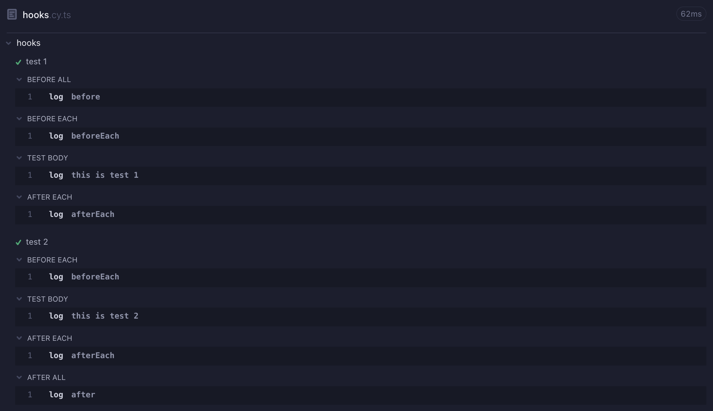

> 42gg 프로젝트에 Cypress 적용을 위해 공부한 내용을 정리한 것입니다.
> 당장 필요한 것 같아 보이는 내용들을 위주로 정리하여 빠진 내용도 많습니다. 😇

테스트를 작성하기 위한 다양한 커맨드들을 기본적인 테스트 스크립트를 작성해보면서 정리해보려고 합니다.

## 📍 로그인 테스트

```typescript
describe("로그인 기능을 테스트합니다.", () => {
  beforeEach(() => {
    // 매 테스트의 시작 전에 실행
    // 홈 페이지로 이동
    cy.visit("http://localhost:3000");
    // 로그인 버튼 눌러 로그인 페이지로 이동
    cy.get("button").contains("Login").click();
  });
  it("일반 유저 로그인", () => {
    // 로그인 페이지에서 ID, PW 입력
    cy.get('input[name="ID"]').type("compose");
    cy.get('input[name="Password"]').type("qwe123!@#");
    // 로그인 버튼 누르기
    cy.get("button").contains("로그인").click();
    // 로그인 성공 후 홈 페이지로 이동
    cy.url().should("eq", "http://localhost:3000/");
  });
  it("로그인 실패", () => {
    cy.get('input[name="ID"]').type("compose");
    cy.get('input[name="Password"]').type("badpassword");
    cy.get("button").contains("로그인").click();
    // 로그인 실패 후 로그인 페이지에 머무르기
    cy.url().should("eq", "http://localhost:3000/login");
  });
});

```

### hook (before, beforeEach, afterEach, after)

[Cypress hook](https://docs.cypress.io/guides/core-concepts/writing-and-organizing-tests#Hooks) , [mocha hook](https://mochajs.org/#hooks)

hook을 이용하여 테스트의 시작에 필요한 조건들을 설정하거나, 테스트 종료 후에 설정했던 조건들을 해제할 수 있습니다. (mocha의 hook개념을 빌려왔다고 함.)

```typescript
describe('hooks', () => {
  before(() => {
    // 이 블록의 전체 테스트의 시작 전에 한번 실행된다.
    cy.log('before');
  })
  beforeEach(() => {
    // 매 테스트의 시작 전에 실행된다.
    cy.log('beforeEach');
  })
  afterEach(() => {
    // 매 테스트의 종료 후에 실행된다.
    cy.log('afterEach');
  })
  after(() => {
    // 이 블록의 전체 테스트의 종료 후에 실행된다.
    cy.log('after');
  })
  it('test 1', () => {
    cy.log('this is test 1');
  })
  it('test 2', () => {
    cy.log('this is test 2')
  })
})
```



### cy.click

https://docs.cypress.io/api/commands/click

DOM element를 클릭합니다. `cy.click` 이후의 chaining은 안전하지 않습니다.

```typescript
.click()
.click(options)
.click(position)
.click(position, options)
.click(x, y)
.click(x, y, options)
```

Arguments 종류에서도 알 수 있듯이 선택자를 인자로 전달하여 클릭하는 방식이 아니라 앞선 커맨드에서 얻은 DOM element에 연결하여 클릭하는 방식으로 사용합니다.

```typescript
// 옳은 방법
cy.get('.btn').click()
// 잘못된 방법
cy.click('.btn')
```

**> No Args**

```typescript
// nav 안의 a 태그 클릭
cy.get('.nav > a').click()
```

**> Position**

```typescript
// 이미지의 오른쪽 위 모서리 클릭
cy.get('img').click('topRight')
// element의 왼쪽을 기준으로 15px, 위쪽을 기준으로 40px되는 지점 클릭
cy.get('#top-banner').click(15, 40)
```

### cy.contains

https://docs.cypress.io/api/commands/contains

text를 포함하는 DOM element를 가져옵니다.

```typescript
.contains(content)
.contains(content, options)
.contains(selector, content)
.contains(selector, content, options)

// ---or---

cy.contains(content)
cy.contains(content, options)
cy.contains(selector, content)
cy.contains(selector, content, options)
```

**> Content**

```typescript
// yields <li>apples</li>
cy.contains('apples')
// yields input[type='submit'] element in form element
cy.get('form').contains('submit!')
```

**> Number**

```html
<button class="btn btn-primary" type="button">
  Messages <span class="badge">4</span>
</button>
```

```typescript
// yields <button>
cy.contains(4)
```

**> Selector**

```html
<ul>
  <li>apples</li>
  <li>oranges</li>
  <li>bananas</li>
</ul>
```

```typescript
// yields <ul>...</ul>
cy.contains('ul', 'apples')
```

### cy.get

https://docs.cypress.io/api/commands/get

selector나 alias를 이용하여 하나 이상의 DOM element를 가져옵니다.

```typescript
cy.get(selector)
cy.get(alias)
cy.get(selector, options)
cy.get(alias, options)
```

**> selector**

```typescript
cy.get('input')
cy.get('ul li:first')
cy.get('.dropdown-menu')
cy.get('[data-test-id="test-example"]')
cy.get('[id$=-remote]')
```

**> alias**

```typescript
cy.get('ul#todos').as('todos')

// ...

cy.get('@todos')
```

**> options**

| Option             | Default                                                      | Description                                                  |
| ------------------ | ------------------------------------------------------------ | ------------------------------------------------------------ |
| `log`              | `true`                                                       | Command log에 command를 표시한다.                            |
| `timeout`          | `defaultCommandTimeout`                                      | 시간 초과 전에 `cy.get()`이 끝날 때 까지 기다리는 시간       |
| `withinSubject`    | `null`                                                       | childeren이 있는지 확인할 element. 만약 null이라면 root-level DOM element에서부터 탐색이 시작된다. |
| `includeShadowDom` | [`includeShadowDom` config option value](https://docs.cypress.io/guides/references/configuration#Global) | -                                                            |

cy.get은 cy.root에서 탐색을 시작, cy.find는 현재의 범위에서 탐색을 시작합니다.

### cy.log

https://docs.cypress.io/api/commands/log

Cypress Command Log에 메시지를 출력합니다.

```typescript
cy.log(message)
cy.log(message, args...)
```

```typescript
cy.log('Login successful')
cy.log('events triggered', events)
```

### cy.should

https://docs.cypress.io/api/commands/should

assertion을 생성합니다. (assertion : 반드시 참이어야 하는 조건식) assertion은 참이 되거나 timeout 전까지 계속 자동으로 재시도됩니다.

[assertion에 대하여](https://docs.cypress.io/guides/references/assertions)

```typescript
.should(chainers)
.should(chainers, value)
.should(chainers, method, value)
.should(callbackFn)
```

**> Chainers**

```typescript
cy.get(':checkbox').should('be.disabled')
```

checkbox 가 비활성화 되어 있어야 함.

**> Value**

```typescript
cy.get('form').should('have.class', 'form-horizontal')
```

form의 class가 `form-horizontal` 이어야 함.

**> Method and Value**

```typescript
cy.get('#header a') // yields the element
  .should('have.attr', 'href') // yields the "href" attribute
  .and('equal', '/users') // checks the "href" value
```

href이라는 attribute가 있어야 함.

`have.attr` : from chai-jquery

**> Function**

```typescript
cy.get('p')
  .should(($p) => {
    // ...
  })
  .log()

// or

cy.get('p').then(($p) => {
  // ...
  cy.log($p)
})
```

`.should()` 에 함수를 전달해서 여러 개의 assertion을 만들 수 있습니다. 전달한 함수는 assertion이 통과될 때 까지 계속해서 재실행되기 때문에 그 함수에는 side effect가 없어야 합니다.  그리고 함수 내에서는 Cypress 커맨드를 쓸 수 없습니다.

**> Multiple Assertions**

```typescript
// our subject is not changed by our first assertion,
// so we can continue to use DOM based assertions
cy.get('option:first').should('be.selected').and('have.value', 'Metallica')
```

`.and()` 를 이용해서  여러 개의 assertion을 연결할 수 있습니다.

### cy.type

https://docs.cypress.io/api/commands/type

```typescript
.type(text)
.type(text, options)
```

DOM element 안에 타이핑을 할 수 있습니다.

```typescript
cy.get('input').type('Hello, World') // Type 'Hello, World' into the 'input'
cy.get('textarea').type('Hello world') // yields <textarea>
```

### cy.url

https://docs.cypress.io/api/commands/url

현재 화렁화된 페이지의 url을 가져옵니다.

```
cy.url() // Yields the current URL as a string
```

### cy.visit

https://docs.cypress.io/api/commands/visit

다른 url에 접근합니다.

``````typescript
cy.visit(url)
cy.visit(url, options)
cy.visit(options)
``````

```typescript
cy.visit('/') // visits the baseUrl
cy.visit('index.html') // visits the local file "index.html" if baseUrl is null
cy.visit('http://localhost:3000') // specify full URL if baseUrl is null or the domain is different the baseUrl
cy.visit({
  url: '/pages/hello.html',
  method: 'GET',
})
```

[모든 커맨드에 대한 문서](https://docs.cypress.io/api/table-of-contents)