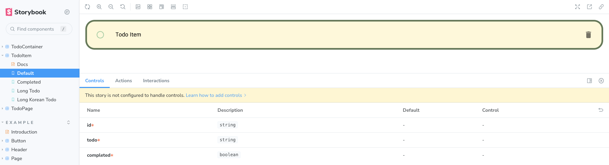
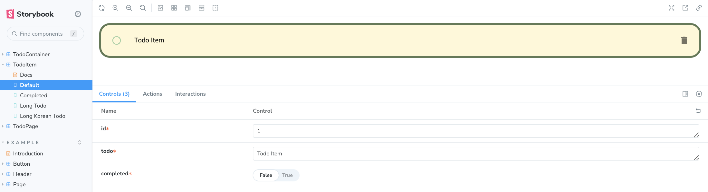
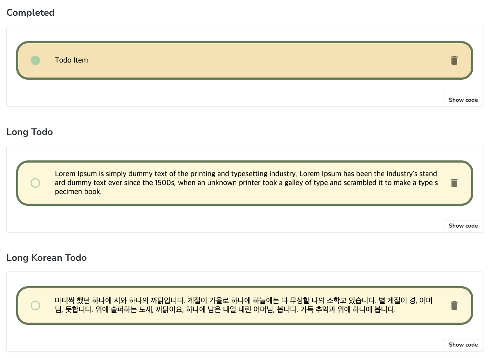
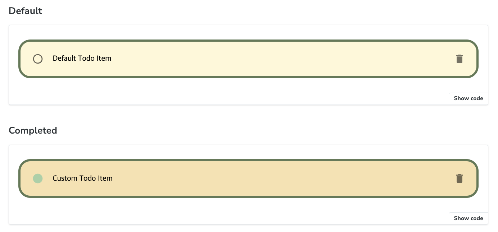
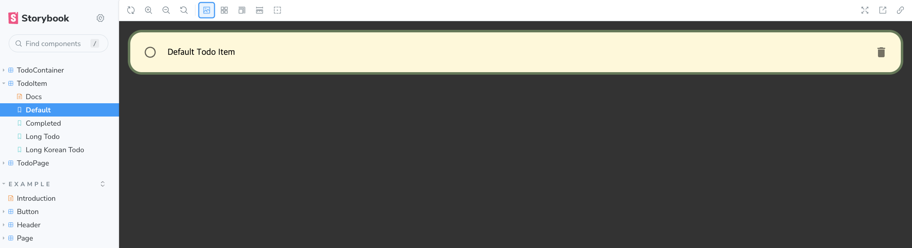
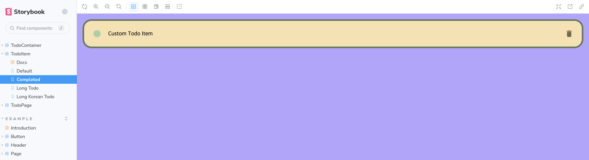
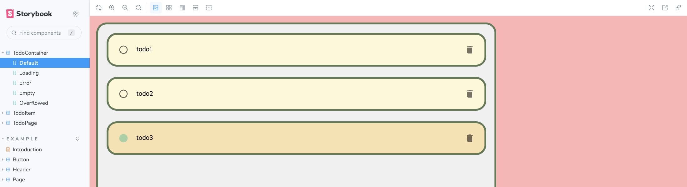
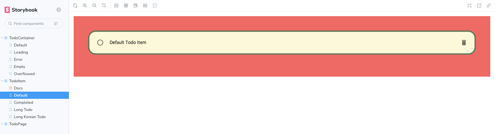

> 42gg 프로젝트에 Storybook 적용을 위해 공부한 내용을 정리한 것입니다.
> 당장 필요한 것 같아 보이는 내용들을 위주로 정리하여 빠진 내용도 많습니다. 😇

## 📍 Storybook

https://storybook.js.org/

Storybook은 컴포넌트와 페이지를 독립적으로 빌드할 수 있는 도구이다.

프로젝트가 복잡해질수록 하나의 컴포넌트에 여러 api, props, state, ... 같은 것들이 얽혀있어 테스트하기가 힘들어지는데, Storybook은 복잡한 비즈니스 로직과 컴포넌트를 분리하여 따로 컴포넌트 랜더링 자체만 테스트 해 볼 수 있게 해 준다.

## 📍 Storybook 설치하고 실행하기

https://storybook.js.org/docs/react/get-started/install

설치

```shell
npx storybook@latest init
```

실행

```shell
npm run storybook
```

## 📍 Story 개요

Storybook에서 다양한 컴포넌트의 variation을 저장하기 위해서 사용하는 단위가 Story이다.

Story는 랜더링된 컴포넌트의 상태를 포착하는 식으로 동작하는데, 필요한 다양한 상태들을 하나의 Story로 만들어서 확인할 수 있다.

각 컴포넌트들은 여러 개의 Story를 가질 수 있고, `.stories.ts/.stories.tsx` 파일에 작성해서 Story를 확인할 수 있다.

```tsx
// TodoItem.stories.tsx

import TodoItem from ".";
import type { Meta, StoryObj } from "@storybook/react";

const meta: Meta<typeof TodoItem> = {
  title: "TodoItem",
  component: TodoItem,
};

export default meta;
type Story = StoryObj<typeof TodoItem>;

/*
 * 👇 Story 정의
 * render 함수로 어떤 컴포넌트를 랜더링할지 지정할 수 있다.
 */
export const Default: Story = {
	render: () => <TodoItem id="1" todo="Todo Item" completed={false} />,
};
```



위와 같은 상태의 컴포넌트를 `Args`를 이용해서도 표현할 수 있다.

```typescript
// TodoItem.stories.ts

// ... 생략

/*
 * 👇 Story 정의
 * args : Story와 add-on들에 전달되는 인수
 */
export const Default: Story = {
	args: {
		id: "1",
		todo: "Todo Item",
		completed: false,
	},
	// render함수는 생략 가능
	// render: ({id, todo, completed}) => <TodoItem id={id} todo={todo} completed={completed} />,
};
```



`args`를 이용하더라도 `render` 함수를 이용하기 때문에 동작에는 차이가 없지만 `args`를 사용하면 controls 탭에서 동적으로 인자를 조절해 볼 수 있고, 그 외의 action 등을 사용하는 것에도 더 편리하다.

아래로 다양한 `args` 를 갖는 Story들을 추가해 줄 수 있고, Storybook의 TodoItem 하위 탭에서 모두 확인 가능하다.

```typescript
export const Completed: Story = {
  args: {
    id: "1",
    todo: "Todo Item",
    completed: true,
  },
};

export const LongTodo: Story = {
  args: {
    id: "1",
    todo: "Lorem Ipsum is simply dummy text of the printing and typesetting industry. Lorem Ipsum has been the industry's standard dummy text ever since the 1500s, when an unknown printer took a galley of type and scrambled it to make a type specimen book.",
    completed: false,
  },
};

export const LongKoreanTodo: Story = {
  args: {
    id: "1",
    todo: "마디씩 했던 하나에 시와 하나의 까닭입니다. 계절이 가을로 하나에 하늘에는 다 무성할 나의 소학교 있습니다. 별 계절이 경, 어머님, 듯합니다. 위에 슬퍼하는 노새, 까닭이요, 하나에 남은 내일 내린 어머님, 봅니다. 가득 추억과 위에 하나에 봅니다.",
    completed: false,
  },
};
```



## 📍 Story 파일의 구성

[Component Story Format (CSF) 에 대한 문서](https://storybook.js.org/docs/react/api/csf)

### Intro (Meta, StoryObj)

Story에 대한 메타데이터를 정의하고, default export 해 줘야 한다.

```typescript
// TodoItem.stories.ts
import TodoItem from ".";
import type { Meta, StoryObj } from "@storybook/react";

const meta: Meta<typeof TodoItem> = {
  title: "TodoItem",
  component: TodoItem,
  tags: ["autodocs"],
};

export default meta;
```

Story 타입을 정의해주고 Story를 정의해준다. 이렇게 정의해준 Story들 역시 named export 되어야 한다. Story의 이름은 UpperCamelCase를 권장한다.

```typescript
// TodoItem.stories.ts
import TodoItem from ".";
import type { StoryObj } from "@storybook/react";

type Story = StoryObj<typeof TodoItem>;

export const Default: Story = {
  args: {
    id: "1",
    todo: "Todo Item",
    completed: false,
  },
};

```

- Meta 타입 : ?
- StoryObj 타입 : generic parameter로 컴포넌트 타입을 전달하면, 알아서 component props의 타입을 추론한다.

[타입에 대해 참고](https://storybook.js.org/blog/improved-type-safety-in-storybook-7/)

### Args

https://storybook.js.org/docs/react/writing-stories/args

Story는 컴포넌트가 어떻게 랜더링되어야 할지에 관여하는 여러 argument를 갖는 컴포넌트라 할 수 있는데, `Args` 는 이 여러 argumenet들을 하나의 자바스크립트 객체로 다룰 수 있게 해 주는 Storybook의 매커니즘이다.

이렇게 전달된 Args는 props, style, input등 component 뿐만 아니라 addon에도 사용할 수 있다.

args 객체는 story, component, global Level에 정의될 수 있다.

#### Story Args

하나의 Story에만 적용되는 Args

```tsx
// TodoItem.stories.ts
export const Default: Story = {
	args: {
		id: "1",
		todo: "Todo Item",
		completed: false,
	},
	render: ({ id, todo, completed }) => (
		<TodoItem id={id} todo={todo} completed={completed} />
	),
};
```

#### Component Args

컴포넌트 레벨에 적용할 Args는 Meta에 정의하고, 덮어씌우지 않는 이상 모든 스토리에 적용된다.

```typescript
// TodoItem.stories.ts
const meta: Meta<typeof TodoItem> = {
	title: "TodoItem",
	component: TodoItem,
	tags: ["autodocs"],
	// 👇 덮어씌우지 않는 한 모든 스토리들에 적용될 args
	args: {
		id: "1",
		todo: "Default Todo Item",
		completed: false,
	},
};

export const Default: Story = {
	args: {},
};

export const Completed: Story = {
	args: {
		todo: "Custom Todo Item",
		completed: true,
	},
};
```



#### Global Args

Global level에 적용할 Args는 `preview.ts` 파일에 정의하고 재정의하지 않는 이상 모든 컴포넌트의 모든 스토리에 적용된다.

```typescript
// .storybook/preview.ts
// https://storybook.js.org/docs/react/writing-stories/args#global-args
import type { Preview } from "@storybook/react";

const preview: Preview = {
  // All stories expect a theme arg
  argTypes: { theme: { control: 'select', options: ['light', 'dark'] } },
  // The default value of the theme arg to all stories
  args: { theme: 'light' },
};
```

### Parameters

https://storybook.js.org/docs/react/writing-stories/parameters

Parameter는 Story에 대한 정적인 메타데이터이다. Args와 비슷하게 각각 Story, Component, Global Level에 적용될 수 있다.

공식문서의 예를 따라 Background addon에 parameter를 적용해봅시다.

#### Story parameters

Story 단위로 적용되는 parameter이다.

```typescript
// TodoItem.stories.ts
export const Default: Story = {
	parameters: {
		backgrounds: {
			default: "dark",
		},
	},
	args: {},
};
```



#### Component parameters

Component 단위로 적용되는 parameter이고, 재정의하지 않는 이상 component의 모든 story들에 적용된다.

```typescript
// TodoItem.stories.ts
const meta: Meta<typeof TodoItem> = {
	title: "TodoItem",
	component: TodoItem,
	// ... 생략
	parameters: {
		backgrounds: {
			default: "purple",
			values: [
				{ name: "purple", value: "#B2A4FF" },
				{ name: "light", value: "#FFFFFF" },
			],
		},
	},
};

export const Completed: Story = {
	args: {
		todo: "Custom Todo Item",
		completed: true,
	},
};
```



#### Global parameters

Global Level에 적용되는 parameter로 `preview.ts` 파일에 적용하고 재정의하지 않는 이상 모든 컴포넌트의 모든 스토리에 적용된다.

```typescript
// .storybook/preview.ts
import type { Preview } from "@storybook/react";
const preview: Preview = {
	parameters: {
		// ... 기존 Parameter들은 생략함
		backgrounds: {
			default: "pink",
			values: [{ name: "pink", value: "#FFB4B4" }],
		},
	},
};
```



### Decorators

Decorators는 추가적인 rendering으로 story를 기능적으로 감싸는 것이다. Story에서는 주로 추가적인 마크업이나, Context mocking을 위해서 decorator를 사용한다.

#### Extra Markup

필요에 따라서 component를 rendering 할 때 추가적인 마크업이 필요할 수 있다. (100%의 width를 가진 컴포넌트라 좌우 여백이 없어 불편하다던가... 등등 ) 그 때 Decorator를 사용해서 추가적인 마크업을 더해주면 된다.

```tsx
// TodoItem.stories.ts
export const Default: Story = {
	args: {},
	decorators: [
		(Story) => (
			<div style={{ width: "100%", padding: "3rem", backgroundColor: "#FF5F5F" }}>								
				<Story />
			</div>
		),
	],
};
```



#### Context Mocking

styled-component, MUI, Fontawesome 같이 Storybook에서 올바르게 랜더링하기 위해서 추가적인 설정이 필요한 라이브러리들이 있다.

예를 들어 MUI의 ThemeProvider로 Theme를 커스텀하려 할 때 모든 컴포넌트를 ThemeProvider 컴포넌트로 감싸줘야 하는데 이런 경우에도 Decorator를 사용하면 된다.

```tsx
// .storybook/preview.tsx
const preview: Preview = {
	decorators: [
		(Story) => (
			<ThemeProvider theme={theme}>
				<Story />
			</ThemeProvider>
		),
	],
};
```

Decorator 역시 Story, Component, Global Level에 각각 적용할 수 있고, 자세한 예시는 생략합니다... (위의 예시로는 Extra markup → Story Level, Context Mocking → Global Mocking)

### 그 외..

https://storybook.js.org/docs/react/writing-stories/introduction

위 내용 말고도 story에 설정할 수 있는 내용들이 많지만 위 링크로 대신하고 정리는 생략합니다... (추후 필요한 경우 추가 예정)

## 📍 Document

### Automatic documentation

https://storybook.js.org/docs/react/writing-docs/autodocs

Story의 Meta 데이터에 `'autodocs'` 태그를 추가해주면 자동으로 생성된 문서를 사용할 수 있다.

```typescript
const meta: Meta<typeof TodoItem> = {
  title: "TodoItem",
  component: TodoItem,
  //👇 Enables auto-generated documentation for the component story
  tags: ['autodocs'],
};
```

## 📍 Troubleshooting

### Next.js path alias

`@/pages` 같은 next.js의 path alias가 storybook에는 적용되지 않는 문제가 있었는데 `tsconfig.ts` 파일의 `compilerOptions`에 `"baseUrl"` 항목을 추가해서 해결했다.

```typescript
// tsconfig.ts
"compilerOptions": {
		// 생략
    "baseUrl": ".",
    "paths": {
      "@/*": ["./src/*"]
    }
  },
```

(기존에는 `storybook-addon-next` 이라는 애드온을 이용해서 해결한 것 같은데 지금은 오히려 `storybook-addon-next` 를 이용하면 다른 문제 (SassError) 가 발생하므로 사용하지 않는 것이 좋겠습니다.)

## 📍 참고

https://storybook.js.org/recipes/next