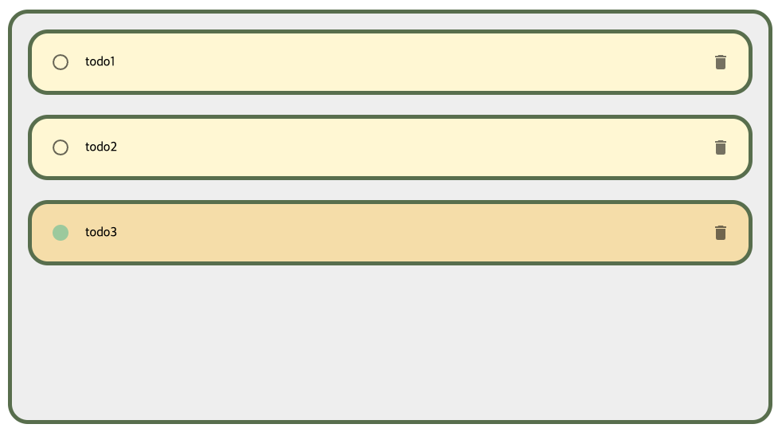
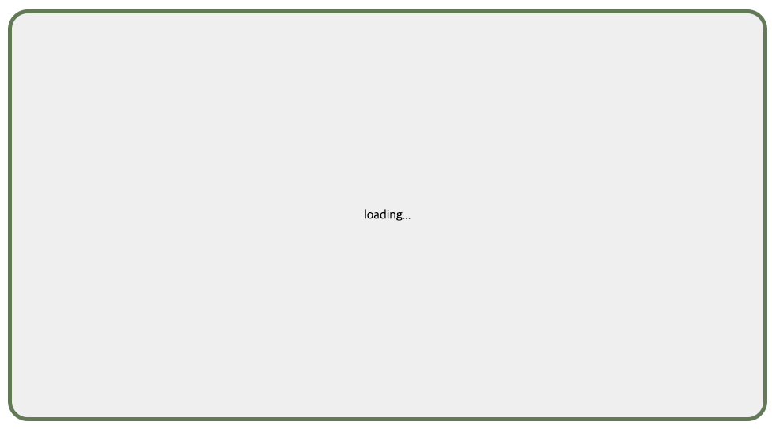

> 42gg 프로젝트에 Storybook 적용을 위해 공부한 내용을 정리한 것입니다.
> 당장 필요한 것 같아 보이는 내용들을 위주로 정리하여 빠진 내용도 많습니다. 😇

## 📍 msw

msw를 사용하여 mocking한 api를 Storybook에서 사용할 수 있습니다.

[Offical Demo](https://msw-sb.vercel.app/?path=/docs/guides-getting-started--docs)

### set-up

Storybook에서 msw를 사용하기 위한 addon을 설치합니다.

```shell
npm i msw msw-storybook-addon -D
```

프로젝트의 public 폴더 경로를 지정하여 Service Worker를 생성합니다.

(이미 msw를 사용하고 있던 프로젝트라면 아래의 설정은 필요하지 않습니다.)

```shell
npx msw init public/
```

`./storybook/preview.tsx` 파일에서 addon에 대한 설정을 해줍니다.

```typescript
// ./storybook/preview.tsx
import { initialize, mswDecorator } from 'msw-storybook-addon';

// Initialize MSW
initialize();

// Option 1 : Provide the MSW addon decorator globally
// 이렇게 decorator만 따로 export 해 줘도 되고
export const decorators = [mswDecorator];

// Option 2 : Provide the MSW addon decorator globally
// 이렇게 Preview의 attribute로 넣어줘도 됩니다.
const preview: Preview = {
  decorators: [mswDecorator],
};

```

`./storybook/main.ts` 파일에서 Storybook의 asset 폴더로 public 폴더 (Service worker 설정 파일이 있는 그 폴더) 를 연결해줍니다.

```typescript
const config: StorybookConfig = {
  // ... 생략
  staticDirs: ["../public"], // 👈 Configures the static asset folder in Storybook
};
```

msw 사용을 위한 설정 완료.

### Usage

Parameter의 msw property로 정의한 handler들을 전달해서 사용할 수 있습니다.

```tsx
export const Default: Story = {
  render: () => <TodoContainer />,
  parameters: {
    msw: [
      rest.get("/todos", (req, res, ctx) => {
        return res(ctx.status(200), ctx.json(todoList));
      }),
    ],
  },
};
```



Story별로 다른 handler를 전달하여 다양한 api 응답에 대한 처리를 테스트 해 볼 수 있습니다.

```tsx
export const Loading: Story = {
  render: () => <TodoContainer />,
  parameters: {
    msw: [
      rest.get("/todos", (req, res, ctx) => {
        return res(ctx.status(200), ctx.delay(2000), ctx.json(todoList));
      }),
    ],
  },
};
```



### Advanced Usage

(추가 예정)

- 기존 프로젝트에서 정의해둔 hander 그대로 가져오기
- Global parameter에 적용하기

## 📍 Recoil

recoil을 사용하기 위해서는 컴포넌트 상위에 RecoilRoot 컴포넌트로 감싸줘야 하므로 `./storybook/preview.tsx` 파일의 decorator에 추가해주겠습니다.

```tsx
const preview: Preview = {
  // ... 생략
  decorators: [
    mswDecorator,
    (Story) => (
      <RecoilRoot>
        <Story />
      </RecoilRoot>
    ),
  ],
};
```

## 📍 MUI ThemeProvider

커스텀한 테마를 Storybook에도 적용하기 위해서 모든 Story를 ThemeProvider 컴포넌트로 감싸줍니다. (Decorator 활용)

```tsx
const preview: Preview = {
  // ... 생략
  decorators: [
    mswDecorator,
    (Story) => (
      <ThemeProvider theme={theme}>
        <RecoilRoot>
          <Story />
        </RecoilRoot>
      </ThemeProvider>
    ),
  ],
};
```

